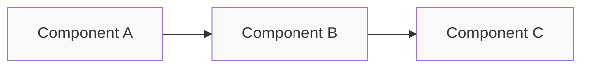

# Feature Specification Template

**Status**: Template
**Created**: [YYYY-MM-DD]
**Last Updated**: [YYYY-MM-DD]
**Priority**: [High/Medium/Low]
**Complexity**: [Low/Medium/High]

---

## Naming Convention

Follow these conventions when naming specification documents:
- Use lowercase with hyphens: `feature-name-spec.md`
- Prefix with feature type: `feat-`, `fix-`, `refactor-`, `docs-`
- Include brief descriptive name: `feat-vocabulary-extraction-spec.md`
- End with `-spec.md` for clarity

Examples:
- `feat-exercise-generation-spec.md`
- `fix-answer-evaluation-spec.md`
- `refactor-agent-workflow-spec.md`
- `docs-api-reference-spec.md`

---

## Overview

[Provide a brief, clear description of the feature. Explain what problem it solves and its importance to the project.]

### Summary
[1-2 sentence elevator pitch]

### Motivation
[Why is this feature needed? What user need does it address?]

---

## Requirements

List all functional and non-functional requirements for this feature.

### Functional Requirements
- [ ] Requirement 1: [Specific, testable requirement]
- [ ] Requirement 2: [Specific, testable requirement]
- [ ] Requirement 3: [Specific, testable requirement]

### Non-Functional Requirements
- [ ] Performance: [e.g., response time < 2s]
- [ ] Reliability: [e.g., 99% uptime, error handling]
- [ ] Security: [e.g., input validation, no API key exposure]
- [ ] Usability: [e.g., intuitive UI, clear error messages]

### Constraints
- [ ] Constraint 1: [e.g., must use existing LLM interface]
- [ ] Constraint 2: [e.g., no new dependencies]
- [ ] Constraint 3: [e.g., backward compatible]

---

## User Stories

Describe the feature from the user's perspective.

- **As a** [user type, e.g., language learner, developer]
  **I want to** [action]
  **So that** [benefit/outcome]

Example:
- As a French language learner, I want to see word definitions alongside exercises so that I can understand new vocabulary better.

---

## Technical Design

### Architecture

[Describe the high-level architecture. Use Mermaid diagrams if helpful.]



### Components

| Component | Responsibility | Dependencies |
|-----------|---------------|--------------|
| `module.py` | [What it does] | [What it depends on] |
| `service.py` | [What it does] | [What it depends on] |

### Data Flow

[Describe how data moves through the system for this feature.]

1. Input: [description]
2. Processing: [description]
3. Output: [description]

---

## API/Interfaces

### Public Functions

```python
# Function signature and type hints
def function_name(param1: type, param2: type) -> ReturnType:
    """
    [Docstring describing purpose, params, return value, and exceptions]
    
    Args:
        param1: [description]
        param2: [description]
        
    Returns:
        [description]
        
    Raises:
        [ExceptionType]: [when it's raised]
    """
    pass
```

### Data Models

```python
from dataclasses import dataclass
from enum import Enum

class StatusEnum(Enum):
    PENDING = "pending"
    COMPLETE = "complete"
    FAILED = "failed"

@dataclass
class DataModel:
    field1: str
    field2: int
    status: StatusEnum
```

### Configuration

New or modified environment variables:

| Variable | Type | Required | Default | Description |
|----------|------|----------|---------|-------------|
| `NEW_VAR` | str | No | "default" | [Purpose] |

---

## Implementation Plan

Describe the step-by-step approach to implement this feature.

### Steps
- [ ] **Step 1**: [Description]
  - [ ] Sub-step 1.1: [Description]
  - [ ] Sub-step 1.2: [Description]
- [ ] **Step 2**: [Description]
  - [ ] Sub-step 2.1: [Description]
  - [ ] Sub-step 2.2: [Description]
- [ ] **Step 3**: [Description]
  - [ ] Sub-step 3.1: [Description]
  - [ ] Sub-step 3.2: [Description]

---

## Acceptance Criteria

List the conditions that must be met for this feature to be considered complete.

### Must Have
- [ ] Criterion 1: [Specific, verifiable condition]
- [ ] Criterion 2: [Specific, verifiable condition]

### Should Have
- [ ] Criterion 3: [Nice-to-have but not critical]

### Test Cases
- [ ] Test case 1: [description of test scenario and expected outcome]
- [ ] Test case 2: [description of test scenario and expected outcome]

---

## Dependencies

### Internal Dependencies
- [ ] Feature/Component A: [link to spec or description]
- [ ] Feature/Component B: [link to spec or description]

### External Dependencies
- [ ] Package/library: [name, version requirement, purpose]

### Blocking Issues
- [ ] Issue #123: [description and link]

---

## Testing Strategy

### Unit Tests
- [ ] Test vocabulary extraction with various HTML inputs
- [ ] Test exercise generation with mock LLM
- [ ] Test error handling scenarios

### Integration Tests
- [ ] Test end-to-end workflow with mock LLM
- [ ] Test UI components in isolation

### Manual Testing
- [ ] Manual test scenario 1
- [ ] Manual test scenario 2

### Test Data
[Describe any special test data needed]

---

## Risks & Mitigations

| Risk | Probability | Impact | Mitigation |
|------|-------------|--------|------------|
| LLM API rate limits | Medium | High | Implement retry logic with backoff |
| HTML parsing edge cases | Low | Medium | Comprehensive test suite |
| Performance issues | Medium | Medium | Profiling and optimization |

---

## Alternatives Considered

### Option 1: [Approach Name]
**Pros:**
- [Advantage 1]
- [Advantage 2]

**Cons:**
- [Disadvantage 1]
- [Disadvantage 2]

**Decision:** [Why this was/wasn't chosen]

### Option 2: [Approach Name]
**Pros:**
- [Advantage 1]

**Cons:**
- [Disadvantage 1]

**Decision:** [Why this was/wasn't chosen]

---

## Open Questions

Questions that need to be resolved before or during implementation:

1. [Question text]?
   - Possible answer A
   - Possible answer B
   - Recommendation: [preferred answer]

2. [Question text]?

---

## Estimation

### Complexity Assessment
- **Technical Complexity**: [Low/Medium/High]
- **Risk Level**: [Low/Medium/High]
- **Dependencies**: [Low/Medium/High]

---

## References

- [Related specification documents](link)
- [External resources](link)
- [Similar implementations](link)

---

## Changelog

| Version | Date | Changes |
|---------|------|---------|
| 1.0 | [Date] | Initial specification created |
| 1.1 | [Date] | Updated based on feedback |
