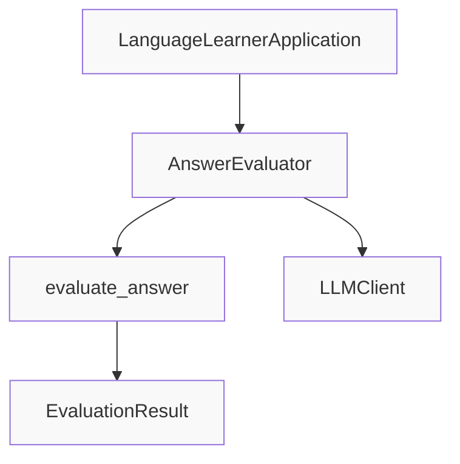

# Answer Evaluation Specification

**Status**: Draft
**Created**: [YYYY-MM-DD]
**Last Updated**: [YYYY-MM-DD]
**Priority**: High
**Complexity**: Medium

---

## Overview

### Summary
The Answer Evaluation system assesses user responses to language learning exercises and provides detailed feedback. It currently implements exact string matching and will be enhanced with LLM-based evaluation for richer feedback and partial credit scoring.

### Motivation
Effective language learning requires immediate, constructive feedback. Users need to understand not just whether their answer was correct, but why it was correct or incorrect, with specific guidance for improvement.

---

## Requirements

### Functional Requirements
- [ ] **Correctness Check**: Determine if user answer matches expected answer
- [ ] **Scoring**: Assign score (0-100) based on correctness
- [ ] **Feedback Generation**: Provide clear, actionable feedback
- [ ] **Explanation**: Explain the correct answer
- [ ] **Learning Tips**: Offer pedagogical suggestions for improvement
- [ ] **Exercise Type Support**: Handle all exercise types (FILL_BLANK, MULTIPLE_CHOICE, TRANSLATION, etc.)
- [ ] **Case Insensitivity**: Normalize case for comparison
- [ ] **Whitespace Normalization**: Strip whitespace for comparison
- [ ] **LLM-Based Evaluation**: Enhanced evaluation using LLM for nuanced assessment (future)
- [ ] **Partial Credit**: Support partial credit scoring for near-correct answers (future)

### Non-Functional Requirements
- [ ] **Speed**: Real-time evaluation (sub-second response)
- [ ] **Clarity**: Feedback must be understandable for language learners
- [ ] **Consistency**: Same answer should receive same evaluation
- [ ] **Extensibility**: Easy to add new evaluation strategies per exercise type
- [ ] **Testability**: Deterministic evaluation logic for testing

### Constraints
- [ ] Must use existing `EvaluationResult` data model
- [ ] Must use existing `Exercise` data model
- [ ] Must integrate with existing `AnswerEvaluator` class
- [ ] Must use existing `LLMClient` interface for LLM-based evaluation
- [ ] Must handle all `ExerciseType` values
- [ ] Must be backward compatible with existing evaluation storage

---

## User Stories

- **As a** language learner
  **I want to** receive immediate feedback on my answers
  **So that** I can learn from mistakes and reinforce correct understanding

- **As a** language learner
  **I want to** see explanations for correct answers
  **So that** I can understand the reasoning behind them

- **As a** language learner
  **I want to** receive learning tips with feedback
  **So that** I can improve my language skills beyond just the current exercise

- **As a** language learner
  **I want to** get partial credit for near-correct answers
  **So that** I am encouraged when making progress

- **As a** developer
  **I want to** easily add new evaluation strategies
  **So that** I can support different exercise types with appropriate scoring

- **As a** developer
  **I want to** enhance evaluation with LLM-based feedback
  **So that** users receive more nuanced and helpful responses

---

## Technical Design

### Architecture



### Components

| Component | Responsibility | Dependencies |
|-----------|---------------|--------------|
| `AnswerEvaluator` | Main evaluator class | `LLMClient`, `Exercise`, `EvaluationResult` |
| `EvaluationResult` | Data model for evaluation results | `dataclasses` |
| `LLMClient` | Protocol for LLM access | None (Protocol) |

### Data Flow

#### Current Implementation (Simple Mode):
1. **Input**: `Exercise` object and `user_answer` string
2. Normalize both answers (lowercase, strip whitespace)
3. Compare user_answer to exercise.correct_answer
4. If match: score = 100, is_correct = True
5. If no match: score = 0, is_correct = False
6. Generate basic feedback and explanation
7. **Output**: `EvaluationResult` object

#### Future Implementation (LLM-Based Mode):
1. **Input**: `Exercise` object and `user_answer` string
2. Check for exact match first (fast path)
3. If no exact match, use LLM to assess:
   - Semantic similarity
   - Partial credit for near-correct answers
   - Common mistake detection
4. Generate rich feedback using LLM:
   - Explain what was correct/incorrect
   - Provide hint for improvement
   - Suggest related vocabulary or grammar rules
5. **Output**: Enhanced `EvaluationResult` object with detailed feedback

### Evaluation Strategies by Exercise Type

| Exercise Type | Current Strategy | Future LLM Strategy |
|--------------|-----------------|-------------------|
| FILL_BLANK | Exact string match | Semantic matching + partial credit |
| MULTIPLE_CHOICE | Exact string match | Validate selection + explanation |
| TRANSLATION | Exact string match | Semantic similarity + grammar check |
| SENTENCE_CONSTRUCTION | Exact string match | Structural analysis + content check |
| WORD_MATCHING | Exact string match | Contextual matching |

---

## API/Interfaces

### Public Classes

```python
class AnswerEvaluator:
    """Evaluate user answers to language learning exercises"""
    
    def __init__(self, llm_client: LLMClient) -> None:
        """Initialize with LLM client.
        
        Args:
            llm_client: LLM client for enhanced evaluation (optional for simple mode)
        """
    
    def evaluate_answer(
        self, 
        exercise: Exercise, 
        user_answer: str
    ) -> EvaluationResult:
        """Evaluate a user's answer to an exercise.
        
        Args:
            exercise: The exercise being answered
            user_answer: User's response as string
            
        Returns:
            EvaluationResult with score, correctness, feedback, explanation, and tips
            
        Raises:
            ValueError: If exercise or user_answer is invalid
        """
```

### Data Models

```python
@dataclass
class EvaluationResult:
    """Represents the evaluation of a user's answer"""
    
    score: float  # 0-100, where 100 is fully correct
    is_correct: bool  # True if answer is considered correct
    feedback: str  # User-facing feedback message
    correct_answer: str  # The expected correct answer
    explanation: str  # Explanation of why the answer is correct/incorrect
    learning_tips: list[str] | None = None  # Tips for improvement
    
    def __post_init__(self):
        if self.learning_tips is None:
            self.learning_tips = []
```

### LLM Interface

```python
class LLMClient(Protocol):
    """Generic interface for LLM clients"""
    
    def generate(
        self, 
        prompt: str, 
        temperature: float = 0.7, 
        max_tokens: int = 150
    ) -> str:
        """Generate text from a prompt"""
        ...
```

### Evaluation Prompts (Future LLM-Based Mode)

**For Near-Correct Answers:**
```
Analyze the user's answer: "{user_answer}" for the exercise: "{exercise.question}"
The correct answer is: "{exercise.correct_answer}"

Evaluate:
1. Is the answer semantically correct? (yes/no)
2. What percentage correct is it? (0-100)
3. What feedback should the user receive?
4. What learning tips would help?

Format: score|is_correct|feedback|explanation|learning_tip_1;learning_tip_2
```

---

## Implementation Plan

### Steps
- [ ] **Step 1**: Analyze existing implementation
  - [x] Review `evaluator.py`
  - [x] Review `models/exercise.py` for `EvaluationResult`
  - [x] Review `application.py` for integration
  - [ ] Document gaps between implementation and requirements

- [ ] **Step 2**: Create draft specification
  - [x] Write specification document following TEMPLATE.md
  - [ ] Define evaluation strategies per exercise type
  - [ ] Define acceptance criteria

- [ ] **Step 3**: Design LLM-based enhancement
  - [ ] Define prompt structure for LLM evaluation
  - [ ] Design partial credit scoring algorithm
  - [ ] Design feedback generation strategy

- [ ] **Step 4**: Review and refine
  - [ ] Validate against actual code
  - [ ] Add comprehensive test cases
  - [ ] Identify risks and mitigations

- [ ] **Step 5**: Finalize
  - [ ] Update status from Draft to Review
  - [ ] Incorporate feedback
  - [ ] Mark as Approved

---

## Acceptance Criteria

### Must Have
- [ ] Specification document created in `specs/feat-answer-evaluation-spec.md`
- [ ] Current simple evaluation documented
- [ ] Future LLM-based evaluation designed
- [ ] All exercise types covered
- [ ] `EvaluationResult` data model fully specified
- [ ] Integration with `AnswerEvaluator` class documented
- [ ] Error handling documented

### Should Have
- [ ] Performance requirements documented
- [ ] Quality metrics defined
- [ ] Migration path from simple to LLM-based evaluation

### Test Cases
- [ ] Test exact match returns 100 score and is_correct=True
- [ ] Test non-match returns 0 score and is_correct=False
- [ ] Test case insensitivity (e.g., "Apple" vs "apple")
- [ ] Test whitespace normalization (e.g., "apple " vs "apple")
- [ ] Test with all exercise types (FILL_BLANK, MULTIPLE_CHOICE, TRANSLATION, etc.)
- [ ] Test feedback contains correct answer
- [ ] Test explanation is provided
- [ ] Test learning_tips is populated
- [ ] Test with empty user_answer
- [ ] Test with None user_answer (should raise error)
- [ ] Test with empty exercise.correct_answer
- [ ] Test score is always between 0 and 100
- [ ] Test EvaluationResult can be serialized to dict
- [ ] Test custom evaluation strategies can be added

---

## Dependencies

### Internal Dependencies
- [ ] `models/exercise.py`: `Exercise`, `ExerciseType`, `EvaluationResult` data models
- [ ] `core/llm_interface.py`: `LLMClient` protocol
- [ ] `core/llm_client.py`: `MistralLLMClient` implementation
- [ ] `core/application.py`: Integration with main application
- [ ] `exceptions.py`: Error handling
- [ ] `config.py`: Settings management (future)

### External Dependencies
- [ ] `dataclasses`: For `EvaluationResult` data class
- [ ] `typing`: For type hints
- [ ] `mistralai`: For LLM access (future enhancement)

---

## Testing Strategy

### Unit Tests
- [ ] Test `AnswerEvaluator.__init__()` with and without LLM client
- [ ] Test `evaluate_answer()` with exact match
- [ ] Test `evaluate_answer()` with case variations
- [ ] Test `evaluate_answer()` with whitespace variations
- [ ] Test `evaluate_answer()` with all exercise types
- [ ] Test `evaluate_answer()` with empty/None inputs (error handling)
- [ ] Test `EvaluationResult` dataclass initialization
- [ ] Test `EvaluationResult.__post_init__` default for learning_tips

### Integration Tests
- [ ] Test evaluation through `LanguageLearnerApplication.evaluate_answer()`
- [ ] Test evaluation with mock LLM client
- [ ] Test end-to-end: exercise creation → answer submission → evaluation

### Manual Testing
- [ ] Manual test with real exercises and various answer formats
- [ ] Manual test with French language exercises
- [ ] Manual test with English language exercises
- [ ] Manual test with edge cases (partially correct answers, typos, etc.)

### Test Data
- Sample exercises of each type with known correct answers
- Variations of correct answers (different case, whitespace)
- Incorrect answers (wrong, empty, partial)
- Edge cases: empty strings, very long answers, special characters

---

## Risks & Mitigations

| Risk | Probability | Impact | Mitigation |
|------|-------------|--------|------------|
| LLM evaluation too slow | Medium | High | Cache common evaluations, provide fallback to simple mode |
| LLM evaluation inconsistent | Medium | Medium | Use deterministic mode when possible, add validation |
| Partial credit subjective | Medium | Medium | Define clear scoring rubric, calibrate with human evaluation |
| Feedback quality varies | Medium | Medium | Template-based feedback structure, validation |
| Dependency on LLM for evaluation | Medium | High | Keep simple exact-match as fallback/baseline |
| JetBrains/encoding issues with special characters | Low | Medium | Proper Unicode handling, normalization |

---

## Alternatives Considered

### Option 1: Simple Evaluation Only (No LLM)
**Pros:**
- Fast and deterministic
- No LLM dependency
- Easy to test
- Simple implementation

**Cons:**
- No partial credit for near-correct answers
- Cannot detect semantic correctness
- Limited feedback quality
- Cannot explain why answer was wrong

**Decision:** Start with simple mode for v1, add LLM-based enhancement later

### Option 2: LLM Evaluation Only (No Simple Mode)
**Pros:**
- Richer feedback
- Can handle partial credit
- More flexible

**Cons:**
- Slower
- LLM dependency for core functionality
- More expensive
- Inconsistent results

**Decision:** Keep simple exact-match as baseline; add LLM enhancement as opt-in

### Option 3: Hybrid Approach (Try LLM, Fallback to Simple)
**Pros:**
- Best of both worlds
- Resilient to LLM failures
- Can use LLM when available

**Cons:**
- More complex logic
- Inconsistent evaluation method

**Decision:** For v1, use simple mode only; LLM enhancement as future feature

### Option 4: Exercise Type-Specific Evaluators
**Pros:**
- Optimized evaluation per type
- Better scoring for each type

**Cons:**
- More code to maintain
- Potential duplication

**Decision:** Current unified approach sufficient; can add type-specific logic in evaluate_answer()

---

## Open Questions

1. **What constitutes a "near-correct" answer?**
   - Consideration: Typos, minor grammatical errors, synonyms
   - Recommendation: Define thresholds for each exercise type

2. **How should partial credit be scored?**
   - Consideration: Linear scale, step-based, or type-specific
   - Recommendation: Start with linear scale (e.g., 50% for half correct)

3. **Should evaluation be configurable per exercise?**
   - Consideration: Some exercises may need strict matching, others lenient
   - Recommendation: Add evaluation_mode field to Exercise model for future

4. **Should we support multiple attempts with hints?**
   - Consideration: Progressive hint system for incorrect answers
   - Recommendation: Separate feature; document as future enhancement

5. **Should evaluation results be persisted?**
   - Consideration: Track user progress over time
   - Recommendation: Part of Exercise Management / Session Persistence feature

6. **What LLM temperature is optimal for evaluation?**
   - Consideration: Need consistent, factual responses (low temperature)
   - Recommendation: Use temperature 0.3-0.5 for deterministic-like output

---

## Estimation

### Complexity Assessment
- **Technical Complexity**: Medium (current simple implementation + future LLM enhancement design)
- **Risk Level**: Low (simple mode is straightforward; LLM enhancement is additive)
- **Dependencies**: Medium (minimal external dependencies for v1)

### Effort Estimate
- Specification creation: 2-3 hours
- LLM enhancement design: 1-2 hours
- Code review against spec: 1 hour
- Test case definition: 1 hour
- **Total**: 5-7 hours

---

## References

- [Language Learner Mission Document](../mission.md)
- [Technical Stack & Architecture](../tech-stack.md)
- [Roadmap](../roadmap.md)
- [Vocabulary Extraction Pipeline Spec](../feat-vocabulary-extraction-spec.md)
- [Exercise Generation Spec](../feat-exercise-generation-spec.md)
- [Mistral AI Documentation](https://docs.mistral.ai/)

---

## Changelog

| Version | Date | Changes |
|---------|------|---------|
| 1.0 | [Date] | Initial specification created |
