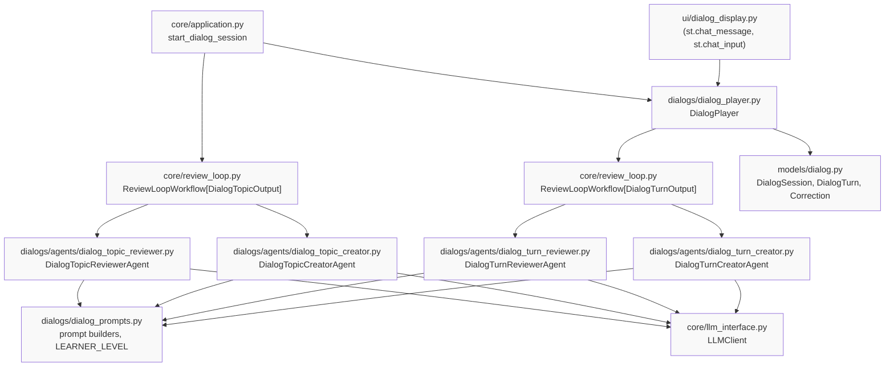
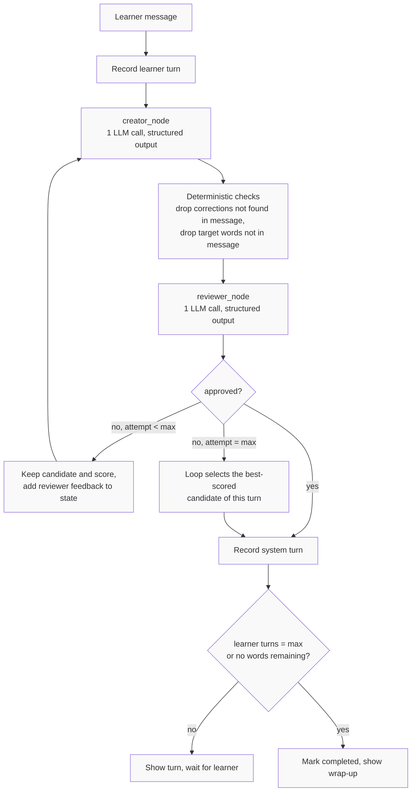

# Dialog Practice Specification

**Status**: Review
**Priority**: High
**Complexity**: High
**Intent**: `../intent/dialog-practice-intent.md`

---

## Overview

### Summary
Dialog practice is a new practice type in which the learner and the system hold a short, open-form French conversation built around 3 to 5 vocabulary words extracted from the learner's page. The system speaks at A2-B1, steers the conversation toward the target words, and corrects the learner's mistakes in French, inside the conversation. Every system turn is produced by a creator agent and checked by a reviewer agent before it is shown.

### Motivation
The existing exercise types are closed questions with one expected answer. They train recognition, not production. An A2-B1 learner needs to *use* new words in sentences of their own and be corrected while doing so. See the intent document for the full problem statement and the decisions this spec implements.

### Decisions inherited from the intent
These are fixed and are not re-opened here:

| # | Decision |
|---|----------|
| 1 | Corrections and their explanation are in French (immersion), at A2-B1 level |
| 2 | The most important error is corrected explicitly; other errors are recast in the reply |
| 3 | A dialog has 5 to 8 learner turns, or ends earlier once all target words were used |
| 4 | 3 to 5 target words per dialog, from the top of the extracted list |
| 5 | Off-topic, English or one-word learner messages are accepted, answered briefly, and steered back to a target word |
| 6 | Every dialog turn goes through the creator/reviewer workflow before display |
| 7 | Per dialog, record the target words used correctly and the corrections made |
| 8 | Level is fixed at A2-B1, not a learner-facing setting |
| 9 | The dialog topic is fictional, invented by the model from the target words alone so that they come up naturally, and reviewed like a turn. No page text is used for it |
| 10 | The creator → reviewer → improve → best-candidate loop is implemented once as a generic, reusable component, because the application will need it for every kind of generated content |

---

## Requirements

### Functional Requirements
- [ ] **FR1 Dialog creation**: From the extracted vocabulary, build a dialog session with N target words (N from config, default 4) and a **dialog topic**: a fictional everyday situation, 2 to 4 French sentences at A2-B1, invented by the model from the target words alone so that each of them can be used naturally in conversation. One topic per dialog. No text from the page is used, stored or sent to the LLM; only the extracted words are.
- [ ] **FR2 Opening turn**: The system opens the dialog in French with a short message that introduces the dialog topic and asks a question inviting one target word.
- [ ] **FR3 Learner turn**: The learner types free text. The message is stored as a learner turn.
- [ ] **FR4 System turn**: For each learner message the system produces one reply in French (2 to 4 short sentences, ending in a question unless the dialog is closing) that moves the conversation toward the remaining target words.
- [ ] **FR5 Error detection and correction**: Errors in the learner message (wrong word, gender, agreement, conjugation, word order, spelling that changes meaning) are detected. At most one is corrected explicitly, as `original`, `corrected`, and a French explanation of at most 20 words. Other errors are recast in the reply.
- [ ] **FR6 No false corrections**: A correct learner message produces no correction. A correction's `original` must occur in the learner message.
- [ ] **FR7 Target word tracking**: Target words the learner used correctly (any inflected form) are recorded on the learner turn and removed from the remaining set.
- [ ] **FR8 Steering**: The system reply uses or invites a remaining target word on every turn while any remain.
- [ ] **FR9 Off-topic handling**: English, one-word or off-topic learner messages get a brief French reply and a question that brings back a remaining target word. No correction is issued for a message written in English.
- [ ] **FR10 End condition**: The dialog ends after `DIALOG_MAX_LEARNER_TURNS` learner turns or when no target words remain. The final system turn closes the conversation without a question.
- [ ] **FR11 Wrap-up**: After the final turn a French wrap-up lists the target words used, the target words not used, and every correction made.
- [ ] **FR12 Review before display**: Every system turn (opening, replies, closing) passes through the creator/reviewer workflow. When the reviewer rejects a candidate, the creator analyses the reviewer feedback and produces an improved candidate, which is reviewed again. The number of attempts per turn is limited by `DIALOG_MAX_TURN_ATTEMPTS`. When the limit is reached without approval, the best variant among the candidates the creator produced is selected using the reviewer scores, and that variant is shown. The dialog topic goes through the same loop with the same limit and selection rule. The loop is one generic component shared by turns and topics (decision 10).
- [ ] **FR13 Level**: All system text, including the dialog topic, is A2-B1: short sentences, high-frequency vocabulary, present, passé composé and futur proche as default tenses. Target words are exempt.
- [ ] **FR14 Practice selection**: After vocabulary extraction the learner chooses between Exercises and Dialog practice. A new dialog can be started after one ends, using the next target words.
- [ ] **FR15 Progress record**: Each completed dialog is kept in the Streamlit session with its words used, words not used and corrections, for the Review phase.
- [ ] **FR16 Switch**: Dialog practice can be disabled through configuration without touching exercise generation.

### Non-Functional Requirements
- [ ] **Latency**: A system turn (creator + reviewer, no retry) is shown within 10 s at p50 on `mistral-small` with the default rate limit. A spinner is shown in the chat while waiting.
- [ ] **Cost**: A system turn makes 2 LLM calls (creator, reviewer) per attempt; picking the best variant needs no call. A full dialog makes at most 2 × `DIALOG_MAX_TURN_ATTEMPTS` × (`DIALOG_MAX_LEARNER_TURNS` + 1) calls, 28 with the defaults, plus at most 2 × `DIALOG_MAX_TURN_ATTEMPTS` calls per dialog for the topic, 32 in total with the defaults.
- [ ] **Reliability**: An LLM failure on a turn is reported in the chat in French with an invitation to retry the same message. The dialog state is not corrupted.
- [ ] **Testability**: The whole dialog runs offline with `MockLLMClient`. Prompts are built by pure functions that can be unit-tested.
- [ ] **Security**: Learner text is passed to the LLM only inside the prompt. No learner text is logged at INFO level.
- [ ] **Copyright**: Dialog practice never sends page text to the LLM and never stores it. The only input taken from the page is the extracted vocabulary list. The topic and every dialog turn are invented by the model, so nothing from the page can be reproduced.
- [ ] **Usability**: Corrections are visually distinct from the reply but inside the same system bubble, so the flow of the conversation is preserved.

### Constraints
- [ ] Use the existing `LLMClient` protocol, `MistralLLMClient`, its rate limiter and `response_schema` structured output. No new LLM provider.
- [ ] No new runtime dependencies. Streamlit's `st.chat_message` and `st.chat_input` are sufficient for the UI.
- [ ] Implement the creator/reviewer loop once as a generic `ReviewLoopWorkflow` in `core/`, built on LangGraph for consistency with `ExerciseWorkflow`. Turn and topic agents are plugged into it; neither gets a loop of its own.
- [ ] Keep the three-phase flow. Dialog practice is one more option in Practice and does not change exercise generation.
- [ ] French only, text only, single user, local execution (mission scope).
- [ ] Level string is a constant in the prompt module, not a setting (decision 8).
- [ ] Structured outputs use pydantic models with `extra="forbid"`, as `LLMEvaluationOutput` does, because Mistral strict mode requires `additionalProperties: false`.

---

## User Stories

- **As a** French learner at A2-B1
  **I want to** talk with the system in a simple invented situation built around the words from the page I just read
  **So that** I use the new words in my own sentences instead of only recognising them

- **As a** French learner
  **I want to** be corrected briefly and in French when I make a mistake
  **So that** I learn the right form without leaving the conversation or switching language

- **As a** French learner
  **I want to** be nudged toward the words I have not used yet
  **So that** each dialog covers the vocabulary from the page

- **As a** French learner
  **I want to** see at the end which words I used and what was corrected
  **So that** I know what to review

- **As a** French learner who gets stuck
  **I want to** be able to answer in English or with one word without being penalised
  **So that** the conversation continues and I can try again in French

- **As a** developer
  **I want to** run a full dialog with the mock LLM
  **So that** unit tests do not need an API key

---

## Technical Design

### Architecture



### Per-turn workflow



The boxes from creator to selection are the generic `ReviewLoopWorkflow`; only the creator, the reviewer and the deterministic checks are dialog-specific. The opening turn runs the same loop with an empty learner message and `is_opening=True`. The closing turn runs it with `is_closing=True`, which tells the creator to end without a question.

### Components

| Component | Responsibility | Dependencies |
|-----------|---------------|--------------|
| `models/dialog.py` | Dataclasses `Correction`, `DialogTurn`, `DialogSession`, `DialogSummary`, enum `DialogRole`, `DialogStatus` | stdlib |
| `dialogs/dialog_prompts.py` | `LEARNER_LEVEL` constant, `build_creator_prompt(...)`, `build_reviewer_prompt(...)`, `build_wrap_up(session)`; pure functions | `models/dialog.py` |
| `core/review_loop.py` | `ReviewLoopWorkflow[C]`: generic LangGraph loop creator → reviewer → improve on feedback → best-candidate selection; `Creator[C]` and `Reviewer[C]` protocols; `ReviewVerdict`; `ReviewLoopResult[C]` | LangGraph, pydantic |
| `dialogs/agents/dialog_turn_creator.py` | `DialogTurnCreatorAgent`, a `Creator[DialogTurnOutput]`: produces a candidate turn with structured output, improves it from feedback | `LLMClient`, `dialog_prompts`, pydantic |
| `dialogs/agents/dialog_turn_reviewer.py` | `DialogTurnReviewerAgent`, a `Reviewer[DialogTurnOutput]`: deterministic checks, then LLM review returning a `ReviewVerdict` | `LLMClient`, `dialog_prompts`, pydantic |
| `dialogs/dialog_player.py` | `DialogPlayer`: owns a `DialogSession`, exposes `open()`, `submit_learner_message()`, `is_complete`, `summary()`; builds the turn context and maps the loop result to a `DialogTurn` | `ReviewLoopWorkflow`, `models/dialog.py` |
| `dialogs/agents/dialog_topic_creator.py` | `DialogTopicCreatorAgent`, a `Creator[DialogTopicOutput]`: candidate fictional topic from the target words | `LLMClient`, `dialog_prompts`, pydantic |
| `dialogs/agents/dialog_topic_reviewer.py` | `DialogTopicReviewerAgent`, a `Reviewer[DialogTopicOutput]`: checks French, level, fictional everyday situation, fit with each target word | `LLMClient`, `dialog_prompts`, pydantic |
| `core/application.py` | Builds the two loops from the agents; `start_dialog_session(vocabulary_words)` selects target words, runs the topic loop, returns a `DialogPlayer` | `ReviewLoopWorkflow`, topic agents, `DialogPlayer`, `config` |
| `ui/dialog_display.py` | `display_dialog(player)`: renders history, corrections, spinner, wrap-up, "new dialog" button | Streamlit, `DialogPlayer` |
| `app.py` | Practice-mode selector; keeps the dialog player, practised words and completed dialogs in `st.session_state` | UI modules |
| `core/mock_llm.py` | Returns valid JSON for creator and reviewer prompts | none |
| `config.py` | `dialog_practice_enabled`, `dialog_words_per_dialog`, `dialog_max_learner_turns`, `dialog_max_turn_attempts` | pydantic-settings |

### Data Flow

1. **Input**: extracted vocabulary (ordered list). `start_dialog_session` takes the first `dialog_words_per_dialog` words not yet used by an earlier dialog in this Streamlit session, runs the topic workflow on them, and stores the approved fictional topic on the session. No page text is involved.
2. **Opening**: `DialogPlayer.open()` runs the turn loop with no learner message. The approved turn is appended as the first system turn.
3. **Turn loop**: `submit_learner_message(text)` appends a learner turn, runs the turn loop with the full history, applies the returned `target_words_used` to the learner turn, appends the system turn, and updates the remaining words.
4. **End**: when the learner turn count reaches the max, or the remaining set is empty, the turn loop is run with `is_closing=True`. The session status becomes `COMPLETED` and `summary()` returns a `DialogSummary`.
5. **Output**: the `DialogSession` (all turns, corrections, words used) is appended to `st.session_state.completed_dialogs` for the Review phase.

### Prompt design

Prompts are English instructions to the model; all learner-facing text they produce is French.

**Creator prompt** (built by `build_creator_prompt`):

```
You are a friendly French conversation partner for a learner at level {LEARNER_LEVEL} (CEFR).
Topic of the conversation:
{dialog_topic}

Target words the learner should practise: {target_words}
Target words not used yet: {words_remaining}

Rules for your reply:
- Write in French only. Never use English.
- Level {LEARNER_LEVEL}: sentences of at most 15 words, common vocabulary, present tense,
  passé composé and futur proche. No subjunctive, no passé simple, no idioms. The target
  words are the only exception.
- 2 to 4 sentences. {ending_rule}
- Use one of the words not used yet, or ask a question that invites the learner to use it.
- If the learner wrote in English, answered with one word, or went off topic: reply briefly,
  do not correct, and ask a question that brings back a word not used yet.

Rules for corrections (field "corrections"):
- Look for errors in the learner's last message only: wrong word, gender, agreement,
  conjugation, word order, spelling that changes the meaning.
- If there are errors, put the single most important one in "corrections" with:
  "original" (copied exactly from the learner's message), "corrected", and "explanation"
  (French, at most 20 words, level {LEARNER_LEVEL}).
- Do not list other errors. Instead reuse their correct form naturally in your reply.
- If there are no errors, "corrections" is an empty list. Never invent an error.

Field "target_words_used": the target words the learner used correctly in the last
message, in any inflected form. Empty list if none.

Conversation so far:
{history}

Learner's last message: "{learner_message}"
{reviewer_feedback_block}
```

`ending_rule` is "End with one question." for normal turns, "Start the conversation with a greeting and one question." for the opening turn, and "Close the conversation warmly. Do not ask a question." for the closing turn. `reviewer_feedback_block` is empty on the first attempt. On later attempts it reads "A reviewer rejected your previous reply. Previous reply: {previous_reply}. Previous corrections: {previous_corrections}. Reviewer feedback: {feedback}. Analyse the feedback, keep what was right, fix what was wrong, and produce an improved reply."

**Reviewer prompt** (built by `build_reviewer_prompt`):

```
You are reviewing one turn of a French conversation for a learner at level {LEARNER_LEVEL}.

Learner's last message: "{learner_message}"
Target words: {target_words}. Not used yet before this turn: {words_remaining}
Candidate reply: "{reply}"
Candidate corrections: {corrections_json}
Candidate target_words_used: {target_words_used}

Check, in this order:
1. Every correction is linguistically correct, the "original" really is an error, and
   the "corrected" form is right. A wrong or unnecessary correction means score 0.
2. The reply is French only.
3. The reply is at level {LEARNER_LEVEL}: short sentences, common words, no subjunctive
   or passé simple.
4. The reply {ending_check}.
5. The reply uses or invites a word not used yet, if any remain.
6. target_words_used only lists target words the learner really used correctly.

Respond with approved (true only if score >= 70 and check 1 passed), score (0-100)
and feedback (English, one or two sentences naming what to fix).
```

`ending_check` is "ends with a question" for normal and opening turns and "closes the conversation without a question" for the closing turn.

**Topic creator prompt** (built by `build_topic_creator_prompt`, `temperature=0.7`, `max_tokens=250`):

```
You prepare the topic of a short French conversation for a learner at level {LEARNER_LEVEL} (CEFR).
The conversation must let the learner use these target words: {target_words}

Invent a simple, fictional, everyday situation in which every target word comes up
naturally, and describe it as 2 to 4 sentences in French that a conversation partner
can use to open and steer the conversation. Address the learner as "tu".
- The situation is fictional: no real people, real organisations, real places in the
  news, or real current events.
- Prefer situations from daily life: family, home, school, work, shopping, travel,
  weather, holidays, food, health, hobbies.
- Level {LEARNER_LEVEL}: sentences of at most 15 words, common everyday vocabulary,
  present tense and passé composé only. No subjunctive, no passé simple, no idioms,
  no technical or rare words except the target words.
{reviewer_feedback_block}
```

Output schema `DialogTopicOutput`: `topic: str`. `reviewer_feedback_block` follows the same pattern as for turns.

**Topic reviewer prompt** (built by `build_topic_reviewer_prompt`, `temperature=0.3`, `max_tokens=200`):

```
You are reviewing the topic of a French conversation for a learner at level {LEARNER_LEVEL}.
Target words: {target_words}
Candidate topic: "{topic}"

Check, in this order:
1. The topic is French only.
2. The topic is a fictional everyday situation: no real people, organisations, places
   in the news, or current events.
3. The topic is at level {LEARNER_LEVEL}: at most 15 words per sentence, common words,
   no subjunctive or passé simple, no rare or technical words except the target words.
4. Every target word has a natural place in a conversation on this topic.
5. The topic has 2 to 4 sentences.

Respond with approved (true only if score >= 70), score (0-100) and feedback
(English, one or two sentences naming what to fix).
```

The reviewer output is the shared `ReviewVerdict`. The topic runs through the same `ReviewLoopWorkflow` as turns: reject → creator improves from feedback → review, up to `DIALOG_MAX_TURN_ATTEMPTS`, then best-scored candidate. If every call fails, the topic is "" and the turn creator prompt line for the topic reads "Topic: choose a simple everyday situation in which the target words fit naturally."

**Deterministic checks** (run in the reviewer node before the LLM call, mirroring the trivial checks of `ExerciseReviewerAgent`):

| Check | Action |
|-------|--------|
| Reply is empty or has more than 6 sentences | Reject with feedback, no LLM call |
| `correction.original` is not a case-insensitive substring of the learner message | Drop that correction |
| Word in `target_words_used` is not a target word, or none of its first 5 characters match a token in the learner message | Drop that word |
| More than one correction | Keep the first, drop the rest |
| Opening or closing turn has corrections | Drop all corrections |

**Wrap-up** (`build_wrap_up`, no LLM call, fixed French template):

```
Bravo, la conversation est terminée !
Mots utilisés : {words_used}
Mots à revoir : {words_not_used}
Corrections :
- « {original} » → « {corrected} » : {explanation}
```

### Feedback loop and best-candidate selection

| Situation | Behaviour |
|-----------|-----------|
| Reviewer approves | Turn is shown |
| Reviewer rejects, attempts < `dialog_max_turn_attempts` | The candidate and its score are kept in state. The creator runs again with the previous candidate and the reviewer feedback in the prompt and returns an improved candidate |
| Reviewer rejects on the last attempt | The creator selects the candidate with the highest reviewer score among all candidates of this turn (ties go to the latest). No LLM call. The turn is shown with `selected_from_attempts` set to the number of attempts and a warning is logged |
| LLM raises on any call | The learner turn is removed from the session, an error line in French is shown ("Désolé, il y a eu un problème. Réessaie ton message.") and the learner can resend |

### UI layout

```
French Language Learner Assistant
[URL input] [Extract Vocabulary and Create Exercises]

Vocabulary: ...

Practice mode:  ( ) Exercises   (•) Dialog

┌ Dialog 1 · words: canicule, sécheresse, prévenir, chaleur ─────────┐
│ 🤖  Bonjour ! Cette semaine il fait très chaud en France.          │
│     Est-ce qu'il y a une canicule chez toi ?                       │
│ 🧑  Oui, il fait beaucoup de chaleur. Le gouvernement prévient     │
│     les gens pour boire de l'eau.                                  │
│ 🤖  ✏️ « prévient les gens pour boire » → « prévient les gens de   │
│        boire » : après « prévenir quelqu'un », on utilise « de ».  │
│     Presque ! Et il y a de la sécheresse dans ta région ?          │
│ Turn 1/6 · words left: sécheresse                                  │
└────────────────────────────────────────────────────────────────────┘
[Écris ta réponse en français…                                      ]
```

When the dialog completes, the wrap-up is shown as a final system message and a button "Nouveau dialogue" starts the next dialog with the next target words. If no words remain, the button is replaced by a message saying all words from the page were practised.

---

## API/Interfaces

### Public Classes and Functions

```python
# dialogs/dialog_player.py
class DialogPlayer:
    def __init__(self, session: DialogSession, turn_loop: ReviewLoopWorkflow[DialogTurnOutput]) -> None: ...

    def open(self) -> DialogTurn:
        """Run the opening system turn. Raises DialogTurnError on LLM failure."""

    def submit_learner_message(self, text: str) -> DialogTurn:
        """Record the learner message, run the turn loop, return the system turn.
        Raises ValueError if the dialog is complete or text is blank.
        Raises DialogTurnError on LLM failure; the learner turn is not kept."""

    @property
    def is_complete(self) -> bool: ...

    def summary(self) -> DialogSummary:
        """Words used, words not used, corrections. Valid at any time."""


# core/application.py (addition)
def start_dialog_session(
    self, vocabulary_words: list[str], dialog_topic: str = ""
) -> DialogPlayer:
    """Select the first `dialog_words_per_dialog` words and return a ready DialogPlayer.
    The caller passes words not yet practised in this session."""


def create_dialog_topic(self, target_words: list[str]) -> str:
    """Run the topic loop. Returns a fictional situation of 2 to 4
    French sentences at A2-B1 built around the target words, or "" if the LLM fails.
    Called by start_dialog_session."""


# core/review_loop.py  (generic, reusable by any generated content)
C = TypeVar("C")


class ReviewVerdict(BaseModel):
    """Reviewer output. Also the JSON schema handed to LLM reviewers."""
    model_config = ConfigDict(extra="forbid")
    approved: bool
    score: int = Field(..., ge=0, le=100)
    feedback: str


class Creator(Protocol[C]):
    def create(self, context: Any, previous: C | None, feedback: str | None) -> C:
        """First attempt: previous and feedback are None. Later attempts: improve
        `previous` using the reviewer `feedback`. Raises on LLM failure."""


class Reviewer(Protocol[C]):
    def review(self, context: Any, candidate: C) -> ReviewVerdict:
        """May run deterministic checks first and skip the LLM on a hard failure."""


@dataclass
class ReviewLoopResult(Generic[C]):
    candidate: C
    verdict: ReviewVerdict
    attempts: int
    approved: bool                              # False when selected after exhaustion
    candidates: list[tuple[C, ReviewVerdict]]   # every attempt, in order


class ReviewLoopWorkflow(Generic[C]):
    def __init__(self, creator: Creator[C], reviewer: Reviewer[C], max_attempts: int = 2) -> None: ...

    def run(self, context: Any) -> ReviewLoopResult[C]:
        """LangGraph StateGraph: creator → reviewer → (approved → END |
        rejected and attempt < max_attempts → creator | else select_best → END)."""

    @staticmethod
    def select_best(candidates: list[tuple[C, ReviewVerdict]]) -> tuple[C, ReviewVerdict]:
        """Highest reviewer score wins; ties go to the latest candidate. No LLM call."""


# dialogs/agents/dialog_turn_creator.py
@dataclass
class DialogTurnContext:
    session: DialogSession
    learner_message: str | None      # None means opening turn
    is_closing: bool


class DialogTurnCreatorAgent:        # implements Creator[DialogTurnOutput]
    def __init__(self, llm_client: LLMClient) -> None: ...
    def create(self, context: DialogTurnContext, previous: DialogTurnOutput | None,
               feedback: str | None) -> DialogTurnOutput: ...


# dialogs/agents/dialog_turn_reviewer.py
class DialogTurnReviewerAgent:       # implements Reviewer[DialogTurnOutput]
    def __init__(self, llm_client: LLMClient) -> None: ...
    def review(self, context: DialogTurnContext, candidate: DialogTurnOutput) -> ReviewVerdict: ...


# dialogs/agents/dialog_topic_creator.py / dialog_topic_reviewer.py
# Same shape with context `list[str]` (target words) and candidate `DialogTopicOutput`.


# dialogs/dialog_prompts.py
LEARNER_LEVEL = "A2-B1"

def build_creator_prompt(
    session: DialogSession,
    learner_message: str | None,
    is_closing: bool,
    reviewer_feedback: str | None = None,
) -> str: ...

def build_reviewer_prompt(
    session: DialogSession,
    learner_message: str | None,
    candidate: DialogTurnOutput,
    is_closing: bool,
) -> str: ...

def build_wrap_up(session: DialogSession) -> str: ...

def build_topic_creator_prompt(
    target_words: list[str], reviewer_feedback: str | None = None
) -> str: ...

def build_topic_reviewer_prompt(
    target_words: list[str], candidate: DialogTopicOutput
) -> str: ...


# ui/dialog_display.py
def display_dialog(player: DialogPlayer) -> bool:
    """Render the dialog. Returns True when the dialog just completed."""
```

### Data Models

```python
# models/dialog.py
from dataclasses import dataclass, field
from datetime import datetime
from enum import Enum


class DialogRole(Enum):
    SYSTEM = "system"
    LEARNER = "learner"


class DialogStatus(Enum):
    IN_PROGRESS = "in_progress"
    COMPLETED = "completed"


@dataclass
class Correction:
    original: str       # exact substring of the learner message
    corrected: str
    explanation: str    # French, at most 20 words


@dataclass
class DialogTurn:
    role: DialogRole
    text: str
    corrections: list[Correction] = field(default_factory=list)   # system turns only
    target_words_used: list[str] = field(default_factory=list)    # learner turns only
    review_score: int | None = None                               # system turns only
    selected_from_attempts: int = 1                               # >1 means best-of selection


@dataclass
class DialogSession:
    dialog_id: str
    target_words: list[str]
    dialog_topic: str           # fictional, model-written, reviewed
    max_learner_turns: int
    turns: list[DialogTurn] = field(default_factory=list)
    status: DialogStatus = DialogStatus.IN_PROGRESS
    start_time: datetime = field(default_factory=datetime.now)
    end_time: datetime | None = None

    @property
    def learner_turn_count(self) -> int: ...
    @property
    def words_used(self) -> list[str]: ...        # order of first use
    @property
    def words_remaining(self) -> list[str]: ...


@dataclass
class DialogSummary:
    words_used: list[str]
    words_not_used: list[str]
    corrections: list[Correction]
    learner_turns: int
```

Structured LLM outputs (pydantic, in the agent modules):

```python
class CorrectionOutput(BaseModel):
    model_config = ConfigDict(extra="forbid")
    original: str
    corrected: str
    explanation: str


class DialogTurnOutput(BaseModel):
    model_config = ConfigDict(extra="forbid")
    reply: str
    corrections: list[CorrectionOutput]
    target_words_used: list[str]


class DialogTopicOutput(BaseModel):
    model_config = ConfigDict(extra="forbid")
    topic: str


# Reviewer output for both turns and topics: `ReviewVerdict` from core/review_loop.py
```

Generic loop state (in `core/review_loop.py`, not dialog-specific):

```python
class ReviewLoopState(TypedDict, Generic[C]):
    context: Any
    candidate: C | None
    verdict: ReviewVerdict | None
    candidates: list[tuple[C, ReviewVerdict]]   # all attempts of this run
    feedback: str | None
    attempt: int
    max_attempts: int
```

### Configuration

| Variable | Type | Required | Default | Description |
|----------|------|----------|---------|-------------|
| `DIALOG_PRACTICE_ENABLED` | bool | No | true | Show the Dialog option in practice mode |
| `DIALOG_WORDS_PER_DIALOG` | int | No | 4 | Target words per dialog (decision 4: 3 to 5) |
| `DIALOG_MAX_LEARNER_TURNS` | int | No | 6 | Learner turns before the closing turn (decision 3: 5 to 8) |
| `DIALOG_MAX_TURN_ATTEMPTS` | int | No | 2 | Creator attempts per turn before the best-scored candidate is selected |

The level is not configurable (decision 8). It is the constant `LEARNER_LEVEL = "A2-B1"` in `dialogs/dialog_prompts.py`.

Note on `EXERCISE_TYPES`: the intent suggested switching dialog practice like the other exercise types. Adding a `dialog` value to `ExerciseType` would make `ExerciseCreatorAgent` try to generate it and fall back to fill-in-the-blank, so a separate boolean is used instead.

---

## Implementation Plan

### Steps
- [ ] **Step 1: Models and configuration**
  - [ ] Add `models/dialog.py` with the dataclasses and enums above
  - [ ] Add the four settings to `config.py` and document them in `INSTRUCTIONS.md` and `specs/tech-stack.md`
  - [ ] Unit tests for `DialogSession` properties (`learner_turn_count`, `words_used`, `words_remaining`)
- [ ] **Step 2: Prompts and creator agent**
  - [ ] Add `dialogs/dialog_prompts.py` with `LEARNER_LEVEL`, the turn builders, the topic builders and `build_wrap_up`
  - [ ] Add `dialogs/agents/dialog_turn_creator.py` with `DialogTurnOutput` and the creator node (one `generate` call with `response_schema`, `temperature=0.7`, `max_tokens=300`)
  - [ ] Unit tests: prompt contains level, target words, remaining words, history, ending rule per turn kind; creator parses valid JSON and raises `DialogTurnError` on invalid JSON
- [ ] **Step 3: Generic review loop, reviewer agents**
  - [ ] Add `core/review_loop.py`: `ReviewVerdict`, `Creator` and `Reviewer` protocols, `ReviewLoopResult`, `ReviewLoopWorkflow` as a LangGraph StateGraph with a conditional edge back to the creator while rejected and `attempt < max_attempts`, then `select_best`
  - [ ] Unit tests for the loop with stub creator and reviewer (no LLM): approve on first attempt; reject then approve, with `previous` and `feedback` passed to the second `create`; all attempts rejected then highest-scored candidate returned with `approved=False`; ties go to the latest; creator exception propagates
  - [ ] Add `dialogs/agents/dialog_turn_reviewer.py` with the deterministic checks and the LLM review (`temperature=0.3`, `max_tokens=200`)
  - [ ] Add `dialogs/agents/dialog_topic_creator.py` and `dialog_topic_reviewer.py`; unit tests with `MockLLMClient` for each agent, plus one end-to-end topic loop test that returns "" when the LLM raises
- [ ] **Step 4: Player and application wiring**
  - [ ] Add `dialogs/dialog_player.py`
  - [ ] Add `start_dialog_session` to `LanguageLearnerApplication`
  - [ ] Unit tests: full dialog with `MockLLMClient`, end by turn count, end by all words used, blank message rejected, LLM failure leaves session unchanged
- [ ] **Step 5: Mock LLM**
  - [ ] Extend `MockLLMClient.generate` to recognise the topic creator prompt (marker "prepare the topic"), the topic reviewer prompt (marker "reviewing the topic"), the turn creator prompt (marker "French conversation partner") and the turn reviewer prompt (marker "reviewing one turn") and return valid JSON for each; make the reviewer verdict overridable via the existing `responses` dict so tests can force a rejection
- [ ] **Step 6: UI**
  - [ ] Add `ui/dialog_display.py` using `st.chat_message`, `st.chat_input`, `st.spinner`
  - [ ] In `app.py`: add the practice-mode radio; keep `st.session_state.dialog_player`, `st.session_state.completed_dialogs` and `st.session_state.dialog_words_practised`
  - [ ] Test in the style of `tests/test_streamlit_display.py`: a full dialog produces non-empty French turns and a summary
- [ ] **Step 7: Integration and manual testing**
  - [ ] Integration test with the real Mistral client (see Testing Strategy)
  - [ ] Manual test script below
- [ ] **Step 8: Documentation**
  - [ ] Add dialog practice to the In Scope list of `specs/mission.md` and mark roadmap Feature Question 4 as decided
  - [ ] Add a note to `specs/feat-ui-review-phase-spec.md` that completed dialogs are available for display
  - [ ] Update `README.md` usage section

---

## Acceptance Criteria

### Must Have
- [ ] AC1: With the mock LLM, a dialog with 4 target words and max 6 learner turns runs from opening to wrap-up with no API key.
- [ ] AC2: Every system turn shown to the learner has passed the reviewer, or is the best-scored candidate of an exhausted attempt loop, with `selected_from_attempts` > 1 and a logged warning.
- [ ] AC3: With the real client, the message "Le gouvernement prévient les gens pour boire de l'eau" during a dialog whose target words include *prévenir* produces exactly one correction whose `corrected` contains "de boire" and whose `explanation` is French.
- [ ] AC4: With the real client, a correct learner message ("Il n'y a pas de pluie depuis deux mois.") produces no correction in at least 4 of 5 runs.
- [ ] AC5: A learner message in English produces a French reply, no correction, and a question.
- [ ] AC6: The dialog ends after `DIALOG_MAX_LEARNER_TURNS` learner turns, and earlier when all target words were used.
- [ ] AC7: The wrap-up lists words used, words not used and all corrections, in French.
- [ ] AC8: The Exercises path is unchanged: all existing tests pass.
- [ ] AC9: `DIALOG_PRACTICE_ENABLED=false` hides the practice-mode selector and the app behaves as before.
- [ ] AC10: `ruff check` and `ruff format --check` pass.

### Should Have
- [ ] AC11: p50 system-turn latency under 10 s with `mistral-small` (measured manually over one dialog).
- [ ] AC12: System replies contain no English words in 10 of 10 turns of a manual dialog.
- [ ] AC13: The dialog topic for the words of a manually chosen page is in French, describes a fictional everyday situation, has 2 to 4 sentences of at most 15 words each, uses no subjunctive or passé simple, and gives each target word a natural place in the conversation.

### Test Cases
- [ ] TC1 `DialogSession.words_remaining` shrinks as learner turns record `target_words_used`, and never contains a word twice.
- [ ] TC2 `build_creator_prompt` for the opening turn contains the greeting rule and no learner message; for the closing turn contains the closing rule.
- [ ] TC3 Creator node raises `DialogTurnError` when the LLM returns non-JSON.
- [ ] TC4 Reviewer drops a correction whose `original` is not in the learner message.
- [ ] TC5 Reviewer keeps only the first of two corrections.
- [ ] TC6 Reviewer drops all corrections on the opening turn.
- [ ] TC7 `ReviewLoopWorkflow` returns the candidate on approval with `attempts=1` and `approved=True`; the player sets `review_score` from the verdict.
- [ ] TC8 `ReviewLoopWorkflow`, on rejection, calls `create` again with the previous candidate and the feedback, and returns the second candidate when approved with `attempts=2`.
- [ ] TC9 `ReviewLoopWorkflow`, after `max_attempts` rejections, returns the candidate with the highest reviewer score (not necessarily the last) with `approved=False`; the player sets `selected_from_attempts` to `attempts`.
- [ ] TC10 Player refuses a blank message and a message after completion.
- [ ] TC11 Player leaves the session unchanged when the turn loop raises.
- [ ] TC12 `start_dialog_session` takes exactly `dialog_words_per_dialog` words and fewer when fewer remain.
- [ ] TC13 `build_wrap_up` lists every correction and both word lists.
- [ ] TC15 `create_dialog_topic` returns "" on LLM error, and `build_creator_prompt` falls back to the generic topic line when the topic is empty.
- [ ] TC16 `build_topic_creator_prompt` contains the level constant, every target word, the sentence-length limit and the fictional-situation rule; `build_topic_reviewer_prompt` contains every target word and the fit check.
- [ ] TC17 Topic loop end to end with `MockLLMClient`: approved topic returned; "" returned when the LLM raises.
- [ ] TC18 Integration: the topic for 4 fixed target words has 2 to 4 sentences, none longer than 15 words, and the reviewer approves it.
- [ ] TC14 Integration: AC3, AC4, AC5 against Mistral, marked `integration`.

---

## Dependencies

### Internal Dependencies
- [ ] Vocabulary extraction: `web/vocabulary_extractor.py` provides the ordered word list (`specs/feat-vocabulary-extraction-spec.md`). Its text and data mining opt-out (Step 5 of that spec) governs the fetch and applies to all practice types alike; dialog practice adds no page-text use of its own
- [ ] LLM layer: `core/llm_interface.py`, `core/llm_client.py` (structured output, rate limiter), `core/mock_llm.py`
- [ ] Configuration: `config.py`
- [ ] Practice UI: `app.py` (`specs/feat-ui-practice-phase-spec.md`)
- [ ] Review phase: consumes `completed_dialogs` (`specs/feat-ui-review-phase-spec.md`)
- [ ] Exercise generation spec, Stage 3 (external prompts): when `PromptLoader` lands, the builders in `dialog_prompts.py` should read their templates from `prompts/dialog/`. Not a blocker.

### External Dependencies
- [ ] `streamlit` 1.55.0: `st.chat_message`, `st.chat_input` (available since 1.24)
- [ ] `langgraph`: `StateGraph`, conditional edges
- [ ] `pydantic`: structured output models
- [ ] `mistralai`: `json_schema` response format (already used by `AnswerEvaluator`)

### Blocking Issues
- None.

---

## Testing Strategy

### Unit Tests
- [ ] `tests/test_dialog_models.py`: TC1
- [ ] `tests/test_dialog_prompts.py`: TC2, TC13
- [ ] `tests/test_dialog_turn_creator.py`: TC3, JSON parsing
- [ ] `tests/test_dialog_turn_reviewer.py`: TC4, TC5, TC6
- [ ] `tests/test_review_loop.py`: TC7, TC8, TC9 with stub creator and reviewer, no LLM
- [ ] `tests/test_dialog_player.py`: TC10, TC11, TC12, full mock dialog (AC1)

### Integration Tests
- [ ] `tests/integration/test_dialog_practice_integration.py` using the `real_llm_client` fixture: one dialog of 3 learner turns with the messages from AC3, AC4 and AC5; assert correction presence/absence, French reply (no token from a small English stop-word list: "the", "is", "you", "and", "to"), reply ends with "?" on non-closing turns.

### Manual Testing
- [ ] Extract vocabulary from a French news article and choose Dialog; check the topic is a fictional everyday situation in French at A2-B1 (short sentences, everyday words, no subjunctive or passé simple) in which the target words fit naturally, and that it does not retell the article. Then and complete one dialog with deliberate errors (gender, agreement, missing "de"); check each correction is right and in French.
- [ ] Answer one turn in English and one with a single word; check the reply stays in French and asks a question with a remaining word.
- [ ] Use all target words within 3 turns; check the dialog closes early with a wrap-up.
- [ ] Complete two dialogs from the same page; check the second uses different words.
- [ ] Set `DIALOG_PRACTICE_ENABLED=false`; check the selector is gone.
- [ ] Kill network mid-dialog; check the French error line appears and the message can be resent.

### Test Data
- Target words: `["canicule", "sécheresse", "prévenir", "chaleur"]`; dialog topic: two French sentences about a heat wave, written for the test (not taken from a page).
- Mock topic JSON: `{"topic": "Tu passes l'été chez ta grand-mère à la campagne. Il fait très chaud et il n'a pas plu depuis des semaines."}`
- Learner messages with known errors and their expected corrections:

| Learner message | Expected `corrected` contains |
|-----------------|-------------------------------|
| Le gouvernement prévient les gens pour boire de l'eau. | de boire |
| La chaleur est très fort. | forte |
| Je suis allé au marché et j'ai acheté des pomme. | pommes |

- Mock creator JSON: `{"reply": "Il fait chaud aujourd'hui. Est-ce qu'il y a une canicule chez toi ?", "corrections": [], "target_words_used": []}`
- Mock reviewer JSON: `{"approved": true, "score": 85, "feedback": "Fine."}`

---

## Risks & Mitigations

| Risk | Probability | Impact | Mitigation |
|------|-------------|--------|------------|
| Wrong or unnecessary correction shown to the learner | Medium | High | Reviewer check 1 scores 0 on any wrong correction, so such a candidate is never the best-scored one when any alternative exists; deterministic substring check |
| English leaks into system replies | Medium | Medium | Creator rule, reviewer check 2, integration assertion |
| Reply above A2-B1 | Medium | Medium | Explicit tense and sentence-length rules, reviewer check 3 |
| Dialog topic above A2-B1 or too far from the target words | Medium | Medium | Explicit level and fit rules in the creator prompt; reviewer checks 3 and 4; AC13 and TC18 |
| Mistral ignores or malforms the JSON schema | Low | High | Strict `json_schema` mode already proven in `AnswerEvaluator`; parse failure raises `DialogTurnError`, learner can resend |
| Latency of 2 to 3 calls per turn with 0.8 calls/s rate limit | High | Medium | Spinner in chat; dialogs are short; `max_tokens` kept small; measured in AC11 |
| Learner never uses target words, dialog drags | Medium | Low | Hard cap on learner turns; steering rule every turn |
| Inflected target words not recognised as used | Medium | Low | LLM reports `target_words_used`; deterministic check uses a 5-character prefix match |
| Streamlit rerun loses in-flight turn | Medium | Medium | Player stored in `st.session_state`; turn result appended before rerun; learner turn removed on failure |
| Mock LLM marker strings drift from real prompts | Low | Medium | Markers are constants imported from `dialog_prompts.py` by both the builders and the mock |
| Topic or dialog reproduces page content | Very low | Medium | Neither the topic agents nor the turn agents ever receive page text; only the word list |

---

## Alternatives Considered

Three options were generated, the simplest that meets the intent was chosen, then simplified.

### Option 1: Dialog as a new `ExerciseType`, each learner turn an `Exercise`
**Pros:**
- Reuses `ExercisePlayer`, `display_exercise`, `AnswerEvaluator` and the existing progress record

**Cons:**
- `Exercise` has one `correct_answer`; a dialog turn has none
- `ExercisePlayer` is a sequential list; a dialog needs history and a remaining-words set
- `ExerciseCreatorAgent` would have to special-case the type everywhere

**Decision:** Rejected. The fit is forced and every reused component would need conditionals.

### Option 2: Separate `dialogs` package with its own models, per-turn LangGraph workflow, and chat UI (chosen)
**Pros:**
- Clean models for turns, corrections and remaining words
- Reuses the LLM layer, config, rate limiter, structured output and the creator/reviewer pattern
- Exercises untouched (AC8)

**Cons:**
- New package and new UI module
- Progress record is a second structure next to `ExerciseSession`

**Decision:** Chosen. Simplifications applied after selection: the wrap-up is a fixed template instead of an LLM call; error detection is folded into the creator call instead of a separate detection call; the level is a constant; the topic is a fictional situation invented from the target words rather than a summary of the page, so no page text is sent to the LLM at all (copyright) and the topic can be tailored to the words.

### Option 3: Generic "practice activity" abstraction over both exercises and dialogs
**Pros:**
- One player, one progress record, one UI dispatcher

**Cons:**
- Refactors working exercise code for a second activity type that does not exist yet
- Larger diff, higher regression risk, slower to deliver

**Decision:** Rejected for v1. Can be revisited if a third practice type appears.

### Sub-decision: review the whole turn vs. only the corrections
Reviewing only the corrections would halve reviewer prompt size but leave level and language drift unchecked. Decision 6 in the intent asks for the whole turn to be reviewed, so the reviewer checks reply and corrections together in one call.

### Sub-decision: one generic review loop instead of one workflow per content type
Turns and topics need the same loop, and every future generated artefact in this application (exercises, hints, summaries) will need it too. Writing it once in `core/review_loop.py` behind `Creator` and `Reviewer` protocols keeps the dialog agents to prompt building and parsing, and lets the loop be tested without any LLM. `ExerciseWorkflow` is not migrated in this feature; that is a candidate refactor for the exercise-generation spec.

### Sub-decision: LangGraph vs. plain Python for the loop
A two-node graph with one conditional edge is small enough for plain Python. LangGraph was kept for consistency with `ExerciseWorkflow` and because the feedback-loop edge is exactly what conditional edges express. No extra dependency is added.

---

## Open Questions

1. Should the learner be able to ask for a hint ("Je ne sais pas") and get a target word suggested in a sentence? Not required by the intent. Recommendation: defer; decision 5 already makes the system offer a remaining word on weak answers.
2. Should the `completed_dialogs` record be persisted to disk with the exercise session once session persistence exists (roadmap open question 1)? Recommendation: yes, same mechanism, decided in that spec.
3. When Stage 3 of the exercise-generation spec (external prompts) lands, should the dialog prompts move to `prompts/dialog/*.md` in the same change? Recommendation: yes, as part of that stage.

---

## Estimation

### Complexity Assessment
- **Technical Complexity**: High (multi-turn state, four structured-output prompts, generic review loop, chat UI)
- **Risk Level**: Medium (correction quality depends on the model; mitigated by the reviewer)
- **Dependencies**: Low (all internal, nothing blocking)

---

## References

- [Intent: dialog practice](../intent/dialog-practice-intent.md)
- [Mission](mission.md), [Roadmap](roadmap.md) (Feature Question 4), [Tech Stack](tech-stack.md)
- [Exercise Generation Spec](feat-exercise-generation-spec.md) (creator/reviewer pattern, Stage 2 CEFR, Stage 3 external prompts)
- [Answer Evaluation Spec](feat-answer-evaluation-spec.md) (structured output precedent)
- [UI Practice Phase Spec](feat-ui-practice-phase-spec.md), [UI Review Phase Spec](feat-ui-review-phase-spec.md)
- [Streamlit chat elements](https://docs.streamlit.io/develop/api-reference/chat)
- [Mistral structured output](https://docs.mistral.ai/capabilities/structured-output/)
- [CEFR levels](https://www.coe.int/en/web/common-european-framework-reference-languages/level-descriptions)
