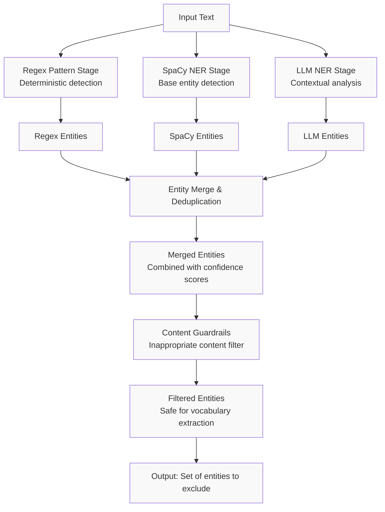
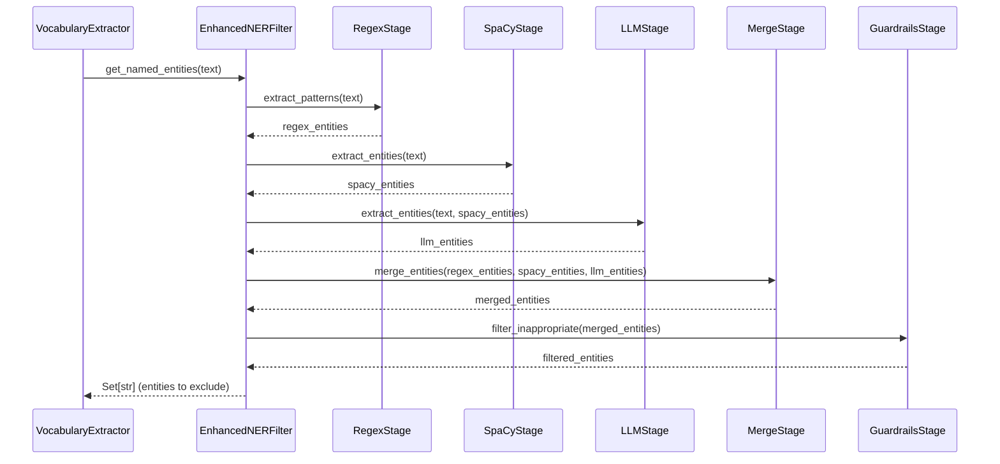

# Enhanced Named Entity Recognition and Guardrails Specification

**Status**: Draft
**Created**: 2026-04-19
**Last Updated**: 2026-04-19
**Priority**: High
**Complexity**: Medium

---

## Overview

### Summary
The Enhanced NER Pipeline implements a three-stage Named Entity Recognition system that combines regex pattern matching, spaCy's statistical models, and Mistral LLM's contextual understanding to improve entity detection accuracy. It also adds content guardrails to filter inappropriate content like insults, profanity, and harmful language.

### Motivation
The current NER implementation using spaCy alone has limitations:
- Misses domain-specific entities not in training data
- Struggles with ambiguous entity types
- Cannot detect inappropriate content that should be filtered
- Single model approach lacks validation
- Cannot reliably detect deterministic patterns like emails and URLs

The enhanced system addresses these by:
1. Using regex patterns for deterministic detection of emails, URLs, and phone numbers
2. Using spaCy for fast, reliable base entity detection
3. Using Mistral LLM for contextual analysis and domain-specific entities
4. Cross-validating results across all three stages
5. Adding guardrails to filter inappropriate content

This improves vocabulary quality and safety for language learners.

---

## Requirements

### Functional Requirements

- [ ] **SpaCy NER Stage**: Extract entities using existing spaCy models
- [ ] **LLM NER Stage**: Use Mistral LLM to identify entities with contextual understanding
- [ ] **Regex Pattern Stage**: Use regular expressions for deterministic entity detection (emails, URLs, phone numbers)
- [ ] **Entity Merge Stage**: Combine and deduplicate entities from all stages
- [ ] **Content Guardrails**: Filter inappropriate content (insults, profanity, hate speech)
- [ ] **Confidence Scoring**: Assign confidence scores to detected entities
- [ ] **Configurable Thresholds**: Allow tuning of confidence thresholds and filter sensitivity
- [ ] **Entity Type Classification**: Support PER, LOC, ORG, GPE, FAC, and custom entity types
- [ ] **Language Support**: Maintain support for French, English, German, Spanish
- [ ] **Error Handling**: Raise clear error if LLM is unavailable
- [ ] **Logging**: Debug and info logging for all major operations

### Non-Functional Requirements

- [ ] **Performance**: LLM calls must have configurable timeout (default: 30 seconds)
- [ ] **Security**: Never expose API keys in logs or error messages
- [ ] **Configurability**: All thresholds and settings via environment variables
- [ ] **Extensibility**: Easy to add new entity types or guardrail categories
- [ ] **Backward Compatibility**: Existing NERFilter interface must remain functional

### Constraints

- [ ] Must use existing spaCy models for base NER
- [ ] Must use existing Mistral AI client from `mistralai` SDK
- [ ] Must integrate with existing `NERFilter` class as enhanced version
- [ ] Must use existing configuration system (`AppSettings`)
- [ ] Must use existing logging infrastructure
- [ ] Must not break existing vocabulary extraction workflow
- [ ] Guardrails must be configurable (enable/disable, sensitivity levels)
- [ ] LLM calls must respect rate limits and budget constraints

---

## User Stories

- **As a** language learner
  **I want to** have vocabulary filtered for inappropriate content
  **So that** I don't encounter offensive words while studying

- **As a** language learner
  **I want to** accurate entity detection that understands context
  **So that** proper nouns are reliably filtered from my vocabulary lists

- **As a** developer
  **I want to** configurable NER system
  **So that** I can tune it for different languages and use cases

---

## Technical Design

### Architecture



### Main Workflow



### Components

| Component | Responsibility | Dependencies |
|-----------|---------------|--------------|
| `EnhancedNERFilter` | Main orchestrator for enhanced NER | `spacy`, `mistralai`, `RegexStage`, `SpaCyStage`, `LLMStage`, `MergeStage`, `GuardrailsStage` |
| `RegexStage` | Deterministic pattern matching (emails, URLs, phone numbers) | `re` |
| `SpaCyStage` | Base NER using spaCy models | `spacy` |
| `LLMStage` | Contextual NER using Mistral LLM | `mistralai`, `EnhancedNERPrompt` |
| `MergeStage` | Combine and deduplicate entities from all stages | None |
| `GuardrailsStage` | Filter inappropriate content | `ContentGuardrails` |
| `EnhancedNERPrompt` | LLM prompt for entity extraction | None |
| `ContentGuardrails` | Inappropriate content detection | `mistralai`, `GuardrailsPrompt` |
| `GuardrailsPrompt` | LLM prompt for content filtering | None |

### Guardrails Implementation

The content guardrails system protects language learners from inappropriate vocabulary by filtering out offensive, harmful, or unwanted content before it reaches the vocabulary list. Implementation uses a multi-layered approach:

**Layer 1: Static Blacklist**
- Predefined list of known inappropriate words per language
- Customizable via `GUARDRAILS_CUSTOM_BLACKLIST` environment variable
- Exact match and substring matching
- Case-insensitive comparison after normalization

**Layer 2: Category-Based LLM Detection**
- Uses Mistral LLM to classify text against categories:
  - `insults`: Personal attacks, derogatory terms
  - `profanity`: Swearing, vulgar language
  - `hate_speech`: Discriminatory content
  - `violence`: Threats, graphic descriptions
  - `sexual_content`: Explicit material
- Sensitivity levels control aggressiveness:
  - `low`: Only clear violations
  - `medium`: Common inappropriate content (default)
  - `high`: Aggressive filtering including borderline cases

**Layer 3: Contextual Analysis**
- LLM evaluates words in context, not just isolated
- Distinguishes between educational content (e.g., medical terms) and inappropriate usage
- Uses filtering prompt with examples and clear boundaries

**Workflow:**
1. Static blacklist check (fast, deterministic)
2. LLM category classification for remaining content
3. Context-aware validation for ambiguous cases
4. Return filtered set of inappropriate entities to exclude

**Prompt Structure:**
```
You are a content safety classifier for a language learning application.
Analyze the following text and identify any words or phrases that are:
- Insults or personal attacks
- Profanity or vulgar language
- Hate speech or discriminatory content
- Violent or threatening language
- Sexual or explicit content

Text: "{text}"

Respond with a JSON array of inappropriate words found, or an empty array if none.
Example: ["word1", "word2"]
```

**Performance Considerations:**
- Static blacklist runs synchronously (O(n) lookup)
- LLM guardrails run asynchronously with timeout
- Results cached per text fragment to avoid duplicate LLM calls
- Empty result on timeout or error (fail-open for availability)

---

## API/Interfaces

### Public Functions

```python
def get_named_entities(self, text: str) -> set[str]:
    """Extract named entities from text using multi-stage approach with guardrails.
    
    Args:
        text: Original text to process
        
    Returns:
        Set of named entity words to filter out (lowercase)
        
    Raises:
        None - returns empty set on complete failure
    """
    pass

def get_named_entities_detailed(self, text: str) -> list[EntityResult]:
    """Extract named entities with full details for debugging/analysis.
    
    Args:
        text: Original text to process
        
    Returns:
        List of EntityResult objects with text, label, confidence, source
        
    Raises:
        None
    """
    pass
```

### Data Models

```python
from dataclasses import dataclass, field
from enum import Enum
from typing import Literal


class EntityLabel(Enum):
    """Standard entity type labels."""
    PERSON = "PER"
    LOCATION = "LOC"
    ORGANIZATION = "ORG"
    GPE = "GPE"  # Countries, cities, states
    FACILITY = "FAC"
    CUSTOM = "CUSTOM"
    INAPPROPRIATE = "INAPPROPRIATE"
    EMAIL = "EMAIL"
    URL = "URL"
    PHONE = "PHONE"


class EntitySource(Enum):
    """Source of entity detection."""
    SPACY = "spacy"
    LLM = "llm"
    BOTH = "both"


@dataclass
class EntityResult:
    """Represents a detected entity with metadata."""
    text: str
    label: EntityLabel
    confidence: float  # 0.0 to 1.0
    source: EntitySource
    start_char: int = 0
    end_char: int = 0
    contexts: list[str] = field(default_factory=list)  # Surrounding text for debugging


@dataclass
class GuardrailsConfig:
    """Configuration for content guardrails."""
    enabled: bool = True
    sensitivity: Literal["low", "medium", "high"] = "medium"
    custom_blacklist: set[str] = field(default_factory=set)
    blacklist_categories: set[str] = field(default_factory=lambda: {
        "insults", "profanity", "hate_speech", "violence", "sexual_content"
    })


@dataclass
class NERConfig:
    """Configuration for enhanced NER."""
    use_llm: bool = True
    use_spacy: bool = True
    min_confidence: float = 0.5
    llm_timeout: int = 30
    merge_strategy: Literal["union", "intersection", "weighted"] = "weighted"
    entity_types: set[EntityLabel] = field(default_factory=lambda: {
        EntityLabel.PERSON, EntityLabel.LOCATION, EntityLabel.ORGANIZATION,
        EntityLabel.GPE, EntityLabel.FACILITY
    })
    guardrails: GuardrailsConfig = field(default_factory=GuardrailsConfig)
```

### Configuration

New or modified environment variables:

| Variable | Type | Required | Default | Description |
|----------|------|----------|---------|-------------|
| `NER_USE_LLM` | bool | No | True | Enable LLM stage for NER |
| `NER_MIN_CONFIDENCE` | float | No | 0.5 | Minimum confidence score for entity acceptance |
| `NER_LLM_TIMEOUT` | int | No | 30 | Timeout for LLM calls in seconds |
| `NER_MERGE_STRATEGY` | str | No | weighted | Strategy for merging spaCy and LLM results |
| `GUARDRAILS_ENABLED` | bool | No | True | Enable content guardrails |
| `GUARDRAILS_SENSITIVITY` | str | No | medium | Sensitivity level: low, medium, high |
| `GUARDRAILS_CUSTOM_BLACKLIST` | str | No | "" | Comma-separated words to always filter |

---

## Implementation Plan

### Steps

- [ ] **Step 1**: Create EnhancedNERFilter class extending/replacing NERFilter
  - [ ] Implement RegexStage for deterministic pattern matching (emails, URLs, phone numbers)
  - [ ] Implement SpaCyStage for base NER extraction
  - [ ] Implement LLMStage for contextual NER using Mistral
  - [ ] Implement MergeStage for combining results
  - [ ] Implement GuardrailsStage for content filtering


- [ ] **Step 2**: Create prompt templates
  - [ ] Create EnhancedNERPrompt for entity extraction
  - [ ] Create GuardrailsPrompt for inappropriate content detection
  - [ ] Add prompt versioning for A/B testing

- [ ] **Step 3**: Implement data models
  - [ ] EntityResult dataclass
  - [ ] EntityLabel enum
  - [ ] EntitySource enum
  - [ ] NERConfig dataclass
  - [ ] GuardrailsConfig dataclass

- [ ] **Step 4**: Configuration integration
  - [ ] Add NER and guardrails settings to AppSettings
  - [ ] Add environment variable support
  - [ ] Add validation for config values

- [ ] **Step 5**: Update VocabularyExtractor
  - [ ] Integrate EnhancedNERFilter as drop-in replacement
  - [ ] Maintain backward compatibility

- [ ] **Step 6**: Logging and monitoring
  - [ ] Add debug logging for each stage
  - [ ] Track LLM call metrics
  - [ ] Add warning for failed LLM calls

---

## Acceptance Criteria

### Must Have

- [ ] EnhancedNERFilter class works as drop-in replacement for NERFilter
- [ ] SpaCy stage extracts entities with confidence scores
- [ ] LLM stage extracts entities with contextual understanding
- [ ] Merge stage combines entities intelligently
- [ ] Guardrails stage filters inappropriate content
- [ ] All existing tests still pass
- [ ] New tests cover all stages
- [ ] Configuration is validated and documented

### Should Have

- [ ] Performance metrics for each stage
- [ ] Detailed logging for debugging
- [ ] Prompt versioning system
- [ ] Cache for LLM responses (same text)
- [ ] Rate limiting protection

---

## Testing Strategy

### Unit Tests

- [ ] Test RegexStage pattern matching
  - [ ] Test email detection
  - [ ] Test URL detection
  - [ ] Test phone number detection
  - [ ] Test edge cases (malformed emails, special characters)
  - [ ] Test performance with large text
- [ ] Test SpaCyStage entity extraction
  - [ ] Test with known entities (Paris, France, John)
  - [ ] Test with mixed language text
  - [ ] Test confidence score calculation
  - [ ] Test error handling

- [ ] Test LLMStage entity extraction
  - [ ] Test with mock LLM client
  - [ ] Test prompt construction
  - [ ] Test response parsing
  - [ ] Test error handling
  - [ ] Test timeout behavior

- [ ] Test MergeStage
  - [ ] Test union strategy
  - [ ] Test intersection strategy
  - [ ] Test weighted strategy
  - [ ] Test deduplication
  - [ ] Test confidence score merging

- [ ] Test GuardrailsStage
  - [ ] Test insult detection
  - [ ] Test profanity detection
  - [ ] Test hate speech detection
  - [ ] Test custom blacklist
  - [ ] Test sensitivity levels
  - [ ] Test with mock LLM client

- [ ] Test EnhancedNERFilter integration
  - [ ] Test full pipeline
  - [ ] Test configuration overrides
  - [ ] Test backward compatibility

### Integration Tests

- [ ] Test end-to-end with real spaCy models
- [ ] Test end-to-end with real LLM (optional, for CI with test API key)
- [ ] Test with VocabularyExtractor
- [ ] Test with existing test suite

### Manual Testing

- [ ] Test with French news articles
- [ ] Test with English text
- [ ] Test with edge cases (very short text, no entities)
- [ ] Test with inappropriate content
- [ ] Test performance with large documents

### Test Data

Create test fixtures for:
- Simple sentences with known entities
- Multi-language text
- Edge cases (empty, special characters)
- Inappropriate content samples (carefully curated)
- Large documents for performance testing

---

## Risks & Mitigations

| Risk | Probability | Impact | Mitigation |
|------|-------------|--------|------------|
| High LLM costs | Medium | High | Add rate limiting, caching, configurable enable/disable |
| LLM API rate limits | Medium | High | Implement retry with exponential backoff |
| False positives in guardrails | Medium | High | Test thoroughly, make configurable, allow user overrides |
| Performance issues with LLM | Medium | Medium | Add timeout, async processing, caching |
| Prompt injection in text | Low | High | Validate inputs, sanitize prompts |
| Different LLM versions | Medium | Medium | Pin LLM version in config, test with multiple versions |
| Breaking existing functionality | Medium | High | Maintain backward compatibility, comprehensive tests |
| Over-filtering vocabulary | Medium | Medium | Make filters configurable, test with real data |

---

## Alternatives Considered

### Option 1: SpaCy Only with Rules
**Pros:**
- Simple implementation
- No LLM costs
- Fast and reliable

**Cons:**
- Limited accuracy for complex cases
- Cannot detect inappropriate content without LLM
- No contextual understanding

**Decision:** Rejected - insufficient for requirements

### Option 2: LLM Only
**Pros:**
- Best contextual understanding
- Can detect any entity type
- Can include guardrails

**Cons:**
- Slow
- Expensive
- Unreliable if API down
- No structured model output

**Decision:** Rejected - single point of failure, cost concerns

### Option 3: Two-Stage (SpaCy + LLM)
**Pros:**
- Best accuracy (combines both strengths)
- SpaCy provides fast, reliable base
- LLM adds contextual understanding
- Can cross-validate results

**Cons:**
- More complex implementation
- LLM costs
- Slightly slower than SpaCy only

**Decision:** Rejected - Regex patterns add deterministic detection that improves accuracy

### Option 4: Three-Stage with Rule-Based Filter - Selected
**Pros:**
- Maximum accuracy (combines Regex, SpaCy, and LLM)
- Rule-based filter for known patterns (emails, URLs, phone numbers)
- Deterministic detection for patterns
- Most comprehensive approach

**Cons:**
- Most complex implementation
- Maintenance burden for regex patterns

**Decision:** **Selected** - The regex stage provides deterministic email/URL/phone detection that complements SpaCy and LLM, making this the most robust solution

---

## Open Questions

1. **LLM Cost Management**: How should we handle LLM costs for high-volume usage?
   - Option A: Rate limiting with queue
   - Option B: Local caching of results
   - Option C: Batch processing
   - Recommendation: Implement caching first, add rate limiting if needed

2. **Prompt Strategy**: Should we use one prompt for both NER and guardrails, or separate prompts?
   - Option A: Single combined prompt (fewer LLM calls)
   - Option B: Separate prompts (clearer separation, easier to test)
   - Recommendation: Separate prompts for modularity and testing

3. **Confidence Threshold**: What default confidence threshold should we use?
   - Option A: 0.5 (current)
   - Option B: 0.7 (more conservative)
   - Option C: 0.3 (more permissive)
   - Recommendation: Start with 0.5, make configurable

4. **Language Support**: Should we support all spaCy languages for LLM stage?
   - Option A: Yes, with language hint in prompt
   - Option B: Only tested languages initially
   - Recommendation: Support all, but warn in logs for untested

5. **Guardrails False Positives**: How to handle false positives in guardrails?
   - Option A: Log and continue (current)
   - Option B: User appeal mechanism
   - Option C: Allowlist for known safe words
   - Recommendation: Implement allowlist, log warnings

---

## Estimation

### Complexity Assessment
- **Technical Complexity**: Medium
- **Risk Level**: Medium (LLM integration, content safety)
- **Dependencies**: Medium (LLM, spaCy, configuration)

### Effort Estimate
- Design & Specification: 2-4 hours
- Core implementation: 8-12 hours
- Testing: 6-8 hours
- Documentation: 2-4 hours
- **Total**: 18-28 hours

---

## Regex Patterns

The following regular expressions are used for deterministic pattern matching:

```python
# Email addresses (RFC 5322 compliant)
EMAIL_PATTERN = r"""[a-zA-Z0-9._%+\-]+@[a-zA-Z0-9.\-]+\.[a-zA-Z]{2,}"""

# URLs (http, https, ftp)
URL_PATTERN = r"""https?://(?:www\.)?[a-zA-Z0-9\-]+(?:\.[a-zA-Z0-9\-]+)*(?:/[^\s]*)?"""

# Phone numbers (international format)
PHONE_PATTERN = r"""(?:\+?(\d{1,3}))?[-.\s]?\(?(\d{1,4})\)?[-.\s]?(\d{1,4})[-.\s]?(\d{1,9})"""

# IP addresses
IP_PATTERN = r"""\b(?:(?:25[0-5]|2[0-4][0-9]|[01]?[0-9][0-9]?)\.){3}(?:25[0-5]|2[0-4][0-9]|[01]?[0-9][0-9]?)\b"""
```

These patterns are compiled once at module load time for performance.

---

## References

- [spaCy Documentation](https://spacy.io/usage)
- [Mistral AI Documentation](https://docs.mistral.ai/)
- [Original NER Filter Implementation](../src/language_learner/web/ner_filter.py)
- [Vocabulary Extraction Spec](feat-vocabulary-extraction-spec.md)
- [Tech Stack Specification](tech-stack.md)

---

## Changelog

| Version | Date | Changes |
|---------|------|---------|
| 0.1 | 2025-01-19 | Initial specification created |
Initial specification created |
ification created |
