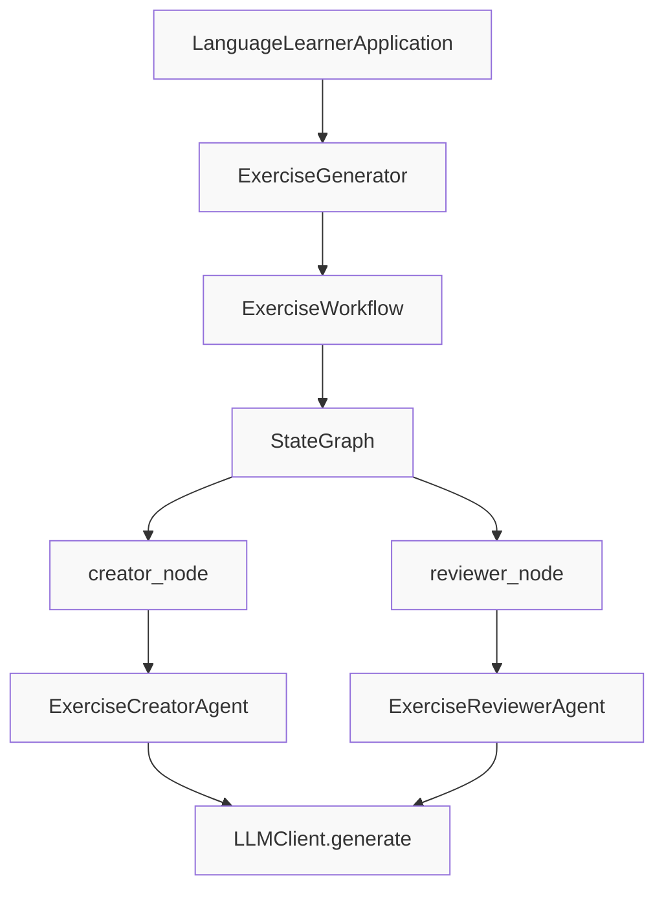
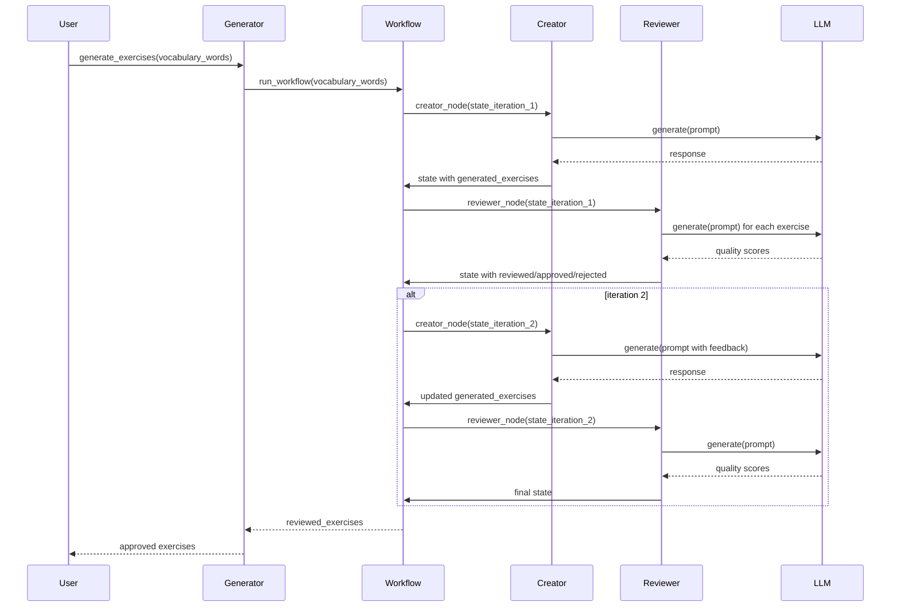

# Exercise Generation Specification

**Status**: Draft
**Created**: [YYYY-MM-DD]
**Last Updated**: [YYYY-MM-DD]
**Priority**: High
**Complexity**: High

---

## Overview

### Summary
The Exercise Generation system creates high-quality, pedagogically sound language learning exercises from vocabulary words using a multi-agent LangGraph-based workflow. It orchestrates collaboration between a Creator Agent (generates exercises) and a Reviewer Agent (evaluates quality) through iterative cycles.

### Motivation
To reinforce vocabulary learning, users need varied, contextually appropriate exercises of consistent quality. The agent-based workflow ensures that only well-constructed, pedagogically valuable exercises reach users by implementing automatic review and filtering.

---

## Requirements

### Functional Requirements
- [ ] **Exercise Type Generation**: Support FILL_BLANK, MULTIPLE_CHOICE, TRANSLATION, SENTENCE_CONSTRUCTION
- [ ] **Vocabulary-to-Exercise**: Convert vocabulary words into exercises using LLM
- [ ] **Contextual Exercises**: Generate exercises with sentence context and translations
- [ ] **Multiple Exercises per Word**: Generate 2+ exercises per vocabulary word (configurable)
- [ ] **Difficulty Levels**: Support EASY, MEDIUM, HARD difficulty levels
- [ ] **Agent Workflow**: LangGraph-based workflow with creator-reviewer cycle
- [ ] **Quality Filtering**: Reviewer must approve/reject each exercise based on quality criteria
- [ ] **Iterative Improvement**: Run multiple creator-reviewer cycles (default: 2 iterations)
- [ ] **Feedback Propagation**: Pass reviewer feedback to creator for improvement in subsequent iterations
- [ ] **State Management**: Maintain workflow state across iterations (generated, reviewed, rejected exercises)
- [ ] **Error Handling**: Graceful handling of LLM failures and malformed responses
- [ ] **Word Limit**: Limit exercises to top words for performance (default: 10 words, top 5 in iteration 2)

### Non-Functional Requirements
- [ ] **Quality**: Minimum quality score threshold of 70/100 for exercise approval
- [ ] **Performance**: Configurable LLM timeout and temperature per agent
- [ ] **Logging**: Comprehensive logging at each iteration step
- [ ] **Extensibility**: Easy to add new exercise types or agents
- [ ] **Testability**: Mockable LLM interface and agents for isolated testing

### Constraints
- [ ] Must use existing `LLMClient` interface (Protocol)
- [ ] Must use existing `Exercise` data model
- [ ] Must use LangGraph for workflow orchestration
- [ ] Must implement `ExerciseCreatorAgent` and `ExerciseReviewerAgent` as separate classes
- [ ] Must use TypedDict for workflow state
- [ ] Must use existing logging infrastructure
- [ ] Must use `uuid4()` for exercise IDs
- [ ] Must handle LLM errors via `ExerciseGenerationError`
- [ ] Must not modify exercises that pass review

---

## User Stories

- **As a** language learner
  **I want to** practice vocabulary through varied, high-quality exercise types
  **So that** my learning is effective and engaging

- **As a** language learner
  **I want to** see exercises in context with translations
  **So that** I can understand word usage and meaning

- **As a** developer
  **I want to** use the agent workflow for exercise generation
  **So that** I can ensure exercises meet quality standards before user presentation

- **As a** developer
  **I want to** configure the number of workflow iterations
  **So that** I can balance quality against performance

- **As a** maintainer
  **I want to** add new review criteria or exercise types
  **So that** I can improve quality standards and variety over time

- **As a** tester
  **I want to** mock individual agents and LLM
  **So that** I can test the workflow in isolation

---

## Technical Design

### Architecture



### Workflow Sequence Diagram



### Components

| Component | Responsibility | Dependencies |
|-----------|---------------|--------------|
| `ExerciseGenerator` | Orchestrate exercise generation using agent workflow | `ExerciseWorkflow`, `LLMClient`, `Exercise`, `ExerciseType` |
| `ExerciseWorkflow` | Orchestrate multi-agent workflow with LangGraph | `StateGraph`, `ExerciseCreatorAgent`, `ExerciseReviewerAgent`, `LLMClient` |
| `ExerciseCreatorAgent` | LangGraph node that creates exercises for vocabulary words | `LLMClient`, `Exercise`, `ExerciseType` |
| `ExerciseReviewerAgent` | LangGraph node that reviews and filters exercises for quality | `LLMClient`, `Exercise`, `ExerciseType` |
| `ExerciseWorkflowState` | State container for complete workflow | `TypedDict`, `Exercise` |
| `ExerciseCreatorState` | State container for creator agent | `TypedDict`, `Exercise` |
| `ExerciseReviewerState` | State container for reviewer agent | `TypedDict`, `Exercise` |

### Data Flow

#### Overall Workflow:
1. **Initialization**: `ExerciseGenerator(llm_client)` creates `ExerciseWorkflow`
2. **Execution**: `generate_exercises(vocabulary_words)` calls `workflow.run_workflow(vocabulary_words, max_iterations=2)`
3. **Graph Construction**: `ExerciseWorkflow.create_workflow()` builds LangGraph with creator → reviewer edge
4. **Iteration Loop**: For each iteration 1 to max_iterations:
   - Update state with current iteration number
   - Invoke compiled workflow with current state
   - Update state from workflow result
   - If not last iteration and feedback exists: prepare for next iteration (limit to top 5 words)
5. **Result**: Return `reviewed_exercises` from final state

#### Creator Node Flow:
1. **Input**: `ExerciseCreatorState` with vocabulary_words, generated_exercises, iteration
2. For each word in vocabulary_words:
   - Generate 2 exercises per word (iteration 1) or 1 exercise (iteration > 1)
   - Call `_generate_single_exercise(word, iteration)`
   - Choose exercise type based on iteration (more variety in later iterations)
   - Generate using LLM with iteration-aware prompt
   - Append to `generated_exercises` list
3. **Output**: Updated state with new generated_exercises

#### Reviewer Node Flow:
1. **Input**: `ExerciseReviewerState` with generated_exercises, reviewed_exercises, rejected_exercises, feedback, iteration
2. For each exercise in generated_exercises:
   - Skip if already reviewed or rejected
   - Call `_review_exercise(exercise, iteration)`
   - First check trivial issues (short question/answer, missing blanks, insufficient options)
   - If not trivial, call `_assess_exercise_quality(exercise, iteration)` using LLM
   - If quality_score >= 70: add to reviewed_exercises with feedback
   - If quality_score < 70: add to rejected_exercises with reason and feedback
3. **Output**: Updated state with reviewed_exercises, rejected_exercises, feedback

### Quality Assessment Criteria
The reviewer agent evaluates exercises on five dimensions:
1. **Learning Value** (0-30 points): Does it effectively teach the vocabulary word?
2. **Challenge Level** (0-25 points): Is it appropriately challenging?
3. **Clarity** (0-20 points): Is the question clear and unambiguous?
4. **Originality** (0-15 points): Is it creative and not too formulaic?
5. **Contextual Relevance** (0-10 points): Does it use natural language context?

**Total: 100 points, Minimum Threshold: 70 for approval**

### Trivial Checks (Automatic Rejection)
Exercises are automatically rejected if they meet these criteria:
- Question length < 15 characters
- Answer length < 2 characters
- Fill-in-the-blank missing `___` placeholder
- Multiple choice with < 3 options

---

## API/Interfaces

### Public Classes

```python
class ExerciseGenerator:
    """Generate language exercises from vocabulary words using agent workflow"""
    
    def __init__(self, llm_client: LLMClient, use_agents: bool = True) -> None:
        """Initialize with LLM client.
        
        Args:
            llm_client: LLM client for exercise generation and review
            use_agents: Always True - agent workflow is the only mode
        """
    
    def generate_exercises(
        self, 
        vocabulary_words: list[str]
    ) -> list[Exercise]:
        """Generate exercises for vocabulary words using agent workflow.
        
        Args:
            vocabulary_words: List of vocabulary words to generate exercises for
            
        Returns:
            List of approved exercises that passed review
        """
```

```python
class ExerciseWorkflow:
    """Orchestrate exercise creation and review workflow using LangGraph"""
    
    def __init__(self, llm_client: LLMClient) -> None:
        """Initialize with LLM client.
        
        Args:
            llm_client: LLM client for exercise generation and review
        """
    
    def create_workflow(self) -> StateGraph:
        """Create the LangGraph workflow.
        
        Returns:
            Configured LangGraph StateGraph with creator and reviewer nodes
        """
    
    def run_workflow(
        self,
        vocabulary_words: list[str],
        max_iterations: int = 2
    ) -> list[Exercise]:
        """Run complete workflow with multiple iterations.
        
        Args:
            vocabulary_words: List of vocabulary words to create exercises for
            max_iterations: Maximum number of creator-reviewer cycles (default: 2)
            
        Returns:
            List of approved exercises from reviewed_exercises
        """
```

```python
class ExerciseCreatorAgent:
    """LangGraph agent that creates language exercises using LLM"""
    
    def __init__(self, llm_client: LLMClient) -> None:
        """Initialize with LLM client.
        
        Args:
            llm_client: LLM client for exercise generation
        """
    
    def create_node(self) -> Callable[[ExerciseCreatorState], ExerciseCreatorState]:
        """Create LangGraph node function for exercise creation.
        
        Returns:
            Node function that processes state and returns updated state
        """
```

```python
class ExerciseReviewerAgent:
    """LangGraph agent that reviews and filters language exercises for quality"""
    
    def __init__(self, llm_client: LLMClient) -> None:
        """Initialize with LLM client.
        
        Args:
            llm_client: LLM client for exercise review
        """
    
    def create_node(self) -> Callable[[ExerciseReviewerState], ExerciseReviewerState]:
        """Create LangGraph node function for exercise review.
        
        Returns:
            Node function that processes state and returns updated state
        """
```

### State Models

```python
class ExerciseWorkflowState(TypedDict):
    """Complete workflow state passed through the entire workflow"""
    vocabulary_words: list[str]
    generated_exercises: list[Exercise]
    reviewed_exercises: list[Exercise]
    rejected_exercises: list[dict[str, Any]]
    feedback: list[str]
    iteration: int


class ExerciseCreatorState(TypedDict):
    """State for creator agent node"""
    vocabulary_words: list[str]
    generated_exercises: list[Exercise]
    iteration: int


class ExerciseReviewerState(TypedDict):
    """State for reviewer agent node"""
    generated_exercises: list[Exercise]
    reviewed_exercises: list[Exercise]
    rejected_exercises: list[dict[str, Any]]
    feedback: list[str]
    iteration: int
```

### Data Models

Uses existing models from `models/exercise.py`:

```python
class ExerciseType(Enum):
    FILL_BLANK = "fill_blank"
    MULTIPLE_CHOICE = "multiple_choice"
    TRANSLATION = "translation"
    SENTENCE_CONSTRUCTION = "sentence_construction"
    WORD_MATCHING = "word_matching"


class DifficultyLevel(Enum):
    EASY = "easy"
    MEDIUM = "medium"
    HARD = "hard"


@dataclass
class Exercise:
    exercise_id: str
    exercise_type: ExerciseType
    question: str
    correct_answer: str
    context: str | None = None
    difficulty: DifficultyLevel = DifficultyLevel.MEDIUM
    options: list[str] | None = None  # For MULTIPLE_CHOICE
    user_answer: str | None = None
    evaluation: dict | None = None
    feedback: str | None = None
    metadata: dict | None = None
```

### LLM Interface

```python
class LLMClient(Protocol):
    """Generic interface for LLM clients"""
    
    def generate(
        self, 
        prompt: str, 
        temperature: float = 0.7, 
        max_tokens: int = 150
    ) -> str:
        """Generate text from a prompt
        
        Args:
            prompt: Input prompt for text generation
            temperature: Sampling temperature (creativity)
            max_tokens: Maximum number of tokens to generate
            
        Returns:
            Generated text string
        """
        ...
```

### Exercise Generation Prompts

Each exercise type uses a specific prompt format with pipe-separated values:

**Fill-in-the-blank:**
```
sentence|correct_answer|translation
Example: J'aime manger des ___.|pommes|I like to eat apples.
```

**Multiple Choice:**
```
question|correct_answer|option1|option2|option3
Example: What does 'pomme' mean?|apple|fruit|red|tree
```

**Translation:**
```
french_sentence|english_translation
Example: J'aime les pommes.|I like apples.
```

### Quality Assessment Prompt
Evaluates on 5 criteria with 100-point total, using format:
```
quality_score|feedback|improvement_suggestions
```

---

## Implementation Plan

### Steps
- [ ] **Step 1**: Analyze existing implementation
  - [x] Review `generator.py`
  - [x] Review `exercise_creator.py`
  - [x] Review `exercise_reviewer.py`
  - [x] Review `exercise_workflow.py`
  - [x] Review `exercise.py` (models)
  - [x] Review `llm_interface.py`
  - [ ] Document any gaps between implementation and requirements

- [ ] **Step 2**: Create draft specification
  - [x] Write specification document following TEMPLATE.md
  - [x] Add component and sequence diagrams
  - [x] Document all state transitions
  - [x] Define acceptance criteria

- [ ] **Step 3**: Review and refine
  - [ ] Validate against actual code
  - [ ] Add comprehensive test cases
  - [ ] Identify risks and mitigations

- [ ] **Step 4**: Finalize
  - [ ] Update status from Draft to Review
  - [ ] Incorporate feedback
  - [ ] Mark as Approved

---

## Acceptance Criteria

### Must Have
- [ ] Specification document created in `specs/feat-exercise-generation-spec.md`
- [ ] All components documented (Generator, Workflow, Creator Agent, Reviewer Agent)
- [ ] State models fully specified
- [ ] Workflow data flow clearly described for both iterations
- [ ] Quality criteria documented with scoring system
- [ ] Trivial checks documented
- [ ] Error handling documented
- [ ] Only agent workflow mode (no direct mode)

### Should Have
- [ ] Performance characteristics documented
- [ ] Quality metrics and thresholds defined
- [ ] Extensibility guide for new exercise types and agents

### Test Cases
- [ ] Test workflow runs with 1 iteration
- [ ] Test workflow runs with 2 iterations
- [ ] Test workflow produces approved exercises
- [ ] Test workflow rejects low-quality exercises
- [ ] Test trivial exercises are rejected automatically
- [ ] Test feedback is propagated between iterations
- [ ] Test fallback when LLM assessment fails (defaults to moderate score)
- [ ] Test with empty vocabulary list
- [ ] Test with single vocabulary word
- [ ] Test state transitions across iterations
- [ ] Test all exercise types are generated and handled by reviewer
- [ ] Test quality score threshold (70) is enforced
- [ ] Test exercise limit (top 10 words iteration 1, top 5 words iteration 2)

---

## Dependencies

### Internal Dependencies
- [ ] `models/exercise.py`: `Exercise`, `ExerciseType`, `DifficultyLevel` data models
- [ ] `core/llm_interface.py`: `LLMClient` protocol
- [ ] `core/llm_client.py`: `MistralLLMClient` implementation
- [ ] `exercises/agents/exercise_creator.py`: Creator agent implementation
- [ ] `exercises/agents/exercise_reviewer.py`: Reviewer agent implementation
- [ ] `exercises/agents/exercise_workflow.py`: Workflow implementation
- [ ] `exceptions.py`: `ExerciseGenerationError` exception
- [ ] `config.py`: Settings management
- [ ] `logging.py`: Logging infrastructure

### External Dependencies
- [ ] `langgraph`: For workflow orchestration (`StateGraph`)
- [ ] `mistralai`: For Mistral LLM access
- [ ] `uuid`: For exercise ID generation
- [ ] `random`: For exercise type selection and option shuffling
- [ ] `typing`: For type hints (`TypedDict`, `Callable`, `Any`, `Protocol`)
- [ ] `pydantic-settings`: For configuration (inherited from LLM client)

---

## Testing Strategy

### Unit Tests
- [ ] Test `ExerciseGenerator.__init__()` with agent mode
- [ ] Test `ExerciseGenerator.generate_exercises()` returns approved exercises
- [ ] Test `ExerciseWorkflow.create_workflow()` returns valid StateGraph
- [ ] Test `ExerciseWorkflow.run_workflow()` with mock agents
- [ ] Test `ExerciseCreatorAgent.create_node()` returns callable
- [ ] Test creator node with mock LLM
- [ ] Test `ExerciseReviewerAgent.create_node()` returns callable
- [ ] Test reviewer node with mock LLM
- [ ] Test trivial check methods for all exercise types
- [ ] Test `_review_exercise()` returns correct structure
- [ ] Test `_assess_exercise_quality()` parsing and fallback

### Integration Tests
- [ ] Test end-to-end workflow with mock LLM: vocabulary → reviewed exercises
- [ ] Test multi-iteration workflow with improvement feedback
- [ ] Test mock creator and reviewer agents in workflow

### Manual Testing
- [ ] Manual test with real LLM and vocabulary words
- [ ] Manual test with varied iteration counts (1, 2)
- [ ] Manual test with edge cases (all exercises rejected, all approved)
- [ ] Manual test of fallback mechanisms
- [ ] Manual test with French vocabulary
- [ ] Manual test with English vocabulary

### Test Data
- Sample vocabulary word lists (French, English)
- Mock LLM responses for all exercise types
- Mock quality assessment responses (high score, low score, boundary score 69/70/71)
- Expected state transitions for each iteration
- Edge cases: empty list, single word, very long words

---

## Risks & Mitigations

| Risk | Probability | Impact | Mitigation |
|------|-------------|--------|------------|
| LLM API rate limits during workflow | High | High | Configurable timeouts, retry logic, iteration limits, word limits |
| Reviewer too strict/too lenient | Medium | High | Calibrate thresholds, test with sample exercises, human review of criteria |
| State corruption across iterations | Low | High | Use immutable state updates, validate state structure after each node |
| Workflow complexity | Medium | Medium | Clear documentation, comprehensive logging, sequence diagram |
| Dependency on LangGraph | Medium | Medium | Document installation requirements, version pinning in pyproject.toml |
| Agent coordination failures | Low | Medium | Fallback to default scores, timeout handling, error logging |
| Performance degradation with many words | Medium | Medium | Word limit enforcement (10 then 5), consider batching for future |
| Prompt parsing failures | Medium | Medium | Strict validation, fallback to safe defaults, comprehensive error handling |

---

## Alternatives Considered

### Option 1: Direct Generation Only (No Agents)
**Pros:**
- Simpler implementation
- Faster execution
- Fewer dependencies
- No LLM calls for review

**Cons:**
- Lower quality exercises (no review)
- Less pedagogically sound
- No quality filtering

**Decision:** Agent workflow is essential for quality; direct mode removed

### Option 2: Single-Pass Workflow
**Pros:**
- Simpler implementation
- Faster execution
- Fewer LLM calls

**Cons:**
- Lower quality output
- No opportunity for improvement
- Less feedback for debugging

**Decision:** Two-iteration workflow balances quality and performance

### Option 3: Separate Quality Score Components
**Pros:**
- More granular feedback
- Easier to debug quality issues
- Can weight criteria differently per exercise type

**Cons:**
- More complex prompt
- More LLM tokens used
- Harder to parse response

**Decision:** Single aggregate score with feedback is sufficient for v1

### Option 4: Human-in-the-Loop Review
**Pros:**
- Highest quality guarantee
- Can handle edge cases

**Cons:**
- Not scalable
- Requires human intervention
- Slower

**Decision:** Fully automated for v1; human review could be added as optional mode later

### Option 5: Pre-Defined Quality Rules Only
**Pros:**
- No LLM dependency for review
- Faster
- More deterministic

**Cons:**
- Limited to rule-based checks
- Cannot assess contextual quality
- Harder to maintain as requirements evolve

**Decision:** Use LLM for quality assessment to capture nuance and contextual appropriateness

---

## Open Questions

1. **What is the optimal number of iterations?**
   - Current: 2 iterations (default)
   - Consideration: Quality vs performance/cost tradeoff
   - Recommendation: Benchmark with real data; 2 seems reasonable for v1

2. **Should thresholds be configurable?**
   - Current: Hardcoded to 70
   - Consideration: Different quality needs for different use cases
   - Recommendation: Make configurable via `AppSettings` for future flexibility

3. **Should we track rejection reasons statistically?**
   - Current: Logged but not aggregated
   - Consideration: Useful for improving generation prompts
   - Recommendation: Add to Monitoring & Analytics feature (Low priority)

4. **Should rejected exercises be retried with different types?**
   - Current: In iteration 2, focuses on top 5 words, generates 1 exercise each
   - Consideration: Could try different exercise types for rejected exercises
   - Recommendation: Current approach sufficient; enhancement for future

5. **Should we support custom review criteria?**
   - Current: Fixed criteria (learning value, challenge, clarity, originality, context)
   - Consideration: Different educational approaches may need different criteria
   - Recommendation: Make criteria configurable in prompts for future extensibility

6. **Should the workflow support branching (conditional edges)?**
   - Current: Linear creator → reviewer
   - Consideration: Could have different paths based on quality score ranges
   - Recommendation: Current linear flow sufficient; branching adds complexity without clear benefit

---

## Estimation

### Complexity Assessment
- **Technical Complexity**: High (LangGraph orchestration, multi-agent coordination, state management)
- **Risk Level**: Medium (LLM dependency, state complexity, prompt parsing)
- **Dependencies**: High (langgraph, mistralai, multiple internal components)

### Effort Estimate
- Specification creation: 3-4 hours
- Code review against spec: 2-3 hours
- Test case definition: 2 hours
- **Total**: 7-9 hours

---

## References

- [Language Learner Mission Document](../mission.md)
- [Technical Stack & Architecture](../tech-stack.md)
- [Roadmap](../roadmap.md)
- [Vocabulary Extraction Pipeline Spec](../feat-vocabulary-extraction-spec.md)
- [LangGraph Documentation](https://langchain-ai.github.io/langgraph/)
- [Mistral AI Documentation](https://docs.mistral.ai/)

---

## Changelog

| Version | Date | Changes |
|---------|------|---------|
| 1.0 | [Date] | Initial specification created |
| 1.1 | [Date] | [Name] | Merged agent workflow specification; removed direct mode |
