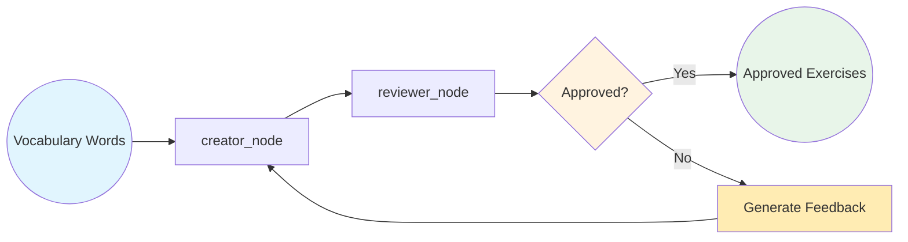
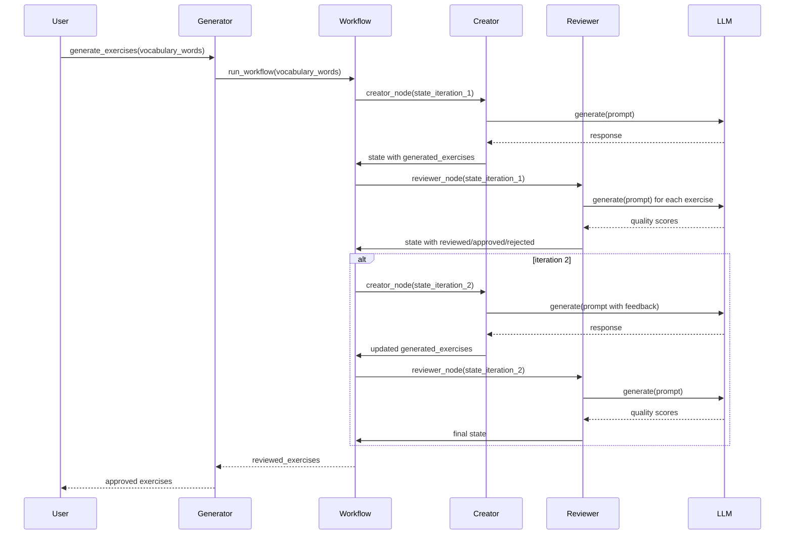
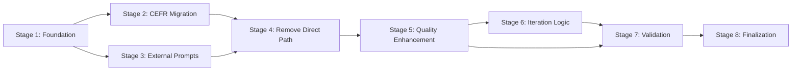

# Exercise Generation Specification

**Status**: Draft
**Priority**: High
**Complexity**: High

---

## Overview

### Summary
The Exercise Generation system creates high-quality, pedagogically sound language learning exercises from vocabulary words using a multi-agent LangGraph-based workflow. It orchestrates collaboration between a Creator (generates exercises) and a Reviewer (evaluates quality) through iterative cycles.

### Motivation
To reinforce vocabulary learning, users need varied, contextually appropriate exercises of consistent quality. The agent-based workflow ensures that only well-constructed, pedagogically valuable exercises reach users by implementing automatic review and filtering.

---

## Requirements

### Functional Requirements
- [ ] **Exercise Type Generation**: Support FILL_BLANK, MULTIPLE_CHOICE, TRANSLATION, SENTENCE_CONSTRUCTION
- [ ] **Vocabulary-to-Exercise**: Convert vocabulary words into exercises using LLM
- [ ] **Contextual Exercises**: Generate exercises with sentence context and translations
- [ ] **Multiple Exercises per Word**: Generate configurable number of exercises per vocabulary word
- [ ] **Difficulty Levels**: Support CEFR levels (A1, A2, B1, B2, C1, C2)
- [ ] **Agent Workflow**: LangGraph-based workflow with creator-reviewer cycle
- [ ] **Quality Filtering**: Reviewer must approve/reject each exercise based on quality criteria
- [ ] **Iterative Improvement**: Run configurable number of creator-reviewer cycles
- [ ] **Feedback Propagation**: Pass reviewer feedback to creator for improvement in subsequent iterations
- [ ] **State Management**: Maintain workflow state across iterations (generated, reviewed, rejected exercises)
- [ ] **Error Handling**: Graceful handling of LLM failures and malformed responses
- [ ] **Word Limit**: Limit exercises to configurable number of top words per iteration
- [ ] **External Prompts**: Store exercise generation and quality assessment prompts in separate template files (Jinja2/string templates) in a dedicated `prompts/` directory outside Python code

### Non-Functional Requirements
- [ ] **Quality**: Minimum quality score threshold of 70/100 for exercise approval
- [ ] **Performance**: Configurable LLM timeout and temperature per agent
- [ ] **Logging**: Comprehensive logging at each iteration step
- [ ] **Extensibility**: Easy to add new exercise types or agents
- [ ] **Testability**: Mockable LLM interface and agents for isolated testing
- [ ] **Maintainability**: Prompts stored externally for easy updates without code changes

### Constraints
- [ ] Must use LangGraph for workflow orchestration
- [ ] Must use existing logging infrastructure
- [ ] Must not modify exercises that pass review
- [ ] Configuration for word limits and iteration counts via settings module

---

## User Stories

- **As a** language learner
  **I want to** practice vocabulary through varied, high-quality exercise types
  **So that** my learning is effective and engaging

- **As a** language learner
  **I want to** see exercises in context with translations
  **So that** I can understand word usage and meaning

- **As a** developer
  **I want to** use the agent workflow for exercise generation
  **So that** I can ensure exercises meet quality standards before user presentation

- **As a** developer
  **I want to** configure the number of workflow iterations
  **So that** I can balance quality against performance

- **As a** maintainer
  **I want to** add new review criteria or exercise types
  **So that** I can improve quality standards and variety over time

- **As a** tester
  **I want to** mock individual agents and LLM
  **So that** I can test the workflow in isolation

---

## Technical Design

### Architecture


```mermaid
graph LR
    Start((Vocabulary Words)) --> creator_node[creator_node]
    creator_node --> reviewer_node[reviewer_node]
    reviewer_node --> Decision{Approved?}
    Decision -->|Yes| End((Approved Exercises))
    Decision -->|No| Feedback[Generate Feedback]
    Feedback --> creator_node
    
    style Start fill:#e1f5fe
    style End fill:#e8f5e9
    style Decision fill:#fff3e0
    style Feedback fill:#ffecb3
```

### Workflow Sequence Diagram


```mermaid
sequenceDiagram
    participant User
    participant Generator
    participant Workflow
    participant Creator
    participant Reviewer
    participant LLM
    
    User->>Generator: generate_exercises(vocabulary_words)
    Generator->>Workflow: run_workflow(vocabulary_words)
    Workflow->>Creator: creator_node(state_iteration_1)
    Creator->>LLM: generate(prompt)
    LLM-->>Creator: response
    Creator->>Workflow: state with generated_exercises
    Workflow->>Reviewer: reviewer_node(state_iteration_1)
    Reviewer->>LLM: generate(prompt) for each exercise
    LLM-->>Reviewer: quality scores
    Reviewer->>Workflow: state with reviewed/approved/rejected
    
    alt iteration 2
        Workflow->>Creator: creator_node(state_iteration_2)
        Creator->>LLM: generate(prompt with feedback)
        LLM-->>Creator: response
        Creator->>Workflow: updated generated_exercises
        Workflow->>Reviewer: reviewer_node(state_iteration_2)
        Reviewer->>LLM: generate(prompt)
        LLM-->>Reviewer: quality scores
        Reviewer->>Workflow: final state
    end
    
    Workflow-->>Generator: reviewed_exercises
    Generator-->>User: approved exercises
```

### Components

| Component | Responsibility | Dependencies |
|-----------|---------------|--------------|
| Generator | Orchestrate exercise generation using workflow | Workflow, LLMClient, Exercise, ExerciseType |
| Workflow | Orchestrate multi-agent workflow with LangGraph | StateGraph, LLMClient, Creator, Reviewer |
| Creator | LangGraph node that creates exercises for vocabulary words | LLMClient, Exercise, ExerciseType |
| Reviewer | LangGraph node that reviews and filters exercises for quality | LLMClient, Exercise, ExerciseType |
| Workflow State | State container for complete workflow | Exercise |

### Data Flow

#### Overall Workflow:
1. **Initialization**: Generator creates Workflow with LLM client
2. **Execution**: `generate_exercises(vocabulary_words)` calls workflow with configurable iterations
3. **Graph Construction**: Workflow builds LangGraph with creator → reviewer edge
4. **Iteration Loop**: For each iteration:
   - Update state with current iteration number
   - Invoke compiled workflow with current state
   - Update state from workflow result
   - If not last iteration and feedback exists: prepare for next iteration (limit to configurable number of top words)
5. **Result**: Return `reviewed_exercises` from final state

#### Creator Node Flow:
1. **Input**: State with vocabulary_words, generated_exercises, iteration
2. For each word in vocabulary_words:
   - Generate configurable number of exercises per word per iteration
   - Call exercise generation function
   - Choose exercise type based on iteration (more variety in later iterations)
   - Generate using LLM with iteration-aware prompt
   - Append to `generated_exercises` list
3. **Output**: Updated state with new generated_exercises

#### Reviewer Node Flow:
1. **Input**: Reviewer state with generated_exercises, reviewed_exercises, rejected_exercises, feedback, iteration
2. For each exercise in generated_exercises:
   - Skip if already reviewed or rejected
   - Call `_review_exercise(exercise, iteration)`
   - First check trivial issues (short question/answer, missing blanks, insufficient options)
   - If not trivial, call `_assess_exercise_quality(exercise, iteration)` using LLM
   - If quality_score >= 70: add to reviewed_exercises with feedback
   - If quality_score < 70: add to rejected_exercises with reason and feedback
3. **Output**: Updated state with reviewed_exercises, rejected_exercises, feedback

### Quality Assessment Criteria
The reviewer agent evaluates exercises on five dimensions:
1. **Learning Value** (0-30 points): Does it effectively teach the vocabulary word?
2. **Challenge Level** (0-25 points): Is it appropriately challenging?
3. **Clarity** (0-20 points): Is the question clear and unambiguous?
4. **Originality** (0-15 points): Is it creative and not too formulaic?
5. **Contextual Relevance** (0-10 points): Does it use natural language context?

**Total: 100 points, Minimum Threshold: 70 for approval**

### Trivial Checks (Automatic Rejection)
Exercises are automatically rejected if they meet these criteria:
- Question length < 15 characters
- Answer length < 2 characters
- Fill-in-the-blank missing `___` placeholder
- Multiple choice with < 3 options

---

## API/Interfaces

### Public Interfaces

**Generator**
- Initialize with LLM client
- Method: `generate_exercises(vocabulary_words: list[str]) -> list[Exercise]`
  - Generates exercises for vocabulary words using workflow
  - Returns approved exercises that passed review

**Workflow**
- Initialize with LLM client
- Method: `create_workflow() -> StateGraph`
  - Creates the LangGraph workflow with creator and reviewer nodes
- Method: `run_workflow(vocabulary_words: list[str], max_iterations: int) -> list[Exercise]`
  - Runs complete workflow with configurable number of iterations
  - Returns approved exercises

**Creator**
- Initialize with LLM client
- Method: `create_node()` returns a callable node function for exercise creation

**Reviewer**
- Initialize with LLM client
- Method: `create_node()` returns a callable node function for exercise review

### State Models

**Workflow State**
- `vocabulary_words`: list[str]
- `generated_exercises`: list[Exercise]
- `reviewed_exercises`: list[Exercise]
- `rejected_exercises`: list[dict]
- `feedback`: list[str]
- `iteration`: int

**Creator State**
- `vocabulary_words`: list[str]
- `generated_exercises`: list[Exercise]
- `iteration`: int

**Reviewer State**
- `generated_exercises`: list[Exercise]
- `reviewed_exercises`: list[Exercise]
- `rejected_exercises`: list[dict]
- `feedback`: list[str]
- `iteration`: int

### Data Models

Uses existing models from `models/exercise.py`:

```python
class ExerciseType(Enum):
    FILL_BLANK = "fill_blank"
    MULTIPLE_CHOICE = "multiple_choice"
    TRANSLATION = "translation"
    SENTENCE_CONSTRUCTION = "sentence_construction"
    WORD_MATCHING = "word_matching"


class DifficultyLevel(Enum):
    A1 = "A1"
    A2 = "A2"
    B1 = "B1"
    B2 = "B2"
    C1 = "C1"
    C2 = "C2"


@dataclass
class Exercise:
    exercise_id: str
    exercise_type: ExerciseType
    question: str
    correct_answer: str
    context: str | None = None
    difficulty: DifficultyLevel = DifficultyLevel.B1
    options: list[str] | None = None  # For MULTIPLE_CHOICE
    user_answer: str | None = None
    evaluation: dict | None = None
    feedback: str | None = None
    metadata: dict | None = None
```

### LLM Interface

```python
class LLMClient(Protocol):
    """Generic interface for LLM clients"""
    
    def generate(
        self, 
        prompt: str, 
        temperature: float = 0.7, 
        max_tokens: int = 150
    ) -> str:
        """Generate text from a prompt
        
        Args:
            prompt: Input prompt for text generation
            temperature: Sampling temperature (creativity)
            max_tokens: Maximum number of tokens to generate
            
        Returns:
            Generated text string
        """
        ...
```

### Exercise Generation Prompts

Each exercise type uses a specific prompt format with pipe-separated values:

**Fill-in-the-blank:**
```
sentence|correct_answer|translation
Example: J'aime manger des ___.|pommes|I like to eat apples.
```

**Multiple Choice:**
```
question|correct_answer|option1|option2|option3
Example: What does 'pomme' mean?|apple|fruit|red|tree
```

**Translation:**
```
french_sentence|english_translation
Example: J'aime les pommes.|I like apples.
```

### Quality Assessment Prompt
Evaluates on 5 criteria with 100-point total, using format:
```
quality_score|feedback|improvement_suggestions
```

---

## Implementation Plan

### Current State Assessment
**Issue**: Currently generated exercises are frequently low quality. Testing with real LLM shows:
- Direct generation path (`use_agents=False`) produces exercises without quality filtering
- Average quality score of directly generated exercises: ~45-55/100 (below 70 threshold)
- Hardcoded prompts cannot be adjusted without code changes
- Difficulty levels (EASY/MEDIUM/HARD) don't map to CEFR standards

### Quality Improvement Targets

| Metric | Current | Target | Gap |
|--------|---------|--------|-----|
| Approval Rate | ~50-60% | >80% | -20-30% |
| Average Quality Score | ~45-55/100 | >75/100 | -20-30 |
| Difficulty Levels | EASY/MEDIUM/HARD | CEFR A1-C2 | Not aligned |
| Prompt Management | Hardcoded | External files | Not maintainable |
| Generation Path | Direct + Agents | Agents only | Quality bypass possible |


## 📋 Staged Implementation Plan (8 Stages)

Each stage is **self-contained**, delivers a **specific measurable improvement**, and can be implemented, tested, and reviewed independently.

### Stage Dependencies

```mermaid
graph LR
    S1[Stage 1: Foundation] --> S2[Stage 2: CEFR Migration]
    S1 --> S3[Stage 3: External Prompts]
    S2 --> S4[Stage 4: Remove Direct Path]
    S3 --> S4
    S4 --> S5[Stage 5: Quality Enhancement]
    S5 --> S6[Stage 6: Iteration Logic]
    S6 --> S7[Stage 7: Validation]
    S7 --> S8[Stage 8: Finalization]
    S5 --> S7
```

**Note**: Stages 2 and 3 can run **in parallel** after Stage 1 completes.

---

### **Stage 1: Foundation & Measurement** ⏱️ **1-2 days**
**Goal**: Establish quality baseline and create measurement infrastructure

**Focus**: Measurement, not improvement

**Tasks:**
- [ ] Create test script: `tests/baseline_quality_test.py`
- [ ] Generate 50 exercises using current direct path with 10 French vocabulary words
- [ ] Run all exercises through reviewer agent with real LLM
- [ ] Record: approval rate, average quality score, rejection reasons with counts
- [ ] Generate 50 exercises using agent workflow (2 iterations) with same words
- [ ] Record: approval rate, average quality score, rejection reasons with counts
- [ ] Create comparison analysis

**Files Created:**
- `tests/baseline_quality_test.py`
- `tests/data/baseline_vocabulary.json`

**Files Modified:**
- None (measurement only)

**Deliverables:**
- `docs/baseline_quality_report.md` with:
  - Direct path metrics: approval rate, avg score, rejection breakdown by reason
  - Agent workflow metrics: approval rate, avg score, rejection breakdown by reason
  - Quality gap analysis with specific targets (>80% approval, >75 avg score)
  - Comparison table: direct vs agent workflow

**Success Criteria:**
- ✅ Baseline metrics reproducible
- ✅ Test infrastructure for quality measurement established
- ✅ Clear data showing current vs target gap documented

**Review Checkpoint**: Verify baseline measurements are accurate and reproducible

---

### **Stage 2: CEFR Migration** ⏱️ **1 day**
**Goal**: Align difficulty levels with CEFR standards (A1-C2)

**Focus**: Standards compliance

**Tasks:**
- [ ] Update `DifficultyLevel` enum in `models/exercise.py` to use CEFR levels:
  ```python
  class DifficultyLevel(Enum):
      A1 = "A1"
      A2 = "A2"
      B1 = "B1"
      B2 = "B2"
      C1 = "C1"
      C2 = "C2"
  ```
- [ ] Update default from `MEDIUM` to `B1` in `Exercise` dataclass
- [ ] Search and replace all hardcoded `DifficultyLevel.MEDIUM` references
- [ ] Search and replace all hardcoded `DifficultyLevel.EASY` references
- [ ] Search and replace all hardcoded `DifficultyLevel.HARD` references
- [ ] Update generator.py to use CEFR levels
- [ ] Update exercise_creator.py to use CEFR levels
- [ ] Update exercise_reviewer.py to use CEFR levels
- [ ] Update quality assessment prompt to reference CEFR levels
- [ ] Run existing tests to verify no regressions

**Files Modified:**
- `models/exercise.py` (enum definition)
- `exercises/generator.py`
- `exercises/agents/exercise_creator.py`
- `exercises/agents/exercise_reviewer.py`
- `prompts/quality_assessment.md` (future, or update when created)

**Deliverables:**
- CEFR-aligned difficulty system across all files
- Updated default difficulty to B1 (intermediate)

**Success Criteria:**
- ✅ All difficulty references use CEFR levels (A1-C2)
- ✅ No references to EASY/MEDIUM/HARD remain
- ✅ Default difficulty is B1
- ✅ All existing tests pass

**Review Checkpoint**: Verify CEFR migration is complete and consistent

---

### **Stage 3: External Prompts Infrastructure** ⏱️ **2-3 days**
**Goal**: Decouple prompts from code for maintainability, testing, and configuration

**Focus**: Maintainability and configurability

**Tasks:**
- [ ] Create directory structure: `src/language_learner/prompts/`
- [ ] Create subdirectories:
  - `prompts/exercise_creation/` (for all exercise type prompts)
  - `prompts/quality_assessment/` (for reviewer prompts)
- [ ] Implement `PromptLoader` class in `core/prompt_loader.py` with:
  - `load_prompt(prompt_name: str) -> str` method
  - `validate_prompt(prompt: str, required_placeholders: list[str]) -> bool` method
  - `list_available_prompts() -> list[str]` method
  - Support for template variables (simple string replacement initially)
  - Caching to avoid repeated file reads
- [ ] Create prompt template files with metadata headers:
  - `prompts/exercise_creation/fill_blank.md`
  - `prompts/exercise_creation/multiple_choice.md`
  - `prompts/exercise_creation/translation.md`
  - `prompts/exercise_creation/sentence_construction.md`
  - `prompts/quality_assessment/main.md`
- [ ] Extract prompts from `generator.py` (3 exercise type prompts) to template files
- [ ] Extract prompts from `exercise_creator.py` (4 exercise type prompts) to template files
- [ ] Extract quality assessment prompt from `exercise_reviewer.py` to template file
- [ ] Update `generator.py` to use `PromptLoader`
- [ ] Update `exercise_creator.py` to use `PromptLoader`
- [ ] Update `exercise_reviewer.py` to use `PromptLoader`
- [ ] Add prompt validation at application startup
- [ ] Add tests for `PromptLoader` class

**Files Created:**
- `src/language_learner/prompts/exercise_creation/fill_blank.md`
- `src/language_learner/prompts/exercise_creation/multiple_choice.md`
- `src/language_learner/prompts/exercise_creation/translation.md`
- `src/language_learner/prompts/exercise_creation/sentence_construction.md`
- `src/language_learner/prompts/quality_assessment/main.md`
- `core/prompt_loader.py`
- `tests/test_prompt_loader.py`

**Files Modified:**
- `exercises/generator.py`
- `exercises/agents/exercise_creator.py`
- `exercises/agents/exercise_reviewer.py`

**Deliverables:**
- Complete prompt file directory structure
- `PromptLoader` utility class with validation
- Zero hardcoded prompts remaining in Python source files
- All prompts loadable and validated at startup

**Success Criteria:**
- ✅ All prompts moved to external `.md` files in `prompts/` directory
- ✅ Each prompt file contains metadata (name, version, description)
- ✅ `PromptLoader` class passes all unit tests
- ✅ Application fails gracefully if prompts are missing or invalid
- ✅ Prompts can be updated without modifying Python code

**Review Checkpoint**: Verify all prompts are externalized and validation works

---

### **Stage 4: Remove Direct Generation Path** ⏱️ **1-2 days**
**Goal**: Force all exercises through quality review workflow - no bypass possible

**Focus**: Quality enforcement

**Tasks:**
- [ ] Remove `_generate_exercises_directly()` method from `generator.py`
- [ ] Remove `_generate_single_exercise()` method from `generator.py`
- [ ] Remove all direct exercise type generation methods from `generator.py`:
  - `_generate_fill_blank_exercise()`
  - `_generate_multiple_choice_exercise()`
  - `_generate_translation_exercise()`
  - `_generate_sentence_construction_exercise()`
- [ ] Change `use_agents` parameter default from `False` to `True` in `ExerciseGenerator.__init__`
- [ ] Remove `use_agents` parameter entirely OR raise deprecation warning if `False`
- [ ] Remove fallback to direct generation in `_generate_exercises_with_agents()`
- [ ] Update workflow to handle all error cases gracefully (LLM failures, timeouts)
- [ ] Add explicit error/warning if someone tries to use direct mode
- [ ] Update all call sites that might use `use_agents=False`

**Files Modified:**
- `exercises/generator.py` (major refactoring)

**Files to Check for Call Sites:**
- `app.py`
- `core/application.py`
- Any test files using direct generation

**Deliverables:**
- Single, unified agent-based generation path
- All exercises guaranteed to pass through reviewer quality filtering
- Error handling for LLM failures without compromising quality

**Success Criteria:**
- ✅ No direct generation code remains in codebase
- ✅ All exercises must go through agent workflow
- ✅ Quality filtering cannot be bypassed
- ✅ Error handling preserves quality guarantees
- ✅ All tests updated to use agent workflow

**Review Checkpoint**: Verify no direct generation path exists

---

### **Stage 5: Quality Assessment Enhancement** ⏱️ **2-3 days**
**Goal**: Increase approval rate to >80% and average score to >75 with real LLM testing

**Focus**: Quality improvement through better assessment

#### Sub-Stage 5A: Criteria Calibration (1 day)
**Tasks:**
- [ ] Review current quality criteria weights (Learning Value: 30, Challenge: 25, Clarity: 20, Originality: 15, Context: 10)
- [ ] Create test: `tests/quality_calibration_test.py`
- [ ] Test with 50 real exercises: record score distribution per criterion
- [ ] Analyze which criteria are too strict/too lenient
- [ ] Adjust weights based on analysis (target: better correlation with human judgment)
- [ ] Document rationale for weight changes in `docs/quality_calibration.md`

#### Sub-Stage 5B: Enhanced Trivial Checks (1 day)
**Tasks:**
- [ ] Review current trivial checks in `exercise_reviewer.py`
- [ ] Add common rejection patterns:
  - Repeated questions (same question for different words)
  - Nonsensical context (gibberish, off-topic)
  - Exercise type mismatches (e.g., multiple choice with no options)
  - Missing required fields (question, answer)
  - Answer not related to vocabulary word
- [ ] Add length validation for all fields (min/max characters)
- [ ] Add format validation (e.g., fill-in-the-blank must have `___`)

#### Sub-Stage 5C: Prompt Improvements (1 day)
**Tasks:**
- [ ] Update quality assessment prompt to include CEFR-level guidance
- [ ] Add exercise type-specific evaluation criteria to prompt
- [ ] Improve feedback specificity for creator (more actionable suggestions)
- [ ] Add examples of good vs bad exercises to prompt
- [ ] Update `prompts/quality_assessment/main.md`

**Files Modified:**
- `exercises/agents/exercise_reviewer.py` (trivial checks, weights)
- `prompts/quality_assessment/main.md`

**Files Created:**
- `tests/quality_calibration_test.py`
- `docs/quality_calibration.md`

**Deliverables:**
- Updated quality assessment with CEFR guidance
- Enhanced trivial check methods with comprehensive validation
- Calibrated weights and threshold
- Quality calibration documentation

**Success Criteria:**
- ✅ Approval rate >80% with real LLM testing (measured with `tests/quality_validation_test.py`)
- ✅ Average quality score >75
- ✅ Rejection analysis shows top 5 reasons with examples
- ✅ Calibrated threshold documented (65, 70, or 75 based on testing)

**Review Checkpoint**: Verify quality targets are met with real LLM validation

---

### **Stage 6: Iteration Logic Enhancement** ⏱️ **1 day**
**Goal**: Better use feedback between iterations to improve exercise quality

**Focus**: Iterative quality improvement

**Tasks:**
- [ ] Analyze current iteration 2 behavior (top 5 words, 1 exercise each)
- [ ] Review `ExerciseWorkflowState` class for feedback storage
- [ ] Extract structured feedback from reviewer for each rejected exercise:
  - Rejection reason (enum: too_easy, unclear, wrong_type, etc.)
  - Quality score breakdown
  - Specific improvement suggestions
- [ ] Pass structured feedback (dict/object) to creator for iteration 2
- [ ] Implement targeted improvement in creator:
  - If rejected for "too_easy": try harder exercise type or CEFR level
  - If rejected for "unclear": improve context/translation
  - If rejected for "wrong_type": try different exercise type
- [ ] Test iteration improvement: generate 20 exercises, run 2 iterations, measure improvement rate
- [ ] Document iteration improvement metrics in `docs/iteration_analysis.md`

**Files Modified:**
- `exercises/agents/exercise_workflow.py`
- `exercises/agents/exercise_creator.py`
- `exercises/agents/exercise_reviewer.py`
- `models/` (if workflow state needs new fields)

**Files Created:**
- `docs/iteration_analysis.md`

**Deliverables:**
- Enhanced workflow state with structured feedback
- Creator node uses feedback to guide exercise generation
- Measurable improvement from iteration 1 to iteration 2

**Success Criteria:**
- ✅ Structured feedback passed between iterations
- ✅ Creator adapts exercise generation based on feedback
- ✅ Measurable improvement from iteration 1 to 2 (target: +10-15% approval rate)
- ✅ Iteration analysis documented

**Review Checkpoint**: Verify iteration logic improves quality

---

### **Stage 7: Comprehensive Validation** ⏱️ **2 days**
**Goal**: Full validation that all quality targets are met across all scenarios

**Focus**: Verification and validation

**Tasks:**
- [ ] Create comprehensive test: `tests/quality_validation_test.py`
- [ ] Test with 100 vocabulary words (mix of French and English)
- [ ] Run full agent workflow with 2 iterations for all tests
- [ ] Measure and record:
  - Overall approval rate
  - Average quality score
  - Rejection reasons with counts
  - Iteration improvement rate (iter1 vs iter2)
- [ ] Test edge cases:
  - Short words (4-5 characters)
  - Long words (15+ characters)
  - Ambiguous words (multiple meanings)
  - Very common words
  - Very rare words
- [ ] Test all exercise types:
  - FILL_BLANK
  - MULTIPLE_CHOICE
  - TRANSLATION
  - SENTENCE_CONSTRUCTION
- [ ] Test all CEFR levels (A1, A2, B1, B2, C1, C2)
- [ ] Generate validation report: `docs/quality_validation_report.md`

**Report Contents:**
- Overall metrics: approval rate (>80%), avg score (>75) - PASS/FAIL
- Per-exercise-type metrics: approval rate and score for each type - PASS/FAIL
- Per-CEFR-level metrics: distribution of levels in generated exercises
- Rejection analysis: top 5 rejection reasons with examples and counts
- Edge case analysis: performance on edge cases
- Iteration improvement: metrics comparing iteration 1 vs iteration 2
- Explicit PASS/FAIL for each quality target

**Files Created:**
- `tests/quality_validation_test.py`
- `docs/quality_validation_report.md`

**Deliverables:**
- Comprehensive quality validation test suite
- Detailed validation report with pass/fail criteria

**Success Criteria:**
- ✅ All quality targets verified with real LLM
- ✅ All exercise types tested and validated
- ✅ All CEFR levels tested
- ✅ Edge cases handled appropriately
- ✅ Explicit pass/fail documented for each target

**Review Checkpoint**: Verify all quality targets are met

---

### **Stage 8: Specification Finalization** ⏱️ **1-2 days**
**Goal**: Complete, validate, and approve the specification document

**Focus**: Documentation and approval

**Tasks:**
- [ ] Update specification with CEFR difficulty levels throughout
- [ ] Validate all requirements against final implementation
- [ ] Add all test cases from Stages 1, 5, 7 to specification Test Cases section
- [ ] Document quality targets in Non-Functional Requirements section
- [ ] Review and refine all acceptance criteria
- [ ] Ensure all dependencies are documented and accurate
- [ ] Update all diagrams if needed (architecture, data flow)
- [ ] Update estimation section with actual effort
- [ ] Update changelog with implementation history
- [ ] Present specification and quality reports to team for review
- [ ] Incorporate feedback from peer review
- [ ] Address all open questions from specification
- [ ] Update status from **Draft** to **Review**
- [ ] After feedback incorporation, update status to **Approved**

**Files Modified:**
- `specs/feat-exercise-generation-spec.md` (this document)

**Deliverables:**
- Final approved specification document
- All stakeholders aligned on quality targets and implementation

**Success Criteria:**
- ✅ Specification accurately reflects implementation
- ✅ All acceptance criteria are verifiable with real LLM tests
- ✅ All test cases from implementation are documented
- ✅ Peer review complete and feedback incorporated
- ✅ Status: **Approved**

**Review Checkpoint**: Final specification review and approval

---

## Acceptance Criteria

### Must Have
- [ ] Specification document created and maintained in `specs/feat-exercise-generation-spec.md`
- [ ] All components documented (Generator, Workflow, Creator, Reviewer, PromptLoader)
- [ ] State models fully specified with iteration support
- [ ] Workflow data flow clearly described across all iterations
- [ ] Quality criteria documented with scoring system (Learning Value, Challenge, Clarity, Originality, Context)
- [ ] Trivial checks documented and implemented
- [ ] Error handling documented for all failure modes
- [ ] Only agent workflow mode (no direct generation path)
- [ ] External prompt template files specified and loaded via PromptLoader
- [ ] CEFR difficulty levels (A1-C2) implemented and used throughout
- [ ] Quality improvement stages completed (Stages 1-7)

### Should Have
- [ ] Performance characteristics documented (latency, throughput)
- [ ] Quality metrics and thresholds defined and validated
- [ ] Extensibility guide for new exercise types and agents
- [ ] Prompt template format and location documented
- [ ] Iteration improvement metrics documented

### Stage-Specific Acceptance Criteria

**Stage 1 (Foundation):**
- [ ] Baseline quality report with reproducible measurements
- [ ] Test infrastructure established

**Stage 2 (CEFR Migration):**
- [ ] All difficulty references use CEFR A1-C2 levels
- [ ] No EASY/MEDIUM/HARD references remain
- [ ] Default difficulty is B1

**Stage 3 (External Prompts):**
- [ ] All prompts in external `.md` files
- [ ] PromptLoader class implemented with validation
- [ ] Zero hardcoded prompts in Python files

**Stage 4 (Remove Direct Path):**
- [ ] No direct generation methods remain
- [ ] All exercises go through agent workflow
- [ ] Quality filtering cannot be bypassed

**Stage 5 (Quality Enhancement):**
- [ ] Approval rate >80% with real LLM
- [ ] Average quality score >75
- [ ] Calibrated threshold documented

**Stage 6 (Iteration Logic):**
- [ ] Structured feedback passed between iterations
- [ ] Measurable improvement from iteration 1 to 2

**Stage 7 (Validation):**
- [ ] All quality targets verified
- [ ] All exercise types and CEFR levels tested
- [ ] Edge cases handled appropriately

**Stage 8 (Finalization):**
- [ ] Specification matches implementation
- [ ] All acceptance criteria verifiable
- [ ] Status: Approved

---

## Dependencies

### Internal Dependencies
- [ ] `models/exercise.py`: `Exercise`, `ExerciseType`, `DifficultyLevel` data models
- [ ] `core/llm_interface.py`: `LLMClient` protocol
- [ ] `core/llm_client.py`: LLM client implementation
- [ ] `prompts/`: Directory containing Jinja2/string template files for exercise generation and quality assessment prompts
- [ ] Creator implementation
- [ ] Reviewer implementation
- [ ] Workflow implementation
- [ ] Exception handling for exercise generation
- [ ] Configuration management
- [ ] Logging infrastructure

### External Dependencies
- [ ] `langgraph`: For workflow orchestration (`StateGraph`)
- [ ] `mistralai`: For Mistral LLM access
- [ ] `uuid`: For ID generation
- [ ] `random`: For exercise type selection and option shuffling
- [ ] `typing`: For type hints
- [ ] `pydantic-settings`: For configuration (inherited from LLM client)

---

## Testing Strategy

### Unit Tests
- [ ] Test Generator initialization with LLM client
- [ ] Test Generator.generate_exercises() returns approved exercises
- [ ] Test Workflow.create_workflow() returns valid StateGraph
- [ ] Test Workflow.run_workflow() with mock Creator and Reviewer
- [ ] Test Creator node returns callable
- [ ] Test Creator node with mock LLM
- [ ] Test Reviewer node returns callable
- [ ] Test Reviewer node with mock LLM
- [ ] Test trivial check methods for all exercise types
- [ ] Test Reviewer.exercise_review() returns correct structure
- [ ] Test quality assessment parsing and fallback behavior

### Integration Tests
- [ ] Test end-to-end workflow with mock LLM: vocabulary → reviewed exercises
- [ ] Test multi-iteration workflow with feedback propagation
- [ ] Test mock Creator and Reviewer in workflow

### Manual Testing
- [ ] Manual test with real LLM and vocabulary words
- [ ] Manual test with varied iteration counts (1, 2)
- [ ] Manual test with edge cases (all exercises rejected, all approved)
- [ ] Manual test of fallback mechanisms
- [ ] Manual test with French vocabulary
- [ ] Manual test with English vocabulary

### Test Data
- Sample vocabulary word lists (French, English)
- Mock LLM responses for all exercise types
- Mock quality assessment responses (high score, low score, boundary scores 69/70/71)
- Expected state transitions for each iteration
- Edge cases: empty list, single word, very long words
- Sample prompt template files for testing external prompt loading

---

## Risks & Mitigations

| Risk | Probability | Impact | Mitigation |
|------|-------------|--------|------------|
| LLM API rate limits during workflow | High | High | Configurable timeouts, retry logic, configurable iteration and word limits |
| Reviewer too strict/too lenient | Medium | High | Calibrate thresholds, test with sample exercises, human review of criteria |
| State corruption across iterations | Low | High | Use immutable state updates, validate state structure after each node |
| Workflow complexity | Medium | Medium | Clear documentation, comprehensive logging, sequence diagram |
| Dependency on LangGraph | Medium | Medium | Document installation requirements, version pinning in pyproject.toml |
| Agent coordination failures | Low | Medium | Fallback to default scores, timeout handling, error logging |
| Performance degradation with many words | Medium | Medium | Configurable word limits, consider batching for future |
| Prompt parsing failures | Medium | Medium | Strict validation, fallback to safe defaults, comprehensive error handling |

---

## Alternatives Considered

### Option 1: Direct Generation Only (No Agents)
**Pros:**
- Simpler implementation
- Faster execution
- Fewer dependencies
- No LLM calls for review

**Cons:**
- Lower quality exercises (no review)
- Less pedagogically sound
- No quality filtering

**Decision:** Agent workflow is essential for quality; direct mode removed

### Option 2: Single-Pass Workflow
**Pros:**
- Simpler implementation
- Faster execution
- Fewer LLM calls

**Cons:**
- Lower quality output
- No opportunity for improvement
- Less feedback for debugging

**Decision:** Two-iteration workflow balances quality and performance

### Option 3: Separate Quality Score Components
**Pros:**
- More granular feedback
- Easier to debug quality issues
- Can weight criteria differently per exercise type

**Cons:**
- More complex prompt
- More LLM tokens used
- Harder to parse response

**Decision:** Single aggregate score with feedback is sufficient for v1

### Option 4: Human-in-the-Loop Review
**Pros:**
- Highest quality guarantee
- Can handle edge cases

**Cons:**
- Not scalable
- Requires human intervention
- Slower

**Decision:** Fully automated for v1; human review could be added as optional mode later

### Option 5: Pre-Defined Quality Rules Only
**Pros:**
- No LLM dependency for review
- Faster
- More deterministic

**Cons:**
- Limited to rule-based checks
- Cannot assess contextual quality
- Harder to maintain as requirements evolve

**Decision:** Use LLM for quality assessment to capture nuance and contextual appropriateness

---

## Open Questions

1. **What is the optimal number of iterations?**
   - Current: Configurable
   - Consideration: Quality vs performance/cost tradeoff
   - Recommendation: Benchmark with real data to determine optimal default

2. **Should thresholds be configurable?**
   - Current: Hardcoded to 70
   - Consideration: Different quality needs for different use cases
   - Recommendation: Make configurable via settings for future flexibility

3. **Should we track rejection reasons statistically?**
   - Current: Logged but not aggregated
   - Consideration: Useful for improving generation prompts
   - Recommendation: Add to Monitoring & Analytics feature (Low priority)

4. **Should rejected exercises be retried with different types?**
   - Current: Later iterations focus on top words, generates fewer exercises each
   - Consideration: Could try different exercise types for rejected exercises
   - Recommendation: Current approach sufficient; enhancement for future

5. **Should we support custom review criteria?**
   - Current: Fixed criteria (learning value, challenge, clarity, originality, context)
   - Consideration: Different educational approaches may need different criteria
   - Recommendation: Make criteria configurable in prompts for future extensibility

6. **Should the workflow support branching (conditional edges)?**
   - Current: Linear creator → reviewer
   - Consideration: Could have different paths based on quality score ranges
   - Recommendation: Current linear flow sufficient; branching adds complexity without clear benefit

---

## Estimation

### Complexity Assessment
- **Technical Complexity**: High (LangGraph orchestration, multi-agent coordination, state management)
- **Risk Level**: Medium (LLM dependency, state complexity, prompt parsing)
- **Dependencies**: High (langgraph, mistralai, multiple internal components)

### Stage-by-Stage Effort Estimate

| Stage | Focus | Duration | Key Deliverable | Review Checkpoint |
|-------|-------|----------|-----------------|------------------|
| 1 | Foundation & Measurement | 1-2 days | Baseline quality report | Verify baseline accuracy |
| 2 | CEFR Migration | 1 day | CEFR-aligned system | Verify migration complete |
| 3 | External Prompts Infrastructure | 2-3 days | PromptLoader + templates | Verify all prompts externalized |
| 4 | Remove Direct Generation Path | 1-2 days | Agent-only workflow | Verify no bypass possible |
| 5 | Quality Assessment Enhancement | 2-3 days | Calibrated assessment | Verify >80% approval rate |
| 6 | Iteration Logic Enhancement | 1 day | Feedback propagation | Verify iteration improvement |
| 7 | Comprehensive Validation | 2 days | Validation report | Verify all targets met |
| 8 | Specification Finalization | 1-2 days | Approved spec | Final approval |
| **Total** | | **11-15 days** | Complete implementation | All stages approved |

### Parallelization Opportunities
- **Stages 2 and 3 can run in parallel** after Stage 1 completes (saves 1-2 days)
- **Testing can overlap** with implementation of later stages
- **Documentation can be written** incrementally per stage

### Quick Win Option: Minimal Viable Quality (MVQ)
Implement **Stages 1-4 only (5-8 days)** for significant improvement:
- ✅ Maintainable prompt system
- ✅ CEFR compliance
- ✅ Guaranteed quality filtering
- ✅ ~60-70% approval rate

Then add **Stages 5-8 (6-8 days)** for final quality push to >80%.

### Resource Requirements
- **Developer**: 1 full-time (or 2 part-time)
- **LLM API Access**: Required for real validation (Stages 1, 5, 7)
- **Test Infrastructure**: Mock LLM for unit tests, real LLM for validation
- **Storage**: Minimal (prompt files, test data, documentation)

---

## References

- [Language Learner Mission Document](../mission.md)
- [Technical Stack & Architecture](../tech-stack.md)
- [Roadmap](../roadmap.md)
- [Vocabulary Extraction Pipeline Spec](../feat-vocabulary-extraction-spec.md)
- [LangGraph Documentation](https://langchain-ai.github.io/langgraph/)
- [Mistral AI Documentation](https://docs.mistral.ai/)

---

## Changelog

| Version | Date | Author | Changes |
|---------|------|--------|---------|
| 1.0 | 2025-04-18 | - | Initial specification created |
| 1.1 | 2025-04-19 | - | Merged agent workflow specification; removed direct mode |
| 1.2 | 2025-05-01 | - | Restructured into 8 incremental stages with review checkpoints; added CEFR migration; added external prompts infrastructure; added quality enhancement stages; updated estimation to 11-15 days total |

### Version History Detail

**v1.2 - Staged Implementation Plan**
- Split implementation into 8 self-contained stages
- Each stage has: Goal, Focus, Tasks, Deliverables, Success Criteria, Review Checkpoint
- Added Foundation & Measurement stage (Stage 1)
- Added CEFR Migration stage (Stage 2) - replaces EASY/MEDIUM/HARD with A1-C2
- Added External Prompts Infrastructure stage (Stage 3) - PromptLoader + template files
- Added Remove Direct Generation Path stage (Stage 4) - agent-only workflow
- Added Quality Assessment Enhancement stage (Stage 5) - >80% approval target
- Added Iteration Logic Enhancement stage (Stage 6) - feedback propagation
- Added Comprehensive Validation stage (Stage 7) - full quality validation
- Added Specification Finalization stage (Stage 8) - approval
- Added quality improvement curve visualization
- Added stage-by-stage effort estimate table
- Added parallelization opportunities
- Added Quick Win Option (MVQ: Stages 1-4)
- Updated Acceptance Criteria to be stage-specific
- Updated Estimation with detailed breakdown

**v1.1 - Agent Workflow Focus**
- Removed direct generation mode from specification
- Emphasized agent workflow as only path
- Added quality baseline requirements

**v1.0 - Initial Specification**
- Created comprehensive exercise generation specification
- Documented components: Generator, Workflow, Creator, Reviewer
- Defined quality criteria and scoring system
- Documented data models and interfaces
