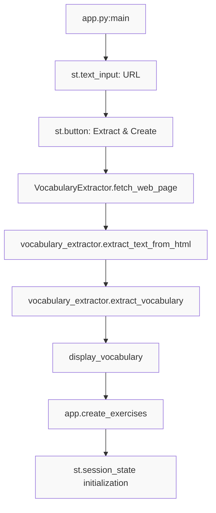
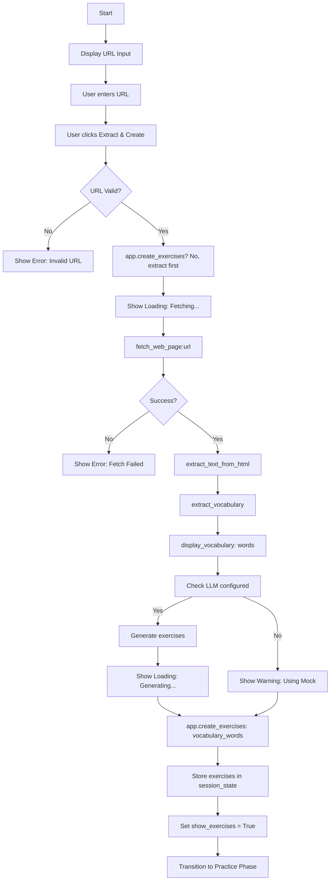

# UI/UX - Creation Phase Specification

**Status**: Draft
**Created**: [YYYY-MM-DD]
**Last Updated**: [YYYY-MM-DD]
**Priority**: High
**Complexity**: Medium
**Phase**: 1 of 3 (Three-phase UI/UX workflow)

---

## Overview

### Summary
The Creation Phase is the first phase of the three-phase user workflow. It enables users to input a URL, extract vocabulary from the web page, and generate personalized language learning exercises. This phase transforms user-provided content into a structured learning resource.

### Motivation
Language learners need to start from authentic content. This phase bridges the gap between real-world web content and structured practice by extracting relevant vocabulary and automatically generating exercises, eliminating manual setup barriers.

---

## Requirements

### Functional Requirements
- [ ] **URL Input**: Accept a valid web page URL from the user
- [ ] **URL Validation**: Validate URL format before processing
- [ ] **Web Page Fetching**: Fetch HTML content from the provided URL
- [ ] **Text Extraction**: Extract clean text from HTML, removing scripts and styles
- [ ] **Vocabulary Extraction**: Extract vocabulary words with frequency counts
- [ ] **Vocabulary Display**: Show top N vocabulary words to the user
- [ ] **Exercise Generation Trigger**: Start exercise generation process
- [ ] **Exercise Generation**: Create exercises from vocabulary words using agent workflow
- [ ] **State Initialization**: Set up session state for practice phase
- [ ] **LLM Configuration Check**: Verify LLM is configured before generation
- [ ] **Visual Feedback**: Show loading states and success/error messages
- [ ] **Progress Indication**: Display status during fetching and generation

### Non-Functional Requirements
- [ ] **Speed**: Fetch and process typical web pages within 5-10 seconds
- [ ] **Usability**: Single-button action to complete the phase
- [ ] **Feedback**: Clear visual indication of each step's progress
- [ ] **Reliability**: Graceful handling of network errors and invalid URLs
- [ ] **Accessibility**: Clear labels and logical flow

### Constraints
- [ ] Must use Streamlit as the UI framework
- [ ] Must use existing `VocabularyExtractor` class
- [ ] Must use existing `ExerciseGenerator` class (with agent workflow)
- [ ] Must use Streamlit `st.session_state` for state management
- [ ] Must handle missing Mistral API key gracefully
- [ ] Must provide fallback to mock LLM mode
- [ ] Must not block UI during long operations

---

## User Stories

- **As a** language learner
  **I want to** enter a URL and have the system extract vocabulary automatically
  **So that** I don't have to manually identify words to learn

- **As a** language learner
  **I want to** see the extracted vocabulary before generating exercises
  **So that** I can verify the words are relevant to my learning goals

- **As a** language learner
  **I want to** generate exercises with one click
  **So that** I can quickly start practicing

- **As a** developer
  **I want to** test the creation phase without LLM API key
  **So that** I can verify functionality in isolation

- **As a** user without API key
  **I want to** use mock mode to see sample exercises
  **So that** I can try the application before configuring LLM access

---

## Technical Design

### Architecture



### Workflow Diagram



### Components

| Component | Responsibility | File | Dependencies |
|-----------|---------------|------|--------------|
| `main()` function | Orchestrate creation phase | `app.py` | streamlit, VocabularyExtractor, LanguageLearnerApplication |
| `VocabularyExtractor` | Extract vocabulary from web pages | `web/vocabulary_extractor.py` | requests, BeautifulSoup, nltk, NERFilter |
| `ExerciseGenerator` | Generate exercises from vocabulary | `exercises/generator.py` | ExerciseWorkflow, LLMClient |
| `LanguageLearnerApplication` | Business logic orchestrator | `core/application.py` | All core modules |
| `display_vocabulary()` | Display vocabulary words | `ui/vocabulary_display.py` | streamlit |
| `MistralLLMClient` | Real LLM for generation | `core/llm_client.py` | mistralai |
| `MockLLMClient` | Mock LLM for fallback | `core/mock_llm.py` | LLMClient |

### UI Layout

```
+---------------------------------------------------+
|  French Language Learner Assistant                 |
+---------------------------------------------------+
|                                                   |
|  Enter a French web page URL to extract           |
|  vocabulary and create exercises:                |
|                                                   |
|  [URL: ________________________________]        |
|                                                   |
|  [Extract Vocabulary and Create Exercises]        |
|                                                   |
+---------------------------------------------------+
|  [During fetching/generation]                      |
|  ✅ Fetching and processing content...            |
|  or                                                  |
|  ✅ Generating exercises...                        |
+---------------------------------------------------+
|  [On success]                                       |
|  ✅ Vocabulary extracted successfully!             |
|                                                   |
|  ✅ Generated 10 exercises!                        |
|                                                   |
|  Top Vocabulary Words:                             |
|  - pomme: 15                                       |
|  - chat: 12                                        |
|  - maison: 8                                       |
|  ...                                              |
+---------------------------------------------------+
```

### Data Flow

1. **Initialization**: `main()` sets up Streamlit page and initializes `st.session_state`
   - `st.session_state.app = LanguageLearnerApplication(llm_client_or_mock)`
   - `st.session_state.exercises = []`
   - `st.session_state.show_exercises = False`

2. **URL Input**: User enters URL in `st.text_input("URL:")`

3. **Action Trigger**: User clicks `st.button("Extract Vocabulary and Create Exercises")`

4. **Validation**: Check if URL is provided (not empty)

5. **LLM Check**: Verify `st.session_state.llm_configured` or show warning for mock mode

6. **Text Extraction**: `extractor.fetch_web_page(url)` → HTML string

7. **HTML Parsing**: `extractor.extract_text_from_html(html)` → clean text string

8. **Vocabulary Extraction**: `extractor.extract_vocabulary(text)` → list of (word, count) tuples

9. **Display Vocabulary**: `display_vocabulary(vocabulary)` renders top N words

10. **Exercise Generation**: `app.create_exercises(vocabulary_words)` → list of Exercise objects

11. **State Update**: Store exercises in `st.session_state.exercises` and set `show_exercises = True`

12. **Phase Transition**: Render practice phase components (handled by main function)

### Visual Feedback Components

| State | Streamlit Component | Message |
|-------|---------------------|---------|
| Fetching | `st.spinner()` | "Fetching and processing content..." |
| Success (fetch) | `st.success()` | "Vocabulary extracted successfully!" |
| Generating | `st.spinner()` | "Generating exercises..." |
| Success (generate) | `st.success()` | "Generated N exercises!" |
| No URL | `st.warning()` | "Please enter a URL" |
| LLM not configured | `st.warning()` | "Mistral LLM not configured. Using mock LLM..." |
| Fetch error | `st.error()` | "Failed to fetch web page: [error]" |

---

## API/Interfaces

### Main Function

```python
def main():
    """Main Streamlit application entry point. Handles all three phases."""
```

### URL Input

```python
url = st.text_input("URL:", "")
```

### Action Button

```python
if st.button("Extract Vocabulary and Create Exercises"):
    # Trigger creation phase
```

### Vocabulary Display

```python
def display_vocabulary(
    vocabulary: Sequence[tuple[str, int]], top_n: int = 10
) -> list[str]:
    """Display the top vocabulary words extracted from text.
    
    Args:
        vocabulary: Sequence of (word, count) tuples
        top_n: Number of top words to display (default: 10)
        
    Returns:
        List of vocabulary words displayed
    """
```

### Session State Variables (Creation Phase)

| Variable | Type | Purpose | Lifecycle |
|----------|------|---------|----------|
| `app` | `LanguageLearnerApplication` | Main application instance | Entire session |
| `llm_configured` | `bool` | Whether real LLM is available | Entire session |
| `exercises` | `list[Exercise]` | Generated exercises | Created here, used in practice |
| `show_exercises` | `bool` | Flag to trigger practice phase | Set here |

### Input Validation

```python
if url:
    # Proceed with extraction
else:
    st.warning("Please enter a URL")
```

---

## Implementation Plan

### Steps
- [ ] **Step 1**: Analyze existing implementation
  - [x] Review `app.py` creation phase logic
  - [x] Review `vocabulary_display.py`
  - [x] Review `vocabulary_extractor.py`
  - [x] Review `generator.py` and agent workflow
  - [ ] Document any gaps between implementation and requirements

- [ ] **Step 2**: Create draft specification
  - [x] Write specification document following TEMPLATE.md
  - [ ] Define phase transition criteria
  - [ ] Define acceptance criteria

- [ ] **Step 3**: Review and refine
  - [ ] Validate against actual code
  - [ ] Add comprehensive test cases
  - [ ] Identify risks and mitigations

- [ ] **Step 4**: Finalize
  - [ ] Update status from Draft to Review
  - [ ] Incorporate feedback
  - [ ] Mark as Approved

---

## Acceptance Criteria

### Must Have
- [ ] Specification document created in `specs/feat-creation-phase-spec.md`
- [ ] All creation phase components documented
- [ ] Data flow clearly described
- [ ] Visual feedback documented
- [ ] Error handling documented
- [ ] LLM fallback documented
- [ ] Phase transition to practice documented

### Should Have
- [ ] Performance benchmarks documented
- [ ] User interaction flow diagram
- [ ] Integration points with other phases

### Test Cases
- [ ] Test URL input field accepts text
- [ ] Test button trigger with valid URL
- [ ] Test vocabulary extraction from real URL
- [ ] Test vocabulary display shows words and counts
- [ ] Test exercise generation produces exercises
- [ ] Test session state updated correctly
- [ ] Test phase transition to practice
- [ ] Test with empty URL (shows warning)
- [ ] Test with invalid URL (shows error)
- [ ] Test with fetch failure (shows error)
- [ ] Test with LLM configured (uses real LLM)
- [ ] Test with LLM not configured (uses mock)
- [ ] Test loading indicators shown during operations

---

## Dependencies

### Internal Dependencies
- [ ] `app.py`: Main application file
- [ ] `ui/vocabulary_display.py`: Vocabulary display component
- [ ] `web/vocabulary_extractor.py`: VocabularyExtractor class
- [ ] `exercises/generator.py`: ExerciseGenerator class
- [ ] `exercises/agents/exercise_workflow.py`: ExerciseWorkflow
- [ ] `exercises/agents/exercise_creator.py`: ExerciseCreatorAgent
- [ ] `exercises/agents/exercise_reviewer.py`: ExerciseReviewerAgent
- [ ] `core/application.py`: LanguageLearnerApplication
- [ ] `core/llm_client.py`: MistralLLMClient
- [ ] `core/mock_llm.py`: MockLLMClient
- [ ] `models/exercise.py`: Exercise, ExerciseType data models

### External Dependencies
- [ ] `streamlit`: Web UI framework
- [ ] `nltk`: Natural language toolkit
- [ ] `requests`: HTTP requests
- [ ] `beautifulsoup4`: HTML parsing
- [ ] `langgraph`: Agent workflow orchestration
- [ ] `mistralai`: LLM access (optional, with fallback)

---

## Testing Strategy

### Unit Tests
- [ ] Test `display_vocabulary()` returns correct word list
- [ ] Test vocabulary extraction with mock HTML
- [ ] Test exercise generation with mock LLM
- [ ] Test session state updates

### Integration Tests
- [ ] Test end-to-end creation: URL → vocabulary → exercises
- [ ] Test with real web page
- [ ] Test with mock LLM
- [ ] Test with real LLM (with test API key)

### Manual Testing
- [ ] Manual test with real French news URL
- [ ] Manual test with invalid URL
- [ ] Manual test with network failure
- [ ] Manual test with slow network
- [ ] Manual test without LLM API key
- [ ] Manual test with various content types

### Test Data
- Valid French web page URLs
- Invalid URLs (empty, malformed, 404)
- Mock HTML content with known vocabulary
- Mock LLM responses for exercise generation

---

## Risks & Mitigations

| Risk | Probability | Impact | Mitigation |
|------|-------------|--------|------------|
| Network timeout during fetch | Medium | High | Configurable timeout, spinner, clear error message |
| Invalid URL format | Medium | Medium | Input validation, user-friendly error |
| Web page blocks scraping | Low | Medium | User agent header, respect robots.txt in future |
| Large page processing slow | Medium | Medium | Limit content size, show progress |
| LLM API failure during generation | Medium | High | Fallback to mock, clear warning |
| Rate limiting by web server | Medium | Medium | Configurable retry, respectful delays |

---

## Alternatives Considered

### Option 1: Separate URL and Generation Steps
**Pros:**
- More control for users
- Can review vocabulary before generating
- Can adjust parameters between steps

**Cons:**
- More clicking required
- Less fluid workflow

**Decision:** Combined into one action for simplicity; vocabulary is displayed before exercises

### Option 2: Batch URL Processing
**Pros:**
- Process multiple URLs at once
- Build larger vocabulary sets

**Cons:**
- More complex UI
- Longer processing time
- More memory usage

**Decision:** Single URL for v1; batch can be added later

### Option 3: Pre-Configured Sample URLs
**Pros:**
- Quick start for new users
- Consistent testing

**Cons:**
- Limited to pre-selected content
- May not match user interests

**Decision:** Not in v1; can be added as "Examples" section later

---

## Open Questions

1. **Should we support URL history?**
   - Current: No history tracking
   - Consideration: Users may want to revisit previous URLs
   - Recommendation: Part of Exercise Management feature

2. **Should we validate URL content language?**
   - Current: No language detection
   - Consideration: Ensure content matches user's target language
   - Recommendation: Auto-detect or allow override in future

3. **Should we cache fetched pages?**
   - Current: No caching
   - Consideration: Avoid re-fetching same URL
   - Recommendation: Short-term cache could improve UX

4. **Should we limit vocabulary count?**
   - Current: Uses extractor defaults (top 50)
   - Consideration: Too many words can overwhelm
   - Recommendation: Configurable limit; default to 10-15 for v1

---

## Estimation

### Complexity Assessment
- **Technical Complexity**: Medium (coordinates multiple components)
- **Risk Level**: Medium (network and LLM dependencies)
- **Dependencies**: High (streamlit, nltk, requests, langgraph, mistralai)

### Effort Estimate
- Specification creation: 1-2 hours
- Code review against spec: 1 hour
- Test case definition: 1 hour
- **Total**: 3-4 hours

---

## References

- [Language Learner Mission Document](../mission.md)
- [Technical Stack & Architecture](../tech-stack.md)
- [Roadmap](../roadmap.md)
- [Vocabulary Extraction Pipeline Spec](../feat-vocabulary-extraction-spec.md)
- [Exercise Generation Spec](../feat-exercise-generation-spec.md)
- [UI Practice Phase Spec](../feat-ui-practice-phase-spec.md)
- [UI Review Phase Spec](../feat-ui-review-phase-spec.md)
- [Streamlit Documentation](https://docs.streamlit.io/)

---

## Changelog

| Version | Date | Changes |
|---------|------|---------|
| 1.0 | [Date] | Initial specification created |
