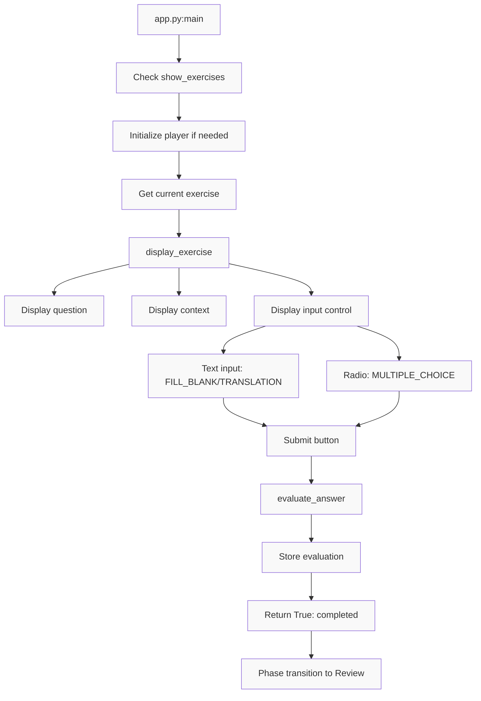
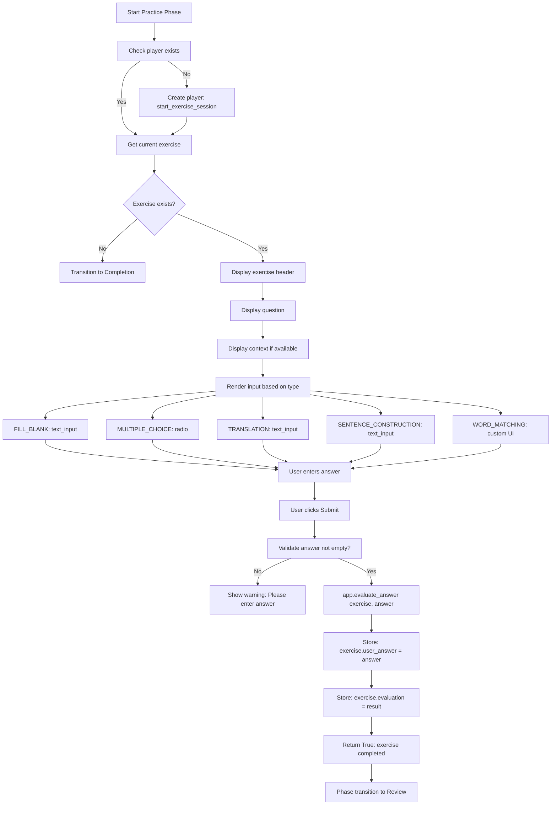

# UI/UX - Practice Phase Specification

**Status**: Draft
**Created**: [YYYY-MM-DD]
**Last Updated**: [YYYY-MM-DD]
**Priority**: High
**Complexity**: Medium
**Phase**: 2 of 3 (Three-phase UI/UX workflow)

---

## Overview

### Summary
The Practice Phase is the second phase of the three-phase user workflow. It enables users to interact with generated exercises, submit answers, and receive immediate feedback. This phase provides the core learning interaction where users actively engage with the vocabulary through various exercise types.

### Motivation
Active practice is essential for language retention. This phase provides users with contextual exercises that reinforce vocabulary learning through interactive question-and-answer format, enabling them to apply their knowledge immediately.

---

## Requirements

### Functional Requirements
- [ ] **Exercise Display**: Show current exercise question and context
- [ ] **Input Field Rendering**: Display appropriate input based on exercise type
- [ ] **Answer Collection**: Capture user's answer via text input or selection
- [ ] **Answer Submission**: Handle user submission with button click
- [ ] **Answer Storage**: Store user answer in exercise object
- [ ] **Evaluation Trigger**: Call evaluation service for submitted answer
- [ ] **Result Storage**: Store evaluation in exercise object
- [ ] **Session Management**: Track current exercise and progress
- [ ] **Type-Specific UI**: Render different input controls for each exercise type
- [ ] **Progress Display**: Show current position in exercise sequence
- [ ] **Phase Transition**: Move to review phase after submission

### Non-Functional Requirements
- [ ] **Responsiveness**: Sub-second response for answer submission
- [ ] **Clarity**: Clear question presentation with context
- [ ] **Usability**: Intuitive input controls for each exercise type
- [ ] **Feedback**: Immediate transition to feedback display
- [ ] **Accessibility**: Keyboard-navigable input controls

### Constraints
- [ ] Must use Streamlit as the UI framework
- [ ] Must use existing `ExercisePlayer` for session management
- [ ] Must use existing `AnswerEvaluator` for evaluation
- [ ] Must use Streamlit `st.session_state` for state persistence
- [ ] Must support all `ExerciseType` values
- [ ] Must store evaluation results in exercise object
- [ ] Must not allow revisiting previous exercises (sequential only)

---

## User Stories

- **As a** language learner
  **I want to** practice exercises one at a time
  **So that** I can focus on each question without distraction

- **As a** language learner
  **I want to** see the exercise context and question clearly
  **So that** I understand what is being asked

- **As a** language learner
  **I want to** see my progress through the exercise set
  **So that** I know how many exercises remain

- **As a** language learner
  **I want to** use the appropriate input method for each exercise type
  **So that** I can provide my answer naturally (text for fill-in, selection for multiple choice)

- **As a** language learner with limited time
  **I want to** submit answers quickly
  **So that** I can complete exercises efficiently

- **As a** developer
  **I want to** easily add new exercise types with appropriate UI
  **So that** I can extend the system's capabilities

---

## Technical Design

### Architecture



### Workflow Diagram



### Components

| Component | Responsibility | File | Dependencies |
|-----------|---------------|------|--------------|
| `main()` function | Orchestrate practice phase | `app.py` | streamlit, ExercisePlayer, LanguageLearnerApplication |
| `display_exercise()` | Render exercise and handle submission | `ui/exercise_display.py` | streamlit, ExercisePlayer, LanguageLearnerApplication, Exercise |
| `ExercisePlayer` | Manage exercise session state | `exercises/player.py` | Exercise, datetime |
| `AnswerEvaluator` | Evaluate user answers | `evaluation/evaluator.py` | LLMClient, Exercise, EvaluationResult |
| `LanguageLearnerApplication` | Business logic orchestrator | `core/application.py` | All core modules |

### UI Layout

```
+---------------------------------------------------+
|  Exercises                                          |
+---------------------------------------------------+
|                                                   |
|  Exercise 3/10                                    |
|                                                   |
|  Question: Complete the sentence:                  |
|  Le chat est sur le ___.                          |
|                                                   |
|  Context: Translation: The cat is on the sofa.     |
|                                                   |
|  Your answer: [____________________]              |
|                                                   |
|  [Submit Answer]                                  |
|                                                   |
+---------------------------------------------------+
```

### Exercise Type UI Mapping

| Exercise Type | Streamlit Component | Interaction |
|---------------|---------------------|-------------|
| FILL_BLANK | `st.text_input()` | User types missing word |
| MULTIPLE_CHOICE | `st.radio()` | User selects from options |
| TRANSLATION | `st.text_input()` | User types translation |
| SENTENCE_CONSTRUCTION | `st.text_input()` | User types full sentence |
| WORD_MATCHING | TBD (custom) | User matches words to definitions |

### Data Flow

1. **Entry Check**: `main()` checks `st.session_state.show_exercises`

2. **Player Initialization**: If `st.session_state.player` doesn't exist:
   - Call `app.start_exercise_session(st.session_state.exercises)`
   - Store in `st.session_state.player`

3. **Get Current Exercise**: `player.get_current_exercise()`

4. **Display Exercise**: `display_exercise(exercise, player, app)`
   - Show progress: `player.get_progress()` (e.g., "3/10")
   - Show question: `exercise.question`
   - Show context if available: `exercise.context`

5. **Type-Specific Rendering**: Based on `exercise.exercise_type.value`:
   - **FILL_BLANK**: `st.text_input("Your answer:", key=f"answer_{exercise_id}")`
   - **MULTIPLE_CHOICE**: `st.radio("Options:", exercise.options, key=f"answer_{exercise_id}")`
   - **TRANSLATION**: `st.text_input("Your translation:", key=f"answer_{exercise_id}")`
   - **SENTENCE_CONSTRUCTION**: `st.text_input("Your sentence:", key=f"answer_{exercise_id}")`
   - **WORD_MATCHING**: Custom matching UI (TBD)

6. **Submission Handling**: User clicks "Submit Answer"
   - Check if `exercise.user_answer is None` (not already answered)
   - Get user_answer from Streamlit widget
   - Call `app.evaluate_answer(exercise, user_answer)`
   - Store result: `exercise.user_answer = user_answer`
   - Store result: `exercise.evaluation = {score, is_correct, feedback, ...}`
   - Return `True` to indicate completion

7. **Phase Transition**: Return `True` triggers `st.rerun()` → Review phase

### Progress Tracking

The `ExercisePlayer` maintains:
- `exercises`: List of all exercises
- `current_index`: Position in the list (0-indexed)
- Progress displayed as: `f"{current_index + 1}/{len(exercises)}"`

### Key Generation
Each input control uses unique key: `f"answer_{exercise.exercise_id}"`
- Prevents widget state collisions
- Ensures each exercise has independent input

---

## API/Interfaces

### Practice Phase Entry

```python
# In app.py main()
if st.session_state.show_exercises and st.session_state.exercises:
    # Practice phase active
```

### Player Management

```python
if "player" not in st.session_state or st.session_state.player is None:
    st.session_state.player = st.session_state.app.start_exercise_session(
        st.session_state.exercises
    )
player = st.session_state.player
```

### Exercise Display Function

```python
def display_exercise(
    exercise: Exercise, 
    player: ExercisePlayer, 
    app: LanguageLearnerApplication
) -> bool:
    """Display an exercise and handle user input.
    
    Args:
        exercise: The current exercise to display
        player: The exercise player managing the session
        app: The language learner application
        
    Returns:
        True if exercise was completed (answer submitted), False otherwise
    """
```

### Progress Display

```python
st.write(f"Exercise {player.get_progress()}")
```

### Exercise Player Methods

```python
class ExercisePlayer:
    def get_current_exercise(self) -> Exercise | None:
        """Get the current exercise."""
        
    def get_progress(self) -> str:
        """Get progress string (e.g., '3/10')."""
        
    def has_more_exercises(self) -> bool:
        """Check if more exercises remain."""
        
    def submit_answer(self, exercise_id: str, user_answer: str) -> bool:
        """Submit answer and advance to next exercise."""
```

### Input Controls

```python
# Fill-in-the-blank
user_answer = st.text_input(
    "Your answer:", 
    key=f"answer_{exercise.exercise_id}"
)

# Multiple choice
user_answer = st.radio(
    "Options:", 
    exercise.options, 
    key=f"answer_{exercise.exercise_id}"
)
```

### Submission Handling

```python
if st.button("Submit Answer"):
    evaluation = app.evaluate_answer(exercise, user_answer)
    exercise.user_answer = user_answer
    exercise.evaluation = {
        "score": evaluation.score,
        "is_correct": evaluation.is_correct,
        "feedback": evaluation.feedback,
        "correct_answer": evaluation.correct_answer,
        "explanation": evaluation.explanation,
        "learning_tips": evaluation.learning_tips,
    }
    return True
```

---

## Implementation Plan

### Steps
- [ ] **Step 1**: Analyze existing implementation
  - [x] Review `app.py` practice phase logic
  - [x] Review `exercise_display.py`
  - [x] Review `player.py`
  - [x] Review `evaluator.py`
  - [ ] Document any gaps between implementation and requirements

- [ ] **Step 2**: Create draft specification
  - [x] Write specification document following TEMPLATE.md
  - [ ] Define exercise type handling
  - [ ] Define acceptance criteria

- [ ] **Step 3**: Review and refine
  - [ ] Validate against actual code
  - [ ] Add comprehensive test cases
  - [ ] Identify risks and mitigations

- [ ] **Step 4**: Finalize
  - [ ] Update status from Draft to Review
  - [ ] Incorporate feedback
  - [ ] Mark as Approved

---

## Acceptance Criteria

### Must Have
- [ ] Specification document created in `specs/feat-practice-phase-spec.md`
- [ ] All practice phase components documented
- [ ] All exercise types handled
- [ ] Data flow clearly described
- [ ] Progress tracking documented
- [ ] Phase transition to review documented
- [ ] Input control key generation documented

### Should Have
- [ ] UI layout diagram for each exercise type
- [ ] User interaction flow diagram
- [ ] Performance benchmarks

### Test Cases
- [ ] Test exercise display for all types
- [ ] Test input control rendering for each type
- [ ] Test answer submission stores user_answer
- [ ] Test answer submission stores evaluation
- [ ] Test progress display shows correct count
- [ ] Test submission returns True (triggers review)
- [ ] Test with no more exercises (completion)
- [ ] Test player initialization
- [ ] Test exercise already answered (should skip to review)
- [ ] Test keyboard input for text fields
- [ ] Test radio button selection for multiple choice
- [ ] Test submission with empty answer (warning)

---

## Dependencies

### Internal Dependencies
- [ ] `app.py`: Main application file
- [ ] `ui/exercise_display.py`: Exercise display and interaction
- [ ] `exercises/player.py`: ExercisePlayer for session management
- [ ] `evaluation/evaluator.py`: AnswerEvaluator for scoring
- [ ] `core/application.py`: LanguageLearnerApplication
- [ ] `models/exercise.py`: Exercise, ExerciseType, EvaluationResult

### External Dependencies
- [ ] `streamlit`: Web UI framework (st.text_input, st.radio, st.button, st.write)
- [ ] `uuid`: For exercise IDs (used in keys)

---

## Testing Strategy

### Unit Tests
- [ ] Test `ExercisePlayer.get_current_exercise()`
- [ ] Test `ExercisePlayer.get_progress()`
- [ ] Test `ExercisePlayer.has_more_exercises()`
- [ ] Test `ExercisePlayer.submit_answer()`
- [ ] Test `display_exercise()` for all exercise types
- [ ] Test input control key generation

### Integration Tests
- [ ] Test end-to-end: display → input → submit → evaluation
- [ ] Test full practice session with multiple exercises
- [ ] Test with mock evaluator
- [ ] Test with real evaluator

### Manual Testing
- [ ] Manual test with all exercise types
- [ ] Manual test with correct answers
- [ ] Manual test with incorrect answers
- [ ] Manual test navigating through all exercises
- [ ] Manual test with long exercise list
- [ ] Manual test of progress display

### Test Data
- Exercises of each type (FILL_BLANK, MULTIPLE_CHOICE, TRANSLATION, etc.)
- Correct answers for each exercise
- Incorrect answers for each exercise
- Empty answers
- Edge cases: special characters, long text

---

## Risks & Mitigations

| Risk | Probability | Impact | Mitigation |
|------|-------------|--------|------------|
| Streamlit widget state issues | Medium | High | Unique keys per exercise, session_state management |
| Long exercise lists slow UI | Low | Medium | Paginated display or lazy loading for future |
| Answer submission race conditions | Low | Medium | Disable submit after first click, use session_state |
| Browser back button breaks state | Medium | Medium | Store exercise state in session_state, validate on load |
| Input field focus issues | Low | Low | Streamlit handles focus |

---

## Alternatives Considered

### Option 1: Multi-Page Practice
**Pros:**
- Cleaner separation
- Browser history works

**Cons:**
- Streamlit multi-page complexity
- Session state management harder
- Less fluid experience

**Decision:** Single-page with state management is simpler for v1

### Option 2: Auto-Advance on Correct Answer
**Pros:**
- Faster for correct answers
- More fluid experience

**Cons:**
- Less time to read feedback
- No control for users
- Harder to implement

**Decision:** Manual advance ("Continue" button) gives users control

### Option 3: Previous/Next Navigation
**Pros:**
- Users can review previous exercises
- More flexibility

**Cons:**
- More complex state management
- May encourage cheating
- Not aligned with sequential learning

**Decision:** Sequential forward-only for v1

### Option 4: Exercise Timer
**Pros:**
- Adds urgency/gamification
- Tracks time per exercise

**Cons:**
- Added pressure may not be desired
- More complex UI

**Decision:** Not in v1; can be added as optional feature later

---

## Open Questions

1. **Should we support skipping exercises?**
   - Current: Must answer each exercise
   - Consideration: Users may want to skip difficult/hard exercises
   - Recommendation: Add skip button with confirmation in future

2. **Should we show a hint option?**
   - Current: No hints provided
   - Consideration: Help users who are stuck
   - Recommendation: Part of future enhancement

3. **Should exercises be timed?**
   - Current: No timing
   - Consideration: Useful for tracking progress
   - Recommendation: Not in v1; add as optional feature

4. **Should we support voice input?**
   - Current: Text only
   - Consideration: Useful for speaking practice
   - Recommendation: Future enhancement, requires browser permissions

---

## Estimation

### Complexity Assessment
- **Technical Complexity**: Medium (multiple exercise types, state management)
- **Risk Level**: Low (Streamlit handles most complexity)
- **Dependencies**: Medium (streamlit, internal modules)

### Effort Estimate
- Specification creation: 1-2 hours
- Code review against spec: 1 hour
- Test case definition: 1 hour
- **Total**: 3-4 hours

---

## References

- [Language Learner Mission Document](../mission.md)
- [Technical Stack & Architecture](../tech-stack.md)
- [Roadmap](../roadmap.md)
- [Exercise Generation Spec](../feat-exercise-generation-spec.md)
- [Answer Evaluation Spec](../feat-answer-evaluation-spec.md)
- [UI Creation Phase Spec](../feat-ui-creation-phase-spec.md)
- [UI Review Phase Spec](../feat-ui-review-phase-spec.md)
- [Streamlit Documentation](https://docs.streamlit.io/)

---

## Changelog

| Version | Date | Changes |
|---------|------|---------|
| 1.0 | [Date] | Initial specification created |
