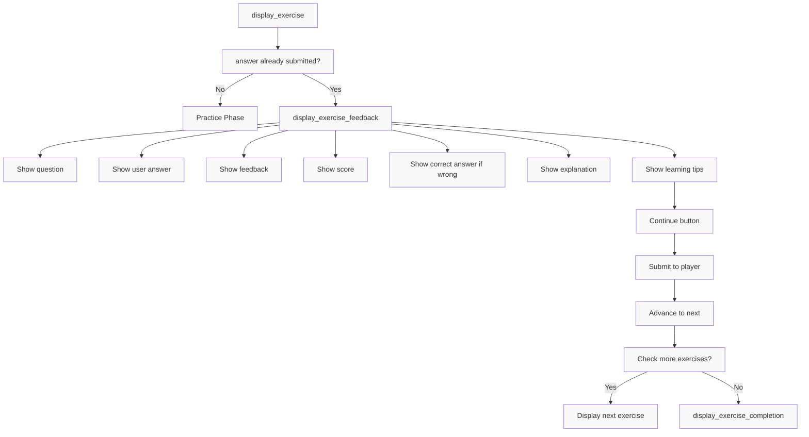
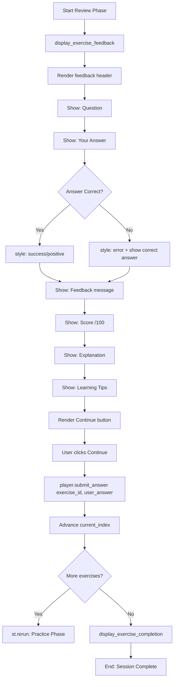

# UI/UX - Review Phase Specification

**Status**: Draft
**Created**: [YYYY-MM-DD]
**Last Updated**: [YYYY-MM-DD]
**Priority**: High
**Complexity**: Low
**Phase**: 3 of 3 (Three-phase UI/UX workflow)

---

## Overview

### Summary
The Review Phase is the third and final phase of the three-phase user workflow. It displays feedback for submitted exercises, allowing users to review their answers, understand corrections, and learn from mistakes before continuing to the next exercise or completing the session.

### Motivation
Immediate feedback is crucial for effective learning. This phase ensures users understand why their answer was correct or incorrect, reinforces learning with explanations, and provides actionable tips for improvement, completing the active learning cycle.

---

## Requirements

### Functional Requirements
- [ ] **Feedback Display**: Show detailed evaluation for submitted answer
- [ ] **Answer Comparison**: Display user's answer alongside correct answer
- [ ] **Score Display**: Show numerical score (0-100)
- [ ] **Explanation Display**: Provide explanation of correct answer
- [ ] **Learning Tips Display**: Show pedagogical suggestions for improvement
- [ ] **Progress Continuation**: Allow user to proceed to next exercise
- [ ] **Completion Detection**: Recognize when all exercises are finished
- [ ] **Completion Celebration**: Display success message when session complete
- [ ] **Session Results**: Show summary when all exercises completed
- [ ] **Visual Distinction**: Clearly differentiate correct vs incorrect answers

### Non-Functional Requirements
- [ ] **Clarity**: Feedback must be easy to understand for language learners
- [ ] **Encouragement**: Positive reinforcement for correct answers
- [ ] **Constructive**: Helpful guidance for incorrect answers
- [ ] **Consistency**: Same feedback format for all exercise types
- [ ] **Speed**: Immediate display after submission

### Constraints
- [ ] Must use Streamlit as the UI framework
- [ ] Must use existing `Exercise` data model with evaluation field
- [ ] Must use existing `EvaluationResult` data model
- [ ] Must use Streamlit `st.session_state` for state management
- [ ] Must use `ExercisePlayer` for session progression
- [ ] Must not allow re-answering (read-only in review)

---

## User Stories

- **As a** language learner
  **I want to** see my answer compared to the correct answer
  **So that** I can understand what I got wrong

- **As a** language learner
  **I want to** read an explanation of the correct answer
  **So that** I can learn the concept, not just the word

- **As a** language learner
  **I want to** see my score for each exercise
  **So that** I can track my performance

- **As a** language learner
  **I want to** receive learning tips with feedback
  **So that** I can improve future answers

- **As a** language learner
  **I want to** feel encouraged when I answer correctly
  **So that** I stay motivated to continue

- **As a** language learner
  **I want to** know when I've completed all exercises
  **So that** I have a sense of accomplishment

---

## Technical Design

### Architecture



### Workflow Diagram



### Components

| Component | Responsibility | File | Dependencies |
|-----------|---------------|------|--------------|
| `display_exercise()` | Detect review vs practice phase | `ui/exercise_display.py` | Exercise, streamlit |
| `display_exercise_feedback()` | Render feedback UI | `ui/exercise_display.py` | Exercise, streamlit |
| `display_exercise_completion()` | Render completion message | `ui/exercise_display.py` | streamlit |
| `ExercisePlayer` | Manage exercise progression | `exercises/player.py` | Exercise |

### UI Layout (Feedback Display)

```
+---------------------------------------------------+
|  Exercise Feedback                                  |
+---------------------------------------------------+
|                                                   |
|  Question: Complete the sentence:                   |
|  Le chat est sur le ___.                          |
|                                                   |
|  Your Answer: canapé                              |
|                                                   |
|  ✅ Feedback: Correct!                             |
|                                                   |
|  ✅ Score: 100/100                                |
|                                                   |
|  Explanation: "Canapé" means sofa/couch in French. |
|                                                   |
|  Learning Tips:                                   |
|  - Remember that "sur" means "on"                 |
|  - "Le" is the masculine definite article         |
|                                                   |
|  [Continue to Next Exercise]                      |
+---------------------------------------------------+
```

### UI Layout (Incorrect Answer)

```
+---------------------------------------------------+
|  Exercise Feedback                                  |
+---------------------------------------------------+
|                                                   |
|  Question: What does 'pomme' mean?                  |
|                                                   |
|  Your Answer: banana                              |
|                                                   |
|  ❌ Feedback: Incorrect, try again.                |
|                                                   |
|  ❌ Score: 0/100                                   |
|                                                   |
|  Correct Answer: apple                             |
|                                                   |
|  Explanation: "Pomme" means apple in French.       |
|  It's a common fruit in France.                    |
|                                                   |
|  Learning Tips:                                   |
|  - Review common fruit vocabulary                 |
|  - Listen for the "om" vs "an" sound              |
|                                                   |
|  [Continue to Next Exercise]                      |
+---------------------------------------------------+
```

### UI Layout (Completion)

```
+---------------------------------------------------+
|                                                   |
|  ✅ You have completed all exercises!             |
|                                                   |
|  🎈🎈🎈 (balloons animation)                       |
|                                                   |
+---------------------------------------------------+
```

### Data Flow

1. **Entry**: `display_exercise()` checks if `exercise.user_answer is not None`
   - If already answered: enter review phase
   - If not answered: stay in practice phase

2. **Feedback Display**: Call `display_exercise_feedback(exercise)`

3. **Extract Evaluation**: Read from `exercise.evaluation` dict which contains:
   - `score`: float (0-100)
   - `is_correct`: bool
   - `feedback`: str
   - `correct_answer`: str
   - `explanation`: str
   - `learning_tips`: list[str]

4. **Render Feedback**:
   - Display question
   - Display user's answer (`exercise.user_answer`)
   - Display feedback message
   - Display score
   - If not correct: display correct answer
   - Display explanation
   - Display learning tips (if present)

5. **Continue Action**: Display "Continue to Next Exercise" button

6. **Progression**: User clicks Continue
   - Call `player.submit_answer(exercise.exercise_id, exercise.user_answer)`
   - This advances `player.current_index`
   - Triggers `st.rerun()`

7. **Completion Check**: After rerun, main() calls `player.get_current_exercise()`
   - If returns `None` (no more exercises): call `display_exercise_completion()`
   - If returns exercise: display it (practice or review phase)

### Visual Feedback Styling

| Condition | Streamlit Style | Visual Element |
|-----------|-----------------|----------------|
| Correct answer | Green/checkmark | ✅ prefix, st.success styling |
| Incorrect answer | Red/x-mark | ❌ prefix, st.error styling |
| Score 100 | Green | Bold success tone |
| Score 0 | Red | Bold error tone |
| Partial score (future) | Yellow/Orange | Warning tone |
| Completion | Celebration | st.balloons() |

---

## API/Interfaces

### Feedback Display Function

```python
def display_exercise_feedback(exercise: Exercise) -> None:
    """Display feedback for a completed exercise.
    
    Args:
        exercise: The exercise with user answer and evaluation
    """
```

### Completion Display Function

```python
def display_exercise_completion() -> None:
    """Display completion message when all exercises are done."""
```

### Exercise Player Methods Used

```python
class ExercisePlayer:
    def submit_answer(self, exercise_id: str, user_answer: str) -> bool:
        """Submit answer and advance to next exercise.
        
        Args:
            exercise_id: ID of the exercise being submitted
            user_answer: User's answer string
            
        Returns:
            True if submission successful
        """
        
    def get_current_exercise(self) -> Exercise | None:
        """Get the current exercise, or None if complete."""
        
    def has_more_exercises(self) -> bool:
        """Check if more exercises remain."""
```

### Continue Button

```python
if st.button("Continue to Next Exercise"):
    player.submit_answer(exercise.exercise_id, exercise.user_answer)
    st.rerun()
```

### Evaluation Data Structure

```python
# Stored in exercise.evaluation
evaluation = {
    "score": float,           # 0-100
    "is_correct": bool,      # True/False
    "feedback": str,          # User-facing message
    "correct_answer": str,    # Expected answer
    "explanation": str,       # Detailed explanation
    "learning_tips": list[str] # Pedagogical suggestions
}
```

---

## Implementation Plan

### Steps
- [ ] **Step 1**: Analyze existing implementation
  - [x] Review `exercise_display.py` feedback functions
  - [x] Review `player.py` submit logic
  - [ ] Document any gaps between implementation and requirements

- [ ] **Step 2**: Create draft specification
  - [x] Write specification document following TEMPLATE.md
  - [ ] Define feedback formatting rules
  - [ ] Define acceptance criteria

- [ ] **Step 3**: Review and refine
  - [ ] Validate against actual code
  - [ ] Add comprehensive test cases
  - [ ] Identify risks and mitigations

- [ ] **Step 4**: Finalize
  - [ ] Update status from Draft to Review
  - [ ] Incorporate feedback
  - [ ] Mark as Approved

---

## Acceptance Criteria

### Must Have
- [ ] Specification document created in `specs/feat-review-phase-spec.md`
- [ ] All review phase components documented
- [ ] Feedback display for correct and incorrect answers documented
- [ ] Completion display documented
- [ ] Data flow clearly described
- [ ] Phase transition logic documented
- [ ] Visual styling rules documented

### Should Have
- [ ] UI layout diagram for feedback display
- [ ] User interaction flow diagram
- [ ] Accessibility considerations

### Test Cases
- [ ] Test feedback display for correct answer
- [ ] Test feedback display for incorrect answer
- [ ] Test all feedback fields displayed
- [ ] Test score display format
- [ ] Test correct answer shown for incorrect submissions
- [ ] Test learning tips displayed
- [ ] Test continue button advances to next exercise
- [ ] Test continue button on last exercise shows completion
- [ ] Test completion message displayed
- [ ] Test balloons animation on completion
- [ ] Test with missing evaluation fields
- [ ] Test with empty learning tips

---

## Dependencies

### Internal Dependencies
- [ ] `ui/exercise_display.py`: `display_exercise_feedback()`, `display_exercise_completion()`
- [ ] `exercises/player.py`: `ExercisePlayer.submit_answer()`, `get_current_exercise()`, `has_more_exercises()`
- [ ] `models/exercise.py`: `Exercise` with evaluation field, `EvaluationResult`

### External Dependencies
- [ ] `streamlit`: Web UI framework (st.write, st.button, st.success, st.error, st.balloons)

---

## Testing Strategy

### Unit Tests
- [ ] Test `display_exercise_feedback()` with correct answer
- [ ] Test `display_exercise_feedback()` with incorrect answer
- [ ] Test `display_exercise_feedback()` with all evaluation fields
- [ ] Test `display_exercise_feedback()` with missing optional fields
- [ ] Test `display_exercise_completion()` renders correctly
- [ ] Test `ExercisePlayer.submit_answer()` advances index
- [ ] Test `ExercisePlayer.has_more_exercises()` after last exercise

### Integration Tests
- [ ] Test end-to-end: submit answer → feedback → continue → next exercise
- [ ] Test complete session: answer all → final completion
- [ ] Test mixed correct/incorrect answers

### Manual Testing
- [ ] Manual test with correct answer review
- [ ] Manual test with incorrect answer review
- [ ] Manual test navigating through all exercises
- [ ] Manual test completion flow
- [ ] Manual test of visual feedback (colors, icons)
- [ ] Manual test with long explanations
- [ ] Manual test with multiple learning tips

### Test Data
- Exercises with correct user answers
- Exercises with incorrect user answers
- Evaluations with all fields populated
- Evaluations with missing optional fields
- Completion scenarios (last exercise)

---

## Risks & Mitigations

| Risk | Probability | Impact | Mitigation |
|------|-------------|--------|------------|
| Missing evaluation data | Low | Medium | Validate exercise.evaluation exists before display |
| Long feedback text overflows | Low | Low | Streamlit handles text wrapping |
| Learning tips list formatting | Low | Low | Simple bullet list display |
| Continue button double-click | Low | Low | st.rerun() is safe to call multiple times |

---

## Alternatives Considered

### Option 1: Auto-Advance After Delay
**Pros:**
- More fluid experience
- Less clicking required

**Cons:**
- Users can't read feedback at their own pace
- Less control for users
- May not suit all learning styles

**Decision:** Manual continue gives users control over learning pace

### Option 2: Show All Feedback at End
**Pros:**
- Comprehensive review
- See all results together

**Cons:**
- Not immediate feedback
- Harder to associate with specific exercise
- Less effective for learning

**Decision:** Immediate per-exercise feedback is more effective pedagogically

### Option 3: Re-Answer Option
**Pros:**
- Users can try again immediately
- Reinforces learning

**Cons:**
- More complex state management
- May game the system
- Design decision: forward-only flow

**Decision:** Sequential forward-only for v1; re-answer can be added later

### Option 4: Skip Review Phase
**Pros:**
- Faster workflow
- Less clicking

**Cons:**
- Misses learning opportunity
- Users don't see feedback
- Defeats purpose of exercises

**Decision:** Review phase is essential for learning effectiveness

---

## Open Questions

1. **Should we show cumulative score?**
   - Current: Only per-exercise score
   - Consideration: Users want to track overall performance
   - Recommendation: Add to completion screen in future

2. **Should we allow reviewing all feedback at end?**
   - Current: Per-exercise review only
   - Consideration: Comprehensive session review
   - Recommendation: Part of Exercise Management feature

3. **Should feedback include difficulty adjustment?**
   - Current: Static difficulty
   - Consideration: Adaptive learning benefits
   - Recommendation: Future enhancement for adaptive difficulty

4. **Should we add time spent per exercise?**
   - Current: No timing data
   - Consideration: Useful analytics
   - Recommendation: Not in v1; add as optional tracking

5. **Should incorrect answers show hints for retry?**
   - Current: Shows correct answer and explanation
   - Consideration: More helpful than just showing answer
   - Recommendation: Current approach sufficient for v1

---

## Estimation

### Complexity Assessment
- **Technical Complexity**: Low (read-only display, minimal user interaction)
- **Risk Level**: Low (well-defined data structure, simple rendering)
- **Dependencies**: Low (few dependencies, mostly display)

### Effort Estimate
- Specification creation: 1-2 hours
- Code review against spec: 1 hour
- Test case definition: 1 hour
- **Total**: 3-4 hours

---

## References

- [Language Learner Mission Document](../mission.md)
- [Technical Stack & Architecture](../tech-stack.md)
- [Roadmap](../roadmap.md)
- [Exercise Generation Spec](../feat-exercise-generation-spec.md)
- [Answer Evaluation Spec](../feat-answer-evaluation-spec.md)
- [UI Creation Phase Spec](../feat-ui-creation-phase-spec.md)
- [UI Practice Phase Spec](../feat-ui-practice-phase-spec.md)
- [Streamlit Documentation](https://docs.streamlit.io/)

---

## Changelog

| Version | Date | Changes |
|---------|------|---------|
| 1.0 | [Date] | Initial specification created |
