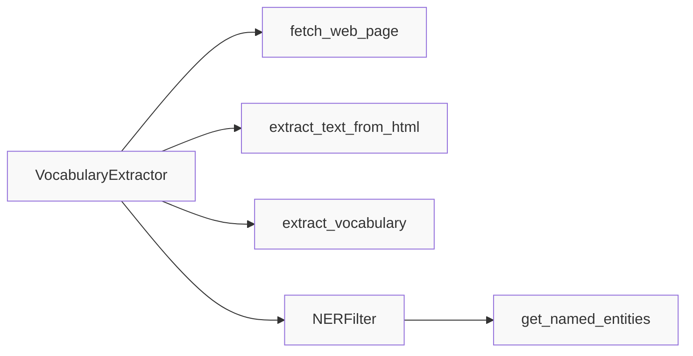

# Vocabulary Extraction Pipeline Specification

**Status**: Approved
**Created**: [YYYY-MM-DD]
**Last Updated**: [YYYY-MM-DD]
**Priority**: High
**Complexity**: Medium

---

## Overview

### Summary
The Vocabulary Extraction Pipeline extracts meaningful vocabulary words from web page content for language learning purposes. It fetches web pages, extracts text, filters out stopwords and proper nouns, and returns a frequency-sorted list of relevant vocabulary.

### Motivation
Language learners need authentic, contextual vocabulary from real sources. This pipeline enables users to extract relevant learnable words from any French (or other language) web page, excluding common words and proper nouns that are less useful for study.

---

## Requirements

### Functional Requirements
- [ ] **Web Page Fetching**: Fetch HTML content from any valid URL
- [ ] **Text Extraction**: Extract clean text from HTML, removing scripts, styles, and excessive whitespace
- [ ] **Stopword Filtering**: Remove common words based on language-specific stopword lists
- [ ] **Named Entity Filtering**: Exclude proper nouns (people, locations, organizations) using NER
- [ ] **Word Length Filtering**: Filter words by minimum length (configurable, default: 4 characters)
- [ ] **Frequency Counting**: Count word occurrences and return top N most frequent (configurable, default: 50)
- [ ] **Language Support**: Support multiple languages, defaulting to French
- [ ] **Error Handling**: Gracefully handle network errors, invalid URLs, and parsing failures

### Non-Functional Requirements
- [ ] **Performance**: Web page fetch timeout configurable (default: 10 seconds)
- [ ] **Reliability**: Retry logic for failed web requests
- [ ] **Logging**: Debug and info logging for all major operations
- [ ] **Configuration**: All thresholds and settings configurable via environment variables
- [ ] **Extensibility**: Easy to add new languages or filtering rules

### Constraints
- [ ] Must use existing `requests` library for HTTP requests
- [ ] Must use existing `BeautifulSoup` from `bs4` for HTML parsing
- [ ] Must use existing `nltk` for tokenization and stopwords
- [ ] Must use existing `spaCy` for NER filtering
- [ ] Must integrate with existing configuration system (`AppSettings`)
- [ ] Must use existing logging infrastructure
- [ ] Must raise `WebFetchError` for web retrieval failures

---

## User Stories

- **As a** language learner
  **I want to** extract vocabulary from a French news article URL
  **So that** I can learn new words from authentic content

- **As a** language learner
  **I want to** filter out proper nouns from extracted vocabulary
  **So that** I can focus on learnable, general vocabulary

- **As a** language learner
  **I want to** configure the minimum word length and top N results
  **So that** I can tune the extraction for different use cases

- **As a** developer
  **I want to** support multiple languages
  **So that** the system can be extended beyond French

---

## Technical Design

### Architecture



### Components

| Component | Responsibility | Dependencies |
|-----------|---------------|--------------|
| `VocabularyExtractor` | Main orchestrator for vocabulary extraction | `requests`, `BeautifulSoup`, `nltk`, `NERFilter`, `AppSettings` |
| `NERFilter` | Named Entity Recognition using spaCy | `spacy` |
| `AppSettings` | Configuration management | `pydantic_settings` |
| `WebFetchError` | Custom exception for fetch failures | `LanguageLearnerError` |

### Data Flow

1. **Input**: URL string
2. **Fetch**: `fetch_web_page(url)` returns HTML string
3. **Extract Text**: `extract_text_from_html(html)` returns cleaned text
4. **Extract Vocabulary**: `extract_vocabulary(text)` calls NER filter and processes words
5. **NER Filtering**: `ner_filter.get_named_entities(text)` returns set of proper nouns to exclude
6. **Filter & Count**: Tokenize, filter stopwords/short words/NER entities, count frequencies
7. **Output**: List of (word, count) tuples sorted by frequency

---

## API/Interfaces

### Public Functions

```python
def fetch_web_page(self, url: str) -> str:
    """Fetch content from a web page.
    
    Args:
        url: URL to fetch
        
    Returns:
        HTML content of the web page
        
    Raises:
        WebFetchError: If there's an error fetching the web page
    """

def extract_text_from_html(self, html: str) -> str:
    """Extract text content from HTML.
    
    Args:
        html: HTML content to extract text from
        
    Returns:
        Cleaned text content
    """

def extract_vocabulary(
    self, 
    text: str, 
    min_word_length: int | None = None, 
    top_n: int | None = None
) -> list[tuple[str, int]]:
    """Extract vocabulary from text.
    
    Args:
        text: Text to extract vocabulary from
        min_word_length: Minimum word length to consider (default from config)
        top_n: Number of top words to return (default from config)
        
    Returns:
        List of (word, count) tuples sorted by frequency
    """
```

### Data Models

```python
# Configuration settings (from AppSettings)
web_request_timeout: int = 10
default_language: str = "french"
min_word_length: int = 4
top_vocabulary_words: int = 50
user_agent: str = "Mozilla/5.0 ..."
```

### Configuration

Environment variables:

| Variable | Type | Required | Default | Description |
|----------|------|----------|---------|-------------|
| `WEB_REQUEST_TIMEOUT` | int | No | 10 | Timeout in seconds for web requests |
| `DEFAULT_LANGUAGE` | str | No | "french" | Default language for extraction |
| `MIN_WORD_LENGTH` | int | No | 4 | Minimum word length to include |
| `TOP_VOCABULARY_WORDS` | int | No | 50 | Number of top words to return |
| `USER_AGENT` | str | No | Chrome UA | User agent for HTTP requests |

---

## Implementation Plan

### Steps
- [x] **Step 1**: Analyze existing implementation
  - [x] Review `vocabulary_extractor.py`
  - [x] Review `ner_filter.py`
  - [x] Review `config.py` for relevant settings
  - [x] Review `exceptions.py` for error handling
  - [x] Document any gaps between implementation and requirements

- [x] **Step 2**: Create draft specification
  - [x] Write specification document following TEMPLATE.md
  - [x] Add data flow diagram
  - [x] Define acceptance criteria

- [x] **Step 3**: Review and refine
  - [x] Validate against actual code
  - [x] Add test cases for `vocabulary_extractor.py`
  - [x] Add integration tests for end-to-end workflow
  - [x] Implement retry logic for web fetching
  - [x] Identify risks and mitigations

- [x] **Step 4**: Finalize
  - [x] Update status from Draft to Review
  - [x] Incorporate feedback
  - [x] Mark as Approved

### Gaps Identified
The following gaps were identified between the specification requirements and current implementation:

1. **✓ RESOLVED - Retry Logic**: The specification requires "Reliability: Retry logic for failed web requests". Implementation added to `vocabulary_extractor.py:fetch_web_page()` with exponential backoff for transient errors (ConnectionError, Timeout). Configuration option `web_request_max_retries` added to `config.py`.

2. **✓ RESOLVED - Vocabulary Extractor Unit Tests**: Created comprehensive unit tests in `tests/test_vocabulary_extractor.py` covering all `VocabularyExtractor` class methods (`fetch_web_page`, `extract_text_from_html`, `extract_vocabulary`) including retry logic, HTML cleaning, stopword filtering, NER integration, and edge cases.

3. **✓ RESOLVED - Integration Tests**: Created integration tests in `tests/test_vocabulary_extraction_integration.py` for end-to-end vocabulary extraction workflow (URL → HTML → text → vocabulary with filtering), including pipeline tests with mocked fetching, configuration testing, and edge case handling.

4. **Performance Considerations**: While configurable timeout exists, there is no streaming or chunked processing for large web pages as mentioned in the risks section. This is deferred to future optimization if needed.

---

## Acceptance Criteria

### Must Have
- [x] Specification document created in `specs/feat-vocabulary-extraction-spec.md`
- [x] All components and dependencies documented
- [x] Data flow clearly described
- [x] Configuration options specified
- [x] Error handling documented

### Should Have
- [x] Performance characteristics documented
- [x] Test cases defined
- [ ] Open questions resolved

### Test Cases
- [x] Test fetching valid URL returns HTML content ( See `tests/test_vocabulary_extractor.py` )
- [x] Test fetching invalid URL raises WebFetchError ( See `tests/test_vocabulary_extractor.py` )
- [x] Test HTML to text extraction removes scripts and styles ( See `tests/test_vocabulary_extractor.py` )
- [x] Test vocabulary extraction with French text ( See `tests/test_vocabulary_extractor.py` )
- [x] Test stopword filtering removes common words ( See `tests/test_vocabulary_extractor.py` )
- [x] Test NER filtering removes proper nouns ( See `tests/test_ner_filter.py` )
- [x] Test minimum word length filtering ( See `tests/test_vocabulary_extractor.py` )
- [x] Test top N results limiting ( See `tests/test_vocabulary_extractor.py` )
- [x] Test with different languages ( See `tests/test_ner_filter.py` )
- [x] Test error handling for network failures ( See `tests/test_vocabulary_extractor.py` )
- [x] Test retry logic on transient failures ( See `tests/test_vocabulary_extractor.py` )
- [x] Test end-to-end pipeline ( See `tests/test_vocabulary_extraction_integration.py` )
- [x] Test configuration settings integration ( See `tests/test_vocabulary_extraction_integration.py` )

---

## Dependencies

### Internal Dependencies
- [ ] `config.py`: For settings management (`AppSettings`)
- [ ] `exceptions.py`: For `WebFetchError` and `LanguageLearnerError`
- [ ] `logging.py`: For logging infrastructure

### External Dependencies
- [ ] `requests`: HTTP requests for web page fetching
- [ ] `beautifulsoup4`: HTML parsing
- [ ] `nltk`: Tokenization and stopwords
- [ ] `spacy`: Named Entity Recognition
- [ ] `pydantic-settings`: Configuration management

---

## Testing Strategy

### Unit Tests
- [ ] Test `fetch_web_page` with mock HTTP responses
- [ ] Test `extract_text_from_html` with various HTML inputs
- [ ] Test `extract_vocabulary` with controlled text inputs
- [ ] Test NER filter with known entity types
- [ ] Test configuration defaults

### Integration Tests
- [ ] Test end-to-end vocabulary extraction from known URL
- [ ] Test with different language configurations

### Manual Testing
- [ ] Manual test with real French news website
- [ ] Manual test with English content
- [ ] Manual test with edge cases (empty page, no text, all stopwords)

### Test Data
- Sample HTML pages with known vocabulary
- French text with proper nouns
- English text for cross-language testing
- Edge cases: empty content, no valid words, very short words

---

## Risks & Mitigations

| Risk | Probability | Impact | Mitigation |
|------|-------------|--------|------------|
| Rate limiting by web servers | Medium | High | Configurable timeout, retry logic, respectful user agent |
| Missing spaCy language models | Medium | High | Clear error messages, documentation on model installation |
| HTML parsing edge cases | Low | Medium | Comprehensive test suite with diverse HTML structures |
| Performance with large pages | Medium | Medium | Configurable limits, streaming processing for future |
| Unicode/encoding issues | Low | Medium | Proper encoding handling in HTML parsing |

---

## Alternatives Considered

### Option 1: Use Only NLTK for Filtering
**Pros:**
- Simpler dependency management
- Single library for tokenization and filtering

**Cons:**
- NLTK NER is limited compared to spaCy
- Would miss many proper nouns

**Decision:** Use spaCy for better NER accuracy, which is critical for vocabulary quality

### Option 3: Separate Text Processing Pipeline
**Pros:**
- More modular, each step independent
- Easier to swap components

**Cons:**
- More complex orchestration
- More files to maintain

**Decision:** Current integrated approach is appropriate for this feature's complexity

---

## Open Questions

1. **Should we support proxy configuration for web fetching?**
   - Current: Direct requests only
   - Consideration: Enterprise environments may need proxy support
   - Recommendation: Add to future roadmap if needed

2. **Should we cache fetched web pages?**
   - Current: No caching
   - Consideration: Repeated requests to same URL
   - Recommendation: Not in v1, but consider for future performance optimization

3. **Should we handle JavaScript-rendered content?**
   - Current: Only static HTML parsing
   - Consideration: Many modern sites use JavaScript rendering
   - Recommendation: Out of scope for v1; document limitation

4. **Should we extract nocoder words (words with special characters like é, è, ê)?**
   - Current: isalpha() check may filter accented characters in some locales
   - Consideration: French has many accented characters
   - Recommendation: Investigate and fix if issue exists

---

## Estimation

### Complexity Assessment
- **Technical Complexity**: Medium
- **Risk Level**: Low
- **Dependencies**: Medium (multiple external libraries)

### Effort Estimate
- Specification creation: 1-2 hours
- Code review against spec: 1 hour
- Test case definition: 1 hour
- **Total**: 3-4 hours

---

## References

- [Language Learner Mission Document](../mission.md)
- [Technical Stack & Architecture](../tech-stack.md)
- [Roadmap](../roadmap.md)
- [spaCy Documentation](https://spacy.io/usage)
- [NLTK Documentation](https://www.nltk.org/)
- [BeautifulSoup Documentation](https://www.crummy.com/software/BeautifulSoup/bs4/doc/)

---

## Changelog

| Version | Date | Changes |
|---------|------|---------|
| 1.0 | [Date] | Initial specification created |
