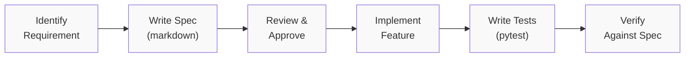

# Language Learner Assistant - Mission Document

## Mission Statement

Build a spec-driven, AI-powered language learning assistant that helps users learn French (and other languages) by extracting vocabulary from authentic web content and generating personalized, high-quality language exercises.

---

## Purpose

The Language Learner Assistant provides an **active learning** experience by:

1. **Extracting vocabulary** from real French web pages that users choose
2. **Filtering intelligently** to focus on relevant, learnable words (excluding stopwords and proper nouns)
3. **Generating diverse exercises** using LLM to reinforce vocabulary in context
4. **Reviewing exercise quality** through an agent-based workflow to ensure pedagogical value
5. **Providing immediate feedback** with detailed evaluations and learning tips

---

## Core Value Proposition

| Problem | Solution | Benefit |
|---------|----------|---------|
| Learning from artificial examples | Uses real web content | Authentic, contextual learning |
| Generic vocabulary lists | Extracts from user-chosen sources | Personalized, relevant content |
| Low-quality exercises | Agent-based review workflow | High pedagogical value |
| Passive learning | Active exercise generation | Better retention |

---

## Scope

### In Scope

- French language learning (primary target)
- Vocabulary extraction from web pages (HTML scraping, text extraction)
- Intelligent filtering: stopwords removal, NER filtering for proper nouns
- Exercise types: fill-in-the-blank, multiple choice, translation, sentence construction
- LLM-powered exercise generation (Mistral AI)
- Agent-based workflow (LangGraph) for exercise creation and review
- Exercise session management with progress tracking
- Long-term learning progress tracking across sessions
- Saving generated exercises locally for reuse
- Answer evaluation with detailed feedback
- Streamlit-based web interface
- Configuration via environment variables
- Local execution without cloud deployment (only LLM calls require external API access)

### Out of Scope

- Mobile applications (web-only)
- Other languages (French-only for v1, design for extensibility)
- Audio/video content
- User authentication
- Gamification features (badges, leaderboards)
- Multi-user support

---

## Architecture Principles

### Design Philosophy

1. **Simplicity First**: Choose the simplest solution that solves the problem
2. **Spec-Driven Development**: All features must have clear specifications before implementation
3. **Modularity**: Components are loosely coupled and independently testable
4. **Extensibility**: Designed for multiple languages, easier to expand from French base
5. **Testability**: All code must be testable, preferably with unit and integration tests

---

## User Flow

The application follows a three-phase user journey for complete language learning cycles.

```mermaid
graph TD
    %% PHASE 1: CREATION - horizontal within phase
    subgraph Phase1[" "]
        direction LR
        Input1["User Input<br>(Web Page URL)"] --> Extract1["Fetch & Extract<br>Vocabulary"]
        Extract1 --> Generate1["Generate<br>Exercises"]
        Generate1 --> Review1["Review &<br>Improve"]
        Review1 --> Approve1["Approve &<br>Filter"]
        Approve1 --> Save1["Save<br>Locally"]
    end
    
    %% PHASE 2: PRACTICE - horizontal within phase, below Phase 1
    subgraph Phase2[" "]
        direction LR
        Input2["Select<br>Saved Exercises"] --> Extract2["Load Local<br>Exercises"]
        Extract2 --> Generate2["Present<br>Exercise"]
        Generate2 --> Review2["Submit<br>Answer"]
        Review2 --> Approve2["Evaluate &<br>Provide Feedback"]
        Approve2 --> Save2["Record<br>Progress & Results"]
    end
    
    %% PHASE 3: REVIEW - horizontal within phase, below Phase 2
    subgraph Phase3[" "]
        direction LR
        Input3["Review<br>Performance"] --> Extract3["View Past<br>Sessions & Results"]
        Extract3 --> End[("End of Cycle")]
    end
    
    %% Phase transitions
    Save1 --> Input2
    Save2 --> Input3
    
    %% Styling by phase
    classDef phase1 fill:#e6f3ff
    classDef phase2 fill:#e6ffe6
    classDef phase3 fill:#ffe6e6
    
    class Phase1 phase1
    class Phase2 phase2
    class Phase3 phase3
```

---

### Step-by-Step User Journey

The complete user journey follows three sequential phases that can be repeated for continuous learning.

#### Phase 1: Creation
1. **Input**: User enters a French web page URL
2. **Fetch**: System retrieves the webpage content
3. **Extract**: Text is extracted and vocabulary is identified
4. **Filter**: Stopwords and proper nouns are removed from vocabulary
5. **Generate**: LLM creates exercises based on the filtered vocabulary
6. **Review**: Agent workflow reviews and approves high-quality exercises
7. **Save**: Exercises and vocabulary are saved locally for future use

#### Phase 2: Practice
1. **Select**: User chooses from locally saved exercise sets
2. **Load**: System retrieves exercises from local storage
3. **Present**: First exercise is displayed to the user
4. **Answer**: User submits their response
5. **Evaluate**: System checks answer and provides immediate feedback
6. **Record**: Progress and results are saved locally
7. **Continue**: Next exercise is presented (repeat until all exercises completed)

#### Phase 3: Review
1. **Access**: User navigates to review section
2. **View**: Past sessions, vocabulary, and performance statistics are displayed
3. **Analyze**: User can identify strengths, weaknesses, and improvement areas
4. **Repeat**: User can start a new cycle with new URLs or revisit saved exercises

---

## Development Workflow

### Spec-Driven Development Process

For the specification document structure, see `TEMPLATE.md` in this directory.

### Branch & PR Conventions

- Branch naming: `feat/[feature-name]` or `fix/[issue-name]`
- PR titles: `[feat/fix/docs/refactor] brief description`
- Commit messages: Follow Conventional Commits format
- All PRs must pass CI (tests + linting)

---

## Documentation

- **Mission & Vision**: This document (`mission.md`)
- **Development Roadmap**: See `roadmap.md`
- **Technical Stack & Architecture**: See `tech-stack.md`
- **Feature Specification Template**: See `TEMPLATE.md`

---

## Version History

| Version | Date | Changes |
|---------|------|---------|
| 1.0 | 2025-04-18 | Initial mission document created, streamlined to focus on vision and high-level architecture |
