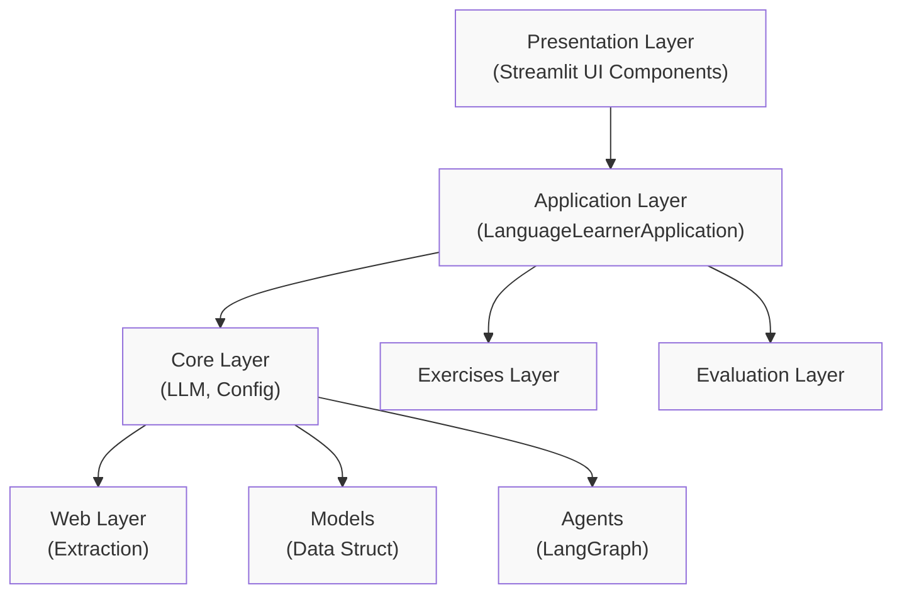
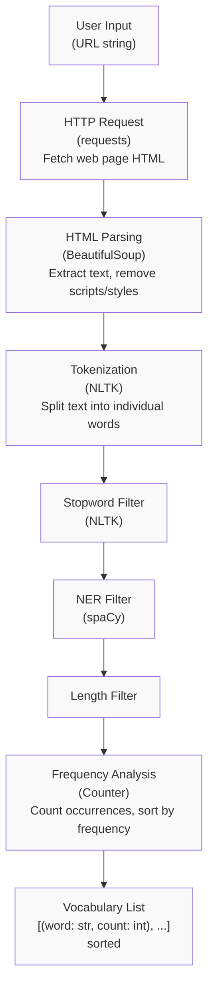
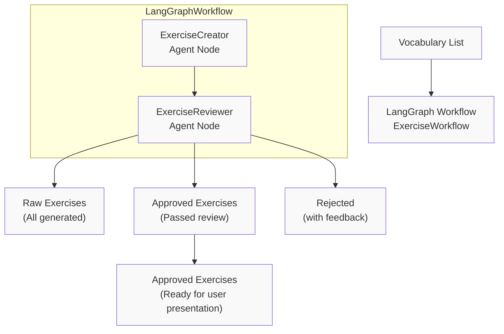

# Language Learner Assistant - Technical Stack & Architecture

## Overview

This document describes the technical architecture, stack choices, and development standards for the Language Learner Assistant project.

---

## Architecture Principles

### Design Philosophy

1. **Simplicity First**: Always choose the simplest solution that solves the problem effectively
2. **Spec-Driven Development**: All features must have clear specifications before implementation
3. **Modularity**: Components are loosely coupled and independently testable
4. **Extensibility**: Designed for multiple languages, easier to expand from French base
5. **Testability**: All code must be testable, preferably with unit and integration tests

### Modular Structure

The application follows a layered architecture:

---

## Technical Stack

### Core Technologies

| Category | Technology | Version | Purpose | Rationale |
|----------|------------|---------|---------|-----------|
| **Language** | Python | 3.12+ | Primary language | Standard, widely supported |
| **Package Manager** | uv | latest | Dependency management | Modern, fast, reliable |

### Application Framework

| Component | Technology | Version | Purpose |
|-----------|------------|---------|---------|
| Web UI | Streamlit | 1.55.0 | User interface | Rapid development, good for data apps |

### AI & LLM

| Component | Technology | Version | Purpose |
|-----------|------------|---------|---------|
| LLM Provider | Mistral AI | mistral-small | Exercise generation & evaluation | Open-source, high-quality, Apache 2.0 compatible |
| LLM SDK | mistralai | >= 1.12.4 | Python client for Mistral | Official SDK |
| Workflow Orchestration | LangGraph | >= 0.0.16 | Agent-based workflows | Flow-based agent systems |
| LLM Chains | LangChain | >= 0.1.0 | LLM orchestration | Industry standard |
| Mistral LangChain | langchain-mistralai | >= 0.1.0 | Mistral integration with LangChain | Official integration |

### NLP & Text Processing

| Component | Technology | Version | Purpose |
|-----------|------------|---------|---------|
| Tokenization | NLTK | 3.9.3 | Word tokenization, stopwords | Mature, well-established |
| NER Filtering | spaCy | >= 3.7.0 | Named Entity Recognition | Industry standard |
| French NER Model | fr-core-news-sm | >= 3.8.0 | French language model for spaCy | Well-established model |

### Web Processing

| Component | Technology | Version | Purpose |
|-----------|------------|---------|---------|
| HTTP Client | requests | 2.32.5 | Web page fetching | Standard, reliable |
| HTML Parsing | BeautifulSoup4 | 4.14.3 | HTML to text conversion | Well-established |

### Configuration & Settings

| Component | Technology | Version | Purpose |
|-----------|------------|---------|---------|
| Settings | pydantic-settings | >= 2.0.0 | Type-safe configuration | Modern, validated |
| Base Models | pydantic | (transitive) | Data validation | Foundation for pydantic-settings |

### Testing & Quality

| Component | Technology | Version | Purpose |
|-----------|------------|---------|---------|
| Testing Framework | pytest | 8.3.2 | Unit & integration testing | Standard Python testing |
| Linting & Formatting | ruff | >= 0.15.5 | Code quality | Fast, compatible |

**Note**: Unit tests should use mock LLM clients. Integration tests should use real LLM calls for end-to-end testing.

---

## Architecture Components

### Core Module

Handles core application logic including LLM integration, orchestration, and client management. Provides both real and mock LLM clients for testing and development.

### Exercises Module

Manages exercise generation, session management, and the agent-based workflow for creating and reviewing exercises using LangGraph orchestration.

### Evaluation Module

Evaluates user answers using LLM to provide feedback, scoring, and learning tips.

### Models Module

Defines the data structures for exercises, sessions, and evaluation results using Python dataclasses and type hints.

### Web Module

Handles web page fetching, HTML parsing, and vocabulary extraction. Includes NER filtering to exclude proper nouns from vocabulary.

### UI Module

Provides Streamlit components for displaying exercises, vocabulary, and facilitating user interaction.

### Root Components

Contains the main application entry point and execution scripts.

### Configuration & Utilities

Manages application configuration, logging setup, and custom exceptions.

---

## Data Flow Architecture

### Vocabulary Extraction Pipeline

### Exercise Generation & Review Pipeline

---

## Configuration Management

### Environment Variables

The application uses Pydantic Settings with the following environment variables:

#### Application Settings

| Variable | Type | Required | Default | Description |
|----------|------|----------|---------|-------------|
| `APP_NAME` | str | No | "Language Learner Assistant" | Application name |
| `APP_VERSION` | str | No | "0.1.0" | Application version |
| `DEBUG_MODE` | bool | No | False | Enable debug logging |

#### LLM Configuration

| Variable | Type | Required | Default | Description |
|----------|------|----------|---------|-------------|
| `MISTRAL_API_KEY` | str | Yes | None | API key for Mistral AI |
| `LLM_TIMEOUT` | int | No | 30 | Timeout in seconds for LLM calls |
| `LLM_MAX_RETRIES` | int | No | 3 | Maximum retries for failed LLM calls |

#### Web Scraping Configuration

| Variable | Type | Required | Default | Description |
|----------|------|----------|---------|-------------|
| `WEB_REQUEST_TIMEOUT` | int | No | 10 | Timeout for web page requests |
| `WEB_REQUEST_MAX_RETRIES` | int | No | 3 | Maximum retries for failed web requests |
| `USER_AGENT` | str | No | Standard Chrome UA | User agent for HTTP requests |

#### Language Processing Configuration

| Variable | Type | Required | Default | Description |
|-----------|------|----------|---------|-------------|
| `DEFAULT_LANGUAGE` | str | No | "french" | Default language for processing |
| `MIN_WORD_LENGTH` | int | No | 4 | Minimum word length to extract |
| `TOP_VOCABULARY_WORDS` | int | No | 50 | Number of top words to extract |
| `EXERCISES_PER_SESSION` | int | No | 10 | Number of exercises per session |

### Configuration File

Environment variables can be loaded from `.env` file (see `.env.example` for template).

---

## Quality Standards

### Code Quality

1. **Linting**: All code must pass `ruff check`
2. **Formatting**: Code must be formatted with `ruff format`
3. **Type Hints**: All public functions must have type hints
4. **Docstrings**: All modules and public functions must have docstrings
5. **Imports**: No circular imports allowed
6. **Style**: Follow existing code style and conventions

### Testing Standards

1. **Coverage**: Target >= 80% test coverage
2. **Unit Tests**: All business logic must have unit tests
3. **Mocking**: LLM-dependent code must use mocks for testing (MockLLMClient)
4. **Integration Tests**: Key workflows should have integration tests
5. **Test Data**: Use realistic test data

### Exercise Quality Standards

Exercises are evaluated using a 100-point scoring system:

| Criterion | Weight | Minimum | Description |
|-----------|--------|---------|-------------|
| Learning Value | 30 | 20 | Effectively teaches the vocabulary word |
| Challenge Level | 25 | 15 | Appropriately challenging |
| Clarity | 20 | 15 | Clear and unambiguous question |
| Originality | 15 | 10 | Creative, not formulaic |
| Contextual Relevance | 10 | 5 | Natural language context |

**Passing Threshold**: >= 70 points

---

## Dependency Constraints

1. **Licensing**: All dependencies must use Apache 2.0 compatible licenses
2. **Maturity**: Prefer well-established, widely-used packages
3. **Minimization**: Use as few dependencies as possible
4. **Standard Library**: Prefer Python standard library when possible
5. **Compatibility**: All dependencies must be compatible with Python 3.12+

### Current Dependency Count

- **Direct dependencies**: 11 (from pyproject.toml)
- **Dev dependencies**: 2 (pytest, ruff)

---

## Development Tools Commands

| Task | Command | Description |
|------|---------|-------------|
| Add dependency | `uv add <package>` | Add package to pyproject.toml |
| Remove dependency | `uv remove <package>` | Remove package from pyproject.toml |
| Install dependencies | `uv sync` | Install all dependencies |
| Load .env file | `set -o allexport && source .env && set +o allexport` | Reload environment variables from .env file |
| Run application | `uv run streamlit run app.py` | Start Streamlit app |
| Run tests | `uv run -m pytest tests/ -v` | Run test suite with verbose output |
| Run single test file | `uv run -m pytest tests/<test_file.py> -v` | Run a specific test file |
| Lint check | `uv run ruff check .` | Check code quality |
| Lint auto-fix | `uv run ruff check --fix .` | Automatically fix lint issues |
| Format code | `uv run ruff format .` | Format all code |

---

## Version History

| Version | Date | Changes |
|---------|------|---------|
| 1.0 | TBD | Initial tech stack document created |
